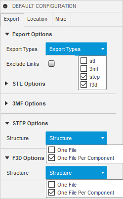
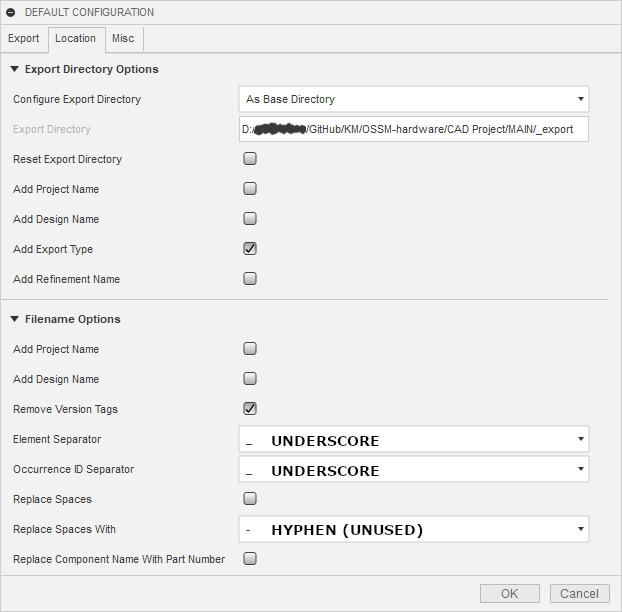
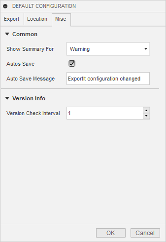

    Work in progress.
    
    TODO: 
      3030 Extrusion Stand Assembly
      Add "OSSM - Mod" multiple-component project template

# Design Guidelines For Contributions

User-contributed Projects with a file structure following these guidelines will allow for the easiest incorporation into an official OSSM release.

## Fusion File Structure:
    ProjectName
        (Bodies)
          <empty>
        (Component)ComponentNameOne
          (Bodies)
            ...
        (Component)ComponentNameTwo
          (Bodies)
            ...
        (Component)Hardware - ProjectName 
          (Bodies)
            <empty>
          (Component)HardwareName:1
            (Bodies)
              ...
          (Component)HardwareName:2
            (Bodies)
              ...

## Naming Conventions

- **Disallowed/Special-Use Characters**: These characters are reserved for special behavior for documentation scripting and have rules for being part of the Document or Component names.
  - `.` Designates file extension (dot)
    - Allowed for use in versioning e.g. `V1.1`
  - `-` Designates parent-child Component relationship
    - Allowed for use in hardware names e.g. `M5 T-Nut`
  - `_` Designates a Component (underscore) *[Disallowed]*
  - `[]` Designates reuse of hardware (brackets)
  - `()` Designates special hardware instructions (parentheses)

- **Single Component Project**: If your Project will only have a single Component for printing, it should contain only one Component named identical to the ProjectName.

- **Parent-child Component Relationship**: If your part should be considered as a primary item for a Parent Component, indicate this by referencing the Parent Component by exact name, followed by ` - ` and then the name of your Child Component.
  - Example: `End Effector - 24mm Short` will cause the release file to be located in the 'End Effector' directory of files, named '24mm Short'.
  - At this time, only one Parent-child relationship is allowed per Document, and must be on a single level.
    - *Documents may be nested as linked Components for more complex Parent-child relationships.*

- **Version Increment**: If your part is an update from the initial release, append ` V#.#` (uppercase, case sensitive) to the Component Name, representative of Major.Minor updates.
  - Example: `Ring V1.1`

- **Includes Hardware**: If your part requires hardware, all hardware should be nested as Components in a single top-level Component `Hardware - ProjectName`
  - Example: `Hardware - Body - Middle` where `Body - Middle` is the ProjectName

- **Reused Hardware**: If your part reuses hardware from a part it will be replacing, note this by appending ` [From:{Component}]` to the Component name.
  - Example: `M3 x 8 Cap Head Bolt [From:OSSM - Body - Middle]`

- **Alternative Hardware**: If an alternative hardware can be used, note this by appending ` ({Specification} alternative)` to the Component Name.
  - Example: `M4x12 Cap Head Screw (M4 x 10 alternative)`

- **Variant Hardware**: If hardware should vary for a different type of hardware a user could have, note this with `({Specification} for {variant},{Specification2} for {variant2})` in the Component Name. 
  - Example: `(M6 x 15 Cap Head Screw for 3030 Extrusion,M6 x 20 Cap Head Screw for 4040 Extrusion)`

## Running a Release from Fusion

This section serves as documentation for OSSM Project Leads.

There is a proof of concept "Release" process that may evolve over time, but it relies on the above conventions being followed strictly.

### Future Work:
- Convert `.stp` to `.stl` at high-quality refinement and bundle into `OSSM-Hardware/Hardware/OSSM Printed Parts` release.
- Generate hardware documentation from `Hardware` named component structures.

### Steps:

1. Update the Fusion Document name to `OSSM Release $MM.DD.YYYY`.
2. Export your Fusion Document as `OSSM.f3z` to overwrite the current file.
3. Run the Add-In "ExportIt" using the settings below. This will populate the `_export` directory with `f3d` and `step` folders.
4. Run `OrganizeForRelease.ps1` in a PowerShell terminal from the directory containing the `_export` folder, next to `OSSM.f3z` 
  - This will create a `RELEASE` folder with the date appended 
  - Files will be organized in a release configuration
    - `.f3d` is grouped based on Fusion nested structure
    - `.stp` is grouped based on naming convention, children grouped into parent
    - [Future] Documentation framework generated referencing files contained in `Hardware` directories 
5. Manually tidy up:
   - Move the previous release to the `_archive` folder.
   - Check for loose files in `_export` and remove them.
     - (This may suggest something went wrong generating your release)

### ExportIt Settings

#### Export Tab

#### Location Tab

#### Misc Tab

