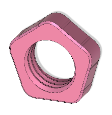
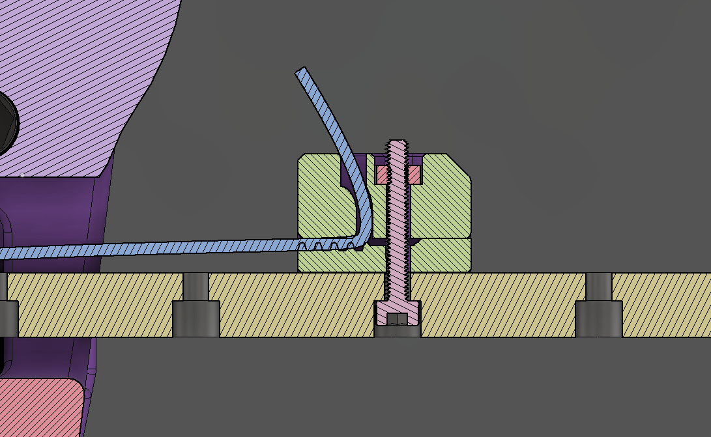

# Open Source Sex Machine

 Assembly Guide

## Table of Contents

- [Some comments on Safety](#some-comments-on-safety)
- [Parts Checklist](#parts-checklist)
  - [Purchased Parts](#purchased-parts)
  - [Printed Parts](#printed-parts)
- [Assembly Instructions](#assembly-instructions)
  - [Mate the Base Plate with the Motor](#mate-the-base-plate-with-the-motor)
  - [Build up the belt idler bearings](#build-up-the-belt-idler-bearings)
  - [Install and Align the Pulley](#install-and-align-the-pulley)
  - [Linear Rail Installation](#linear-rail-installation)
  - [Alternate Middle – Pivot](#alternate-middle--pivot)
  - [Belt Placement](#belt-placement)
  - [Belt Tensioner](#belt-tensioner)
  - [Wrap Belt Around Pulley](#wrap-belt-around-pulley)
  - [Belt Clamp](#belt-clamp)

# Some comments on Safety

## General Safety

- We’ve worked to make building an OSSM easy and not require expert level knowledge. With that said, only you can be responsible for your safety. If you are unsure about something, find a resource, ask the discord, or just pause for a minute before rushing into it. This is a DIY project, and everyone’s build is a bit different – so make sure you are comfortable with your setup and understand how it works!

## Electrical Safety

- 24V is generally considered a fairly safe, low voltage, but always be careful to check wiring polarity and make sure nothing conductive is near the board or power supply that could cause a short circuit.

## Mechanical Safety

- There are some pinch points in the OSSM near the rail – keep sensitive bits away from that during use!
- Depending on your motor selection, the OSSM can generate quite a bit of force, and that can hurt if it’s not applied in the right way, especially in delicate orifices! Always be able to move away from the machine if needed, or have someone specifically responsible for your safety if using it with a partner. Everyone has their own level or risk tolerance, so make sure you understand how your setup works, and give consideration to what you would do should something go wrong.

 
 

This is an open-source, community based project. Lots of people contribute  
to its success which is a huge strength for developing quickly!  
It also means we are not responsible for the complete safety of the design.  
Play risk-aware and consensually!

 

# Parts Checklist

The Github list is always to be considered to be more up-to-date than this document, if there are discrepancies please visit the Discord and ask for clarification in \#OSSM

This guide is for the complete OFFICAL OSSM, however there are many modifications that you may choose to make for your specific build.

## Purchased Parts

|                                                                                                                                                                                                |                                                                                                                               |
| ---------------------------------------------------------------------------------------------------------------------------------------------------------------------------------------------- | ----------------------------------------------------------------------------------------------------------------------------- |
| **Nema 23 Servo Motor – IHSV57-30-18** Most people choose the 180W model for max power. 140 and 100w are also available. Avoid the _StepperOnline_ version because of compatibility issues     |                      |
| **OSSM PCB & Remote**                                                                                                                                                                          |              |
| **GT2 Pulley – 20 Tooth, 8mm Bore, 10mm belt**                                                                                                                                                 |                       |
| **GT2 Timing Belt – 10mm Width x 500mm length** Get a bulk amount of belt 500mm is a minimum for a standard build                                                                              |                  |
| **Roller Bearings MR115 – 5x11x4mm (Qty:6)**                                                                                                                                                   |                  |
| **24v 5A fully enclosed power supply** Look for one that is certified for use in your country                                                                                                  |  |
| Metric Cap Screw Kit Should be about $20 USD, M5, M4, and M3 are used in the build in various lengths Most M5 cap head screws are 20/25mm long The Middle Pivot mount requires 4x m5x35 screws |             |
|                                                                                                                                                                                                |                                                                                                                               |

## Printed Parts

|                                                                 |                                                                                                                             |
| :-------------------------------------------------------------: | --------------------------------------------------------------------------------------------------------------------------- |
|                         **Body - Base**                         |                      |
|                        **Body - Middle**                        |                    |
| **Body – Middle Pivot (Use instead for more mounting options)** |              |
|                        **Body - Cover**                         |                     |
|                  **Body - PCB Support Cover**                   |              |
|                 **Belt Clamp – Tensioner end**                  |         |
|                      **Belt Clamp - Top**                       |                 |
|                     **Belt Clamp - Bottom**                     |              |
|               **Toy Mount – Rail to 24mm thread**               |  |
|                  **Toy Mount - 24MM Jam Nut**                   |         |
|       **Toy Mount - Vac-u-lock adapter (double double)**        |             |
|                         **Remote Body**                         |                    |
|                      **Remote Top Cover**                       |               |
|                      **Remote Knobs x 2**                       |                   |
|                                                                 |                                                                                                                             |

 
 
 

# Assembly Instructions

 

## General Assembly Comments

### Threadlocker

Recommend you use some form of threadlocker/Loctite on the fasteners going into metal (nuts of bearing) to prevent them from loosening as the ossm gets shaken around quite a bit.

If you do not have Loctite, some plain white glue does a decent job, just a small amount on the ends of the threads is all you need.

You can also put threadlocker on the motor shaft to help keep the pulley tightly in place – just be sure you are happy with it’s position, this can be very hard to remove!

### Assembly Videos

We now have a full set of videos showing the assembly process linked on the github main page, and at ossm.tech You can also find links to online CAD models to help see how things go together!

## Mate the Base Plate with the Motor

Attach the OSSM base plate to the motor with (2) 5x20mm cap head screws in the locations marked _M5_ and tighten with a M5 nut below the motor mounting flange. The nut is usually kept from turning by the motor body. If it spins when tightening, insert a flat head screwdriver between the nut and motor to keep it in place.

## Build up the belt idler bearings

 

    

        The idler bearing stacks are built up around 5x20mm cap head screw
         
         
        Stack three 5x11x4mm bearings on a 5x20mm cap head screw and attach to the threaded positions in the baseplate
        as shown above.
    

    

## Install and Align the Pulley

- Mount the 20 tooth GT2 Pulley on the shaft of the motor
- Make sure you line up one of the set screws with the flat on the motor!

 

## Linear Rail Installation

Align the pulley so that it is within the range of the bearings and the set screws that clamp it to the motor shaft are available from above the base plate

MGNRH Rail and Bearing are next. _linear rail is omitted from this view._

 
 

**Be careful not to separate bearing from linear rail, there is a chance of losing ball bearings when the rail and bearing are separated!**
 
 

    
    

        Highlighted holes for M3 cap screws. The cap screws should finish flush with surface when fully tightened.
    

 
 
 

Attach the middle part of the OSSM body utilizing the remaining diagonal holes. The M5x20mm shown below being inserted into the correct positions.

 

## Alternate Middle – Pivot

The new middle pivot design makes it easier to bolt your ossm directly onto extrusion. It can be mounted using 4x M5x35 screws and 4x M5 nuts as shown below.

Here all 4 bolts go through the motor, ossm base, and ossm middle.

 

## Belt Placement

Now is time to place the belt in the iconic OSSM configuration. Using the clamp files provided to secure and tension the belt.  
 
Belt is shown in BLUE  
 
The teeth on the belt are not shown, but should face the pulley.

X-Ray View of entire belt path

 

## Belt Tensioner

Start with getting the belt placed into the tensioner. Fold the belt in half with the teeth facing towards each other. Work each end in from the top following the green arrows below.  
Pull the belt until the lower piece has only a small section sticking out from the tensioner.

Then slip the assembly onto the end of the rail.

Drop an M5 nut into the slot and thread in an M5x16 screw into it. Tightening this screw will push on the rail and apply more tension – be gentle here! We just want to take up the slack, it is easy to apply way too much force if you tighten this too much.
 Too much force can damage your motor bearings!

## Wrap Belt Around Pulley

Wrapping the belt around the main drive pully and past the stacks of idler pulleys will get the belt in the correct location.

## Belt Clamp

- The belt routes through the slot in the top belt clamp. Insert the M3x20 screw from the bottom of the rail, through the clamp bottom (with teeth up engaging the belt), and engage the nut in the top clamp.
- Before you tighten the screw fully, pull the remaining belt slack so it is snug.
- Tighten the screw to secure the belt.
- Trim remaining belt (if you are sure you are happy with stroke length!)

Congratulations!  

(we hope) You should now have a mechanically assembled OSSM  
Reach out on the discord if you have any issues!

