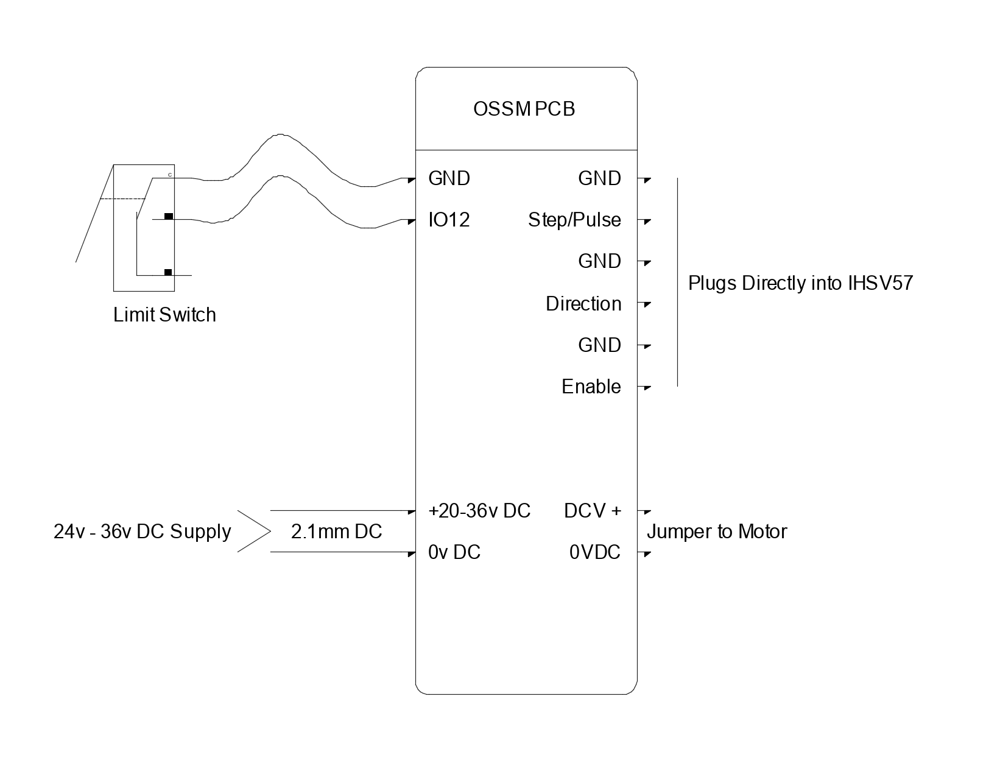
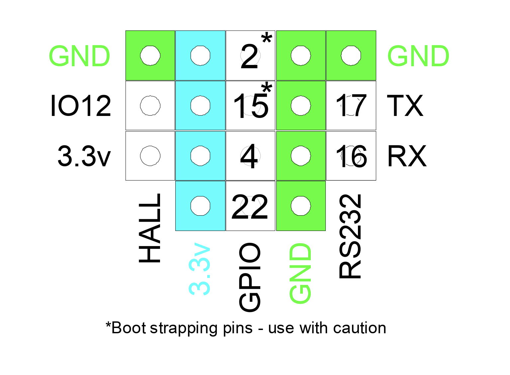
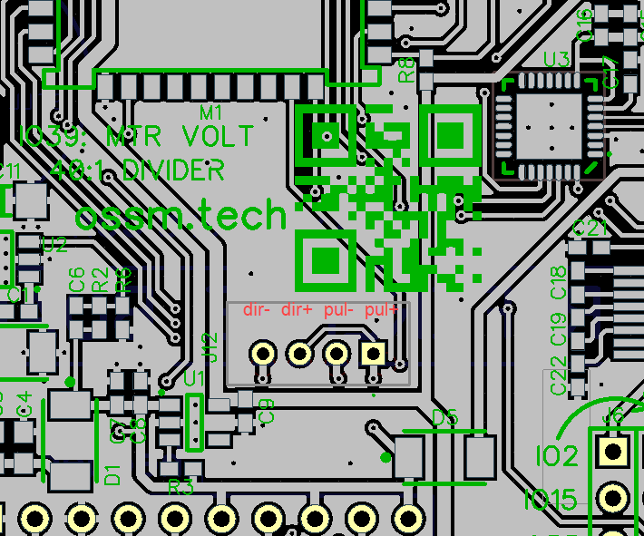
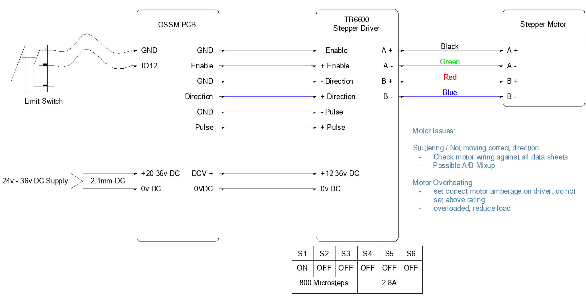

This page provides connection diagrams and pinout references for both the official OSSM PCB and alternative wiring configurations.

## Prerequisites

Before wiring your OSSM electronics, ensure you have:

- An ESP32 development board (ESP32-DevKitC or compatible)
- A motor driver compatible with step/direction control
- Appropriate power supply for your motor
- Basic electronics tools (wire strippers, multimeter)

<Note>
The 3.3V logic level on most ESP32 boards can cause missed steps at high speeds. Use a level shifter to convert signals to 5V for reliable motor driver communication.
</Note>

### Prototyping Components

If you're building a custom wiring setup without the official PCB, you'll need these additional components:

| Component | Purpose | Notes |
|-----------|---------|-------|
| [Adafruit Level Shifter](https://www.adafruit.com/product/3405) | Converts 3.3V signals to 5V | Required for reliable high-speed operation |
| [Breadboard](https://www.amazon.ca/Breadboard-Solderless-Prototype-Distribution-Connecting/dp/B01EV6LJ7G/) | Solderless prototyping | 400 tie-point minimum recommended |
| [Dupont Jumpers](https://www.amazon.ca/120pcs-Multicolored-Breadboard-Arduino-raspberry/dp/B01LZF1ZSZ/) | Wire connections | Male-to-male and male-to-female needed |

## Official OSSM Wiring

The official OSSM reference board provides standardized connections with built-in level shifting. This is the recommended approach for most builds.

### Reference Board Layout

<Frame caption="OSSM reference board (version 1) - front view showing component placement">
  
</Frame>

### PCB Connection Diagram

<Frame caption="Connection diagram showing motor driver and peripheral connections">
  
</Frame>

### GPIO Pinout Reference

The ESP32 GPIO assignments for the OSSM PCB are configured in the firmware. These are the default pin mappings:

| Signal | GPIO Pin | Function |
|--------|----------|----------|
| Step | GPIO 14 | Step pulse output to motor driver |
| Direction | GPIO 27 | Direction signal to motor driver |
| Enable | GPIO 26 | Enable/disable motor driver |
| Encoder A | GPIO 36 | Quadrature encoder channel A |
| Encoder B | GPIO 39 | Quadrature encoder channel B |

<Frame caption="ESP32 GPIO pinout showing control signal routing">
  
</Frame>

<Frame caption="JST header locations with pin labels for easy identification">
  
</Frame>

## Alternative Wiring Configurations

<Info>
The following configurations are community-tested alternatives. Your specific hardware combination may require different pin assignments or wiring modifications.
</Info>

### TB6600 Stepper Driver

The TB6600 is a common stepper driver for OSSM builds using stepper motors instead of servos.

<Steps>
  <Step title="Connect power">
    Wire your stepper motor power supply (typically 24V) to the TB6600 DC+ and DC- terminals. Connect the motor phases to A+, A-, B+, B-.
  </Step>
  <Step title="Wire control signals">
    Connect the OSSM control signals through your level shifter:
    - Step (GPIO 14) → PUL+
    - Direction (GPIO 27) → DIR+
    - Enable (GPIO 26) → ENA+ (if used)
    - Ground → PUL-, DIR-, ENA-
  </Step>
  <Step title="Configure driver switches">
    Set the TB6600 DIP switches for your motor's current rating and desired microstepping. Consult your motor's datasheet for the appropriate current setting.
  </Step>
</Steps>

<Frame caption="Wiring diagram for TB6600 stepper driver with OSSM controller">
  
</Frame>

### Servo Motor Wiring

For builds using servo motors with integrated drivers (such as the iHSV57 or 42AIM30):

<Frame caption="Servo motor wiring configuration showing step/direction interface">
  
</Frame>

<Tip>
Servo motors with integrated drivers often accept both 3.3V and 5V logic levels. Check your servo's documentation—you may not need a level shifter.
</Tip>

### Stepper Motor Wiring

For additional stepper driver configurations and archived designs, refer to the hardware files in the repository:

```
/Hardware/PCB Files/Archive/
```

## Verifying Your Wiring

After completing your wiring, verify the connections before applying power:

<Steps>
  <Step title="Check continuity">
    Use a multimeter to verify that each signal wire connects the correct ESP32 pin to the corresponding motor driver input.
    
    <Check>
    Step, direction, and enable signals each show continuity from ESP32 to driver.
    </Check>
  </Step>
  <Step title="Verify isolation">
    Confirm there are no shorts between signal lines or between signals and power rails.
    
    <Check>
    No continuity between adjacent pins or between signal and power lines.
    </Check>
  </Step>
  <Step title="Check power connections">
    Verify the motor driver power supply polarity and voltage before connecting.
    
    <Warning>
    Reverse polarity can instantly destroy your motor driver. Double-check DC+ and DC- orientation.
    </Warning>
  </Step>
</Steps>

## Troubleshooting

<AccordionGroup>
  <Accordion title="Motor misses steps at high speed">
    This typically indicates a voltage level mismatch or signal integrity issue.
    
    **Check the following:**
    - Level shifter is receiving both 3.3V and 5V power supplies
    - All ground connections are common between ESP32, level shifter, and motor driver
    - Signal wires are short and routed away from motor power cables
    
    **Solution:** If you're not using a level shifter, add one. If you are, verify the 5V supply to the high-voltage side of the shifter.
  </Accordion>
  <Accordion title="Motor doesn't respond to commands">
    The motor driver may not be receiving valid control signals.
    
    **Check the following:**
    - Enable pin state matches your driver's requirements (some are active-low)
    - Step and direction pins match your firmware configuration
    - Motor driver has adequate power supply (check indicator LEDs if present)
    
    **Solution:** Use an oscilloscope or logic analyzer to verify step pulses are present at the driver input.
  </Accordion>
  <Accordion title="Erratic or jittery motor behavior">
    Electrical noise or interference may be affecting the control signals.
    
    **Check the following:**
    - Signal wires are not bundled with motor power cables
    - Motor driver power supply is stable under load
    - Adequate decoupling capacitors are present near the motor driver
    
    **Solution:** Add 0.1µF ceramic capacitors between signal pins and ground at the motor driver. Use shielded cable for longer signal runs.
  </Accordion>
  <Accordion title="Motor runs in wrong direction">
    The direction signal polarity may be inverted.
    
    **Solution:** Either swap the direction wire polarity at the level shifter, or invert the direction in firmware by changing the `INVERT_DIRECTION` setting.
  </Accordion>
</AccordionGroup>
