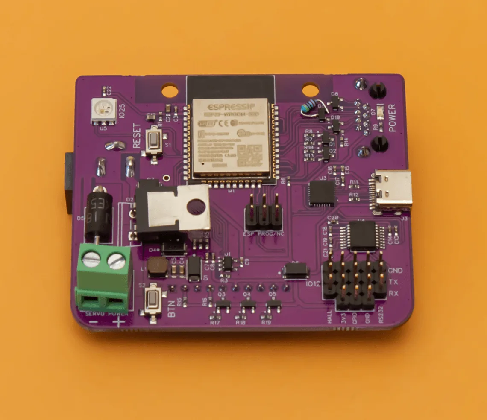
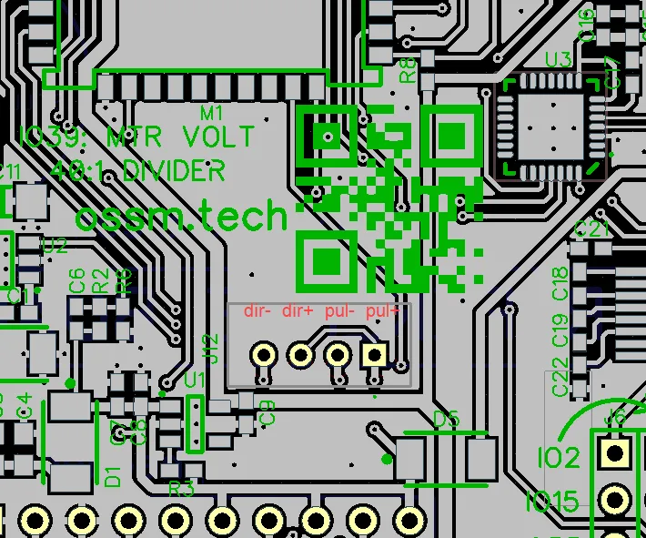
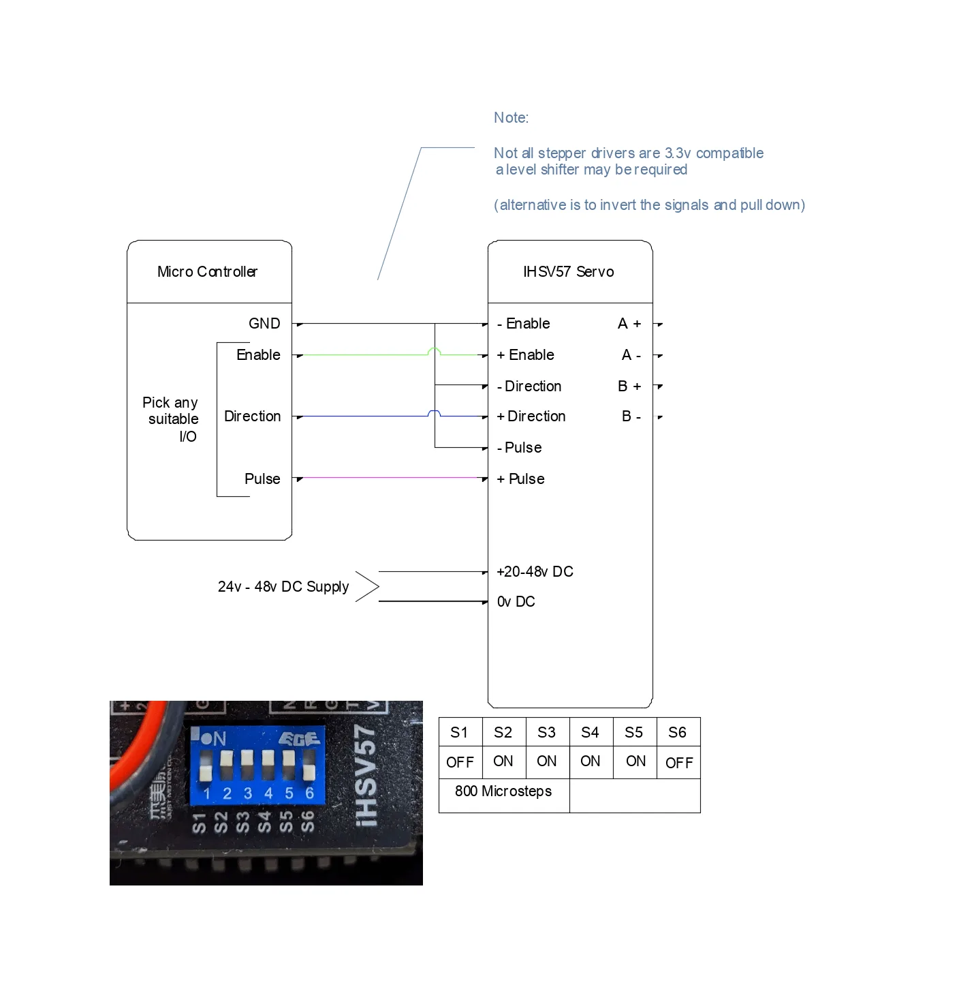

This guide shows you how to connect the official OSSM PCB and how to wire alternative configurations using an ESP32, level shifting, and common motor drivers.

## Prerequisites

Before you begin, make sure you have:

- An ESP32 development board (ESP32‑DevKitC or compatible)
- A motor driver that accepts step/direction inputs
- A power supply sized for your motor and driver
- Basic tools: wire strippers, small screwdriver set, multimeter

<Note>
Most ESP32 boards use 3.3V logic. At higher speeds this can cause missed steps with 5V‑logic drivers. Use a level shifter to convert step/direction/enable to 5V for reliable operation.
</Note>

### Prototyping components (for custom wiring)

If you are wiring without the official PCB, you will typically need:

- Logic level shifter (3.3V → 5V, 4+ channels)
- Solderless breadboard or proto board
- Dupont jumpers (male↔male and male↔female)
- 5V rail for the high‑side of the level shifter (often available from your driver or a separate regulator)

<Tip>
Keep signal wiring short and tidy. Route step/direction/enable away from motor and power leads to minimize noise.
</Tip>

## Official OSSM wiring

The reference OSSM PCB includes level shifting and standardized headers. This is the recommended approach for most builds.

### Reference board layout

<Frame caption="OSSM reference board (version 1) - front view showing component placement">
  
</Frame>

### PCB connection diagram

<Frame caption="Connection diagram showing motor driver and peripheral connections">
  
</Frame>

### ESP32 GPIO pinout (default)

These are the default firmware mappings for the OSSM PCB:

| Signal      | GPIO Pin | Function                                      |
|-------------|----------|-----------------------------------------------|
| Step        | GPIO 14  | Step pulse output to motor driver             |
| Direction   | GPIO 27  | Direction signal to motor driver              |
| Enable      | GPIO 26  | Enable/disable motor driver                   |
| Encoder A   | GPIO 36  | Quadrature encoder channel A (input‑only)     |
| Encoder B   | GPIO 39  | Quadrature encoder channel B (input‑only)     |

<Frame caption="ESP32 GPIO pinout showing control signal routing">
  
</Frame>

<Frame caption="JST header locations with pin labels for easy identification">
  
</Frame>

<Info>
Firmware can remap pins if needed. If you change wiring, update your firmware configuration to match.
</Info>

## Alternative wiring configurations

<Info>
The following setups are community‑tested patterns. Your hardware may require different pin assignments or minor wiring changes. Always consult your driver and motor datasheets.
</Info>

### TB6600 stepper driver

Use this when driving a stepper motor with a TB6600‑style external driver.

<Steps>
  <Step title="Connect motor power and phases">
    Wire the motor supply (commonly 24V) to the TB6600 DC+ and DC‑. Connect the motor phases to A+, A‑, B+, B‑ per the motor’s wiring diagram.

    <Warning>
    Never hot‑plug stepper motors. Disconnect power before changing motor wiring.
    </Warning>
  </Step>
  <Step title="Wire control signals (via level shifter)">
    Connect ESP32 signals through the 3.3V→5V level shifter to the driver inputs:
    
    - Step (GPIO 14) → PUL+
    - Direction (GPIO 27) → DIR+
    - Enable (GPIO 26, if used) → ENA+
    - GND (ESP32/level shifter) → PUL‑, DIR‑, ENA‑

    <Check>
    All grounds are common between ESP32, level shifter, and driver.
    </Check>
  </Step>
  <Step title="Set DIP switches">
    Configure current limit to match your motor and choose a microstep setting appropriate for your mechanics. Start conservative, then fine‑tune during testing.
  </Step>
</Steps>

<Frame caption="Wiring diagram for TB6600 stepper driver with OSSM controller">
  
</Frame>

### Servo motor with integrated driver (iHSV57, 42AIM30, etc.)

Many integrated servos accept step/direction/enable just like a stepper driver.

<Frame caption="Servo motor wiring configuration showing step/direction interface">
  
</Frame>

<Tip>
Some integrated servos accept 3.3V logic directly; others require 5V. Check your servo’s documentation— you may be able to omit the level shifter.
</Tip>

### Additional stepper driver options

For more designs and archived schematics, see the repository’s hardware archive:

```
/ossm/Hardware/PCB Files/Archive/
```

## Power and grounding best practices

- Use a single‑point (star) ground between ESP32, level shifter, and driver
- Keep step/direction/enable leads short; avoid running them parallel to motor power
- Twist each motor phase pair (A+/A‑ and B+/B‑) to reduce EMI
- Provide strain relief for all connectors to prevent intermittent faults
- If runs are long, consider shielded cable for control signals and connect shield to chassis/earth at one end only

## Verifying your wiring

Perform these checks before applying power to the motor driver.

<Steps>
  <Step title="Continuity and pin mapping">
    Use a multimeter to confirm each signal runs from the correct ESP32 pin to the driver input.

    <Check>
    Step, direction, and enable each show continuity from ESP32 → level shifter → driver.
    </Check>
  </Step>
  <Step title="Isolation between signals and power">
    Ensure no shorts exist between adjacent signal lines or between any signal and power rails.

    <Check>
    No continuity between neighboring pins or between signals and DC+/DC‑.
    </Check>
  </Step>
  <Step title="Power polarity and voltage">
    Verify supply polarity and voltage at the driver terminals before connecting the motor.

    <Warning>
    Reverse polarity can instantly damage the driver. Double‑check DC+ and DC‑ orientation.
    </Warning>
  </Step>
</Steps>

## First power‑on checklist

- With the motor disconnected, power the driver and confirm status LEDs look normal
- Connect the motor, then command a very low speed move
- Verify direction changes when commanded
- If using an encoder, confirm counts change smoothly in one direction and reverse when direction changes

<Check>
You can command low‑speed movement without missed steps, oscillation, or driver faults.
</Check>

## Troubleshooting

<AccordionGroup>
  <Accordion title="Motor misses steps at high speed">
    This usually indicates a logic‑level mismatch or poor signal integrity.

    - The level shifter is powered on both sides (3.3V and 5V)
    - Grounds are common between ESP32, level shifter, and driver
    - Signal wires are short and routed away from motor power

    <Tip>
    If you are not using a level shifter, add one. If you are, verify the 5V supply on the high‑side pins.
    </Tip>
  </Accordion>

  <Accordion title="Motor does not respond to commands">
    The driver may not be receiving valid control signals.

    - Check the enable input polarity; many drivers use active‑low enable
    - Confirm step/direction pins match your firmware configuration
    - Ensure the driver has adequate power (verify status LEDs)

    <Info>
    Use a logic analyzer or oscilloscope to confirm step pulses at the driver input.
    </Info>
  </Accordion>

  <Accordion title="Erratic or jittery motion">
    Electrical noise or supply instability may be affecting the control path.

    - Keep signal wires separate from motor power cables
    - Verify the driver supply remains within spec under load
    - Add local decoupling near the driver inputs

    <Tip>
    Add 0.1 µF ceramic capacitors close to the driver’s control inputs (to ground). Use shielded cable for long signal runs.
    </Tip>
  </Accordion>

  <Accordion title="Motor runs in the wrong direction">
    The direction signal is inverted relative to your wiring.

    <Info>
    Swap the direction polarity at the connector, or invert direction in firmware by changing the `INVERT_DIRECTION` setting.
    </Info>
  </Accordion>
</AccordionGroup>

<Warning>
Always power down and wait for capacitors to discharge before rewiring. Reversing polarity or shorting outputs can permanently damage your hardware.
</Warning>
