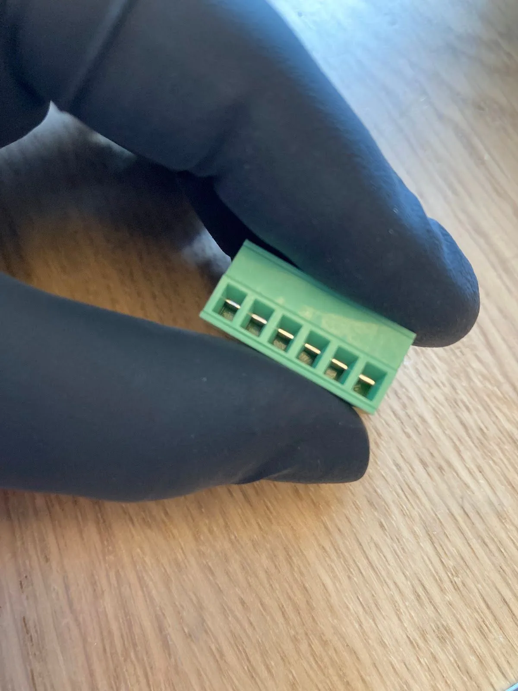
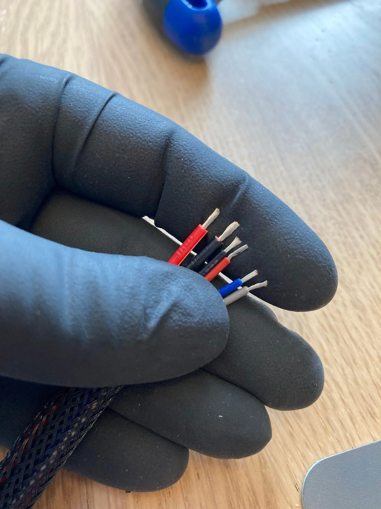
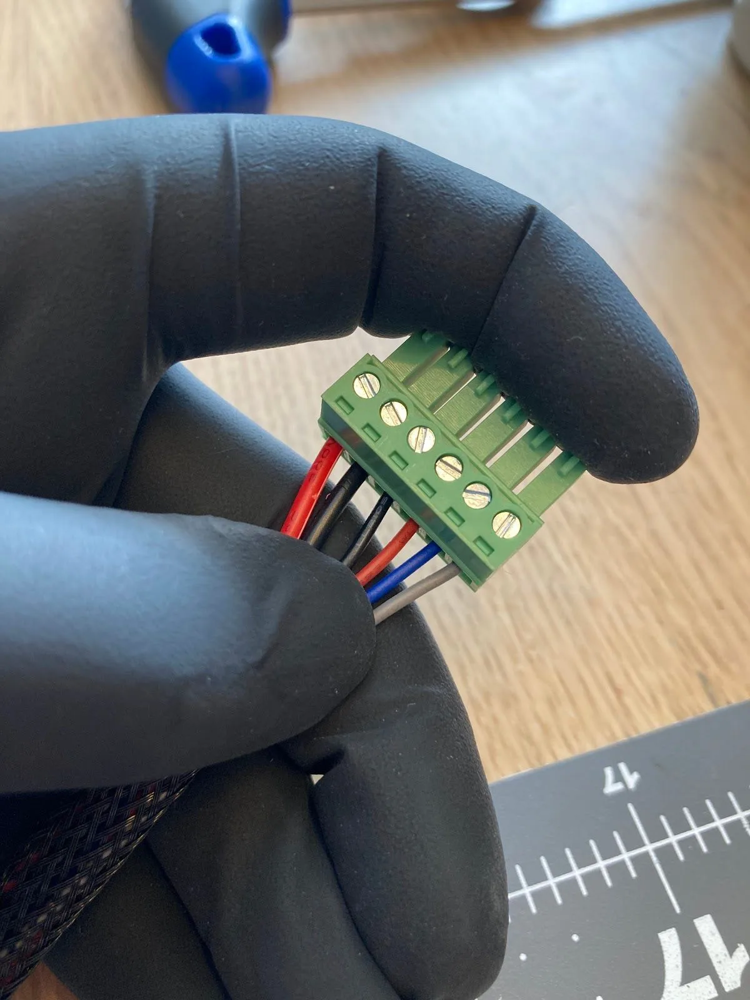
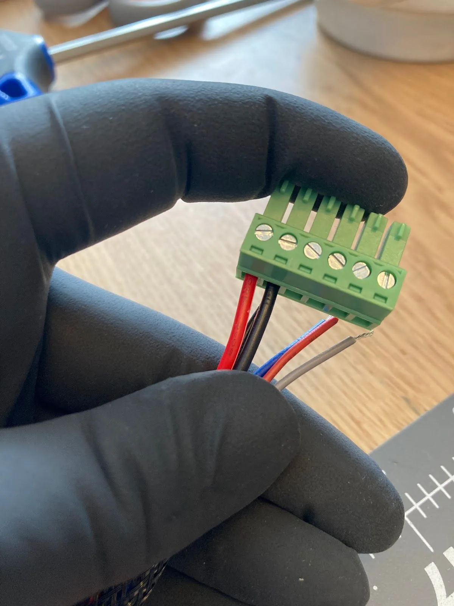
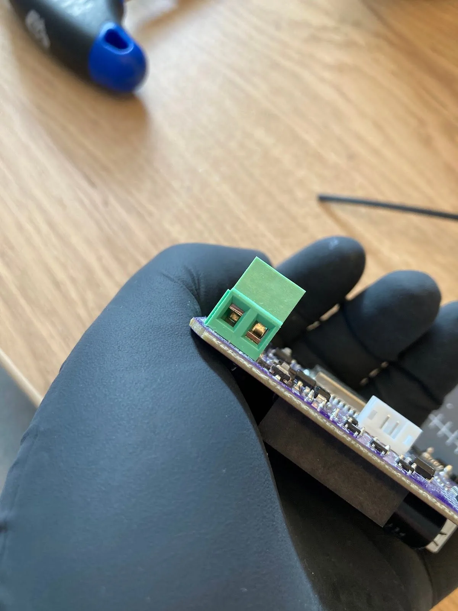
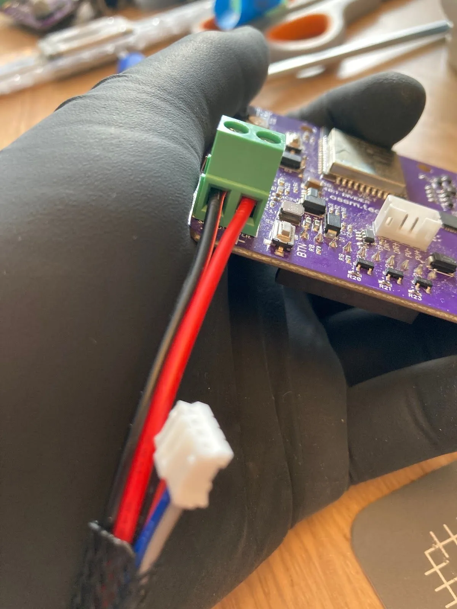
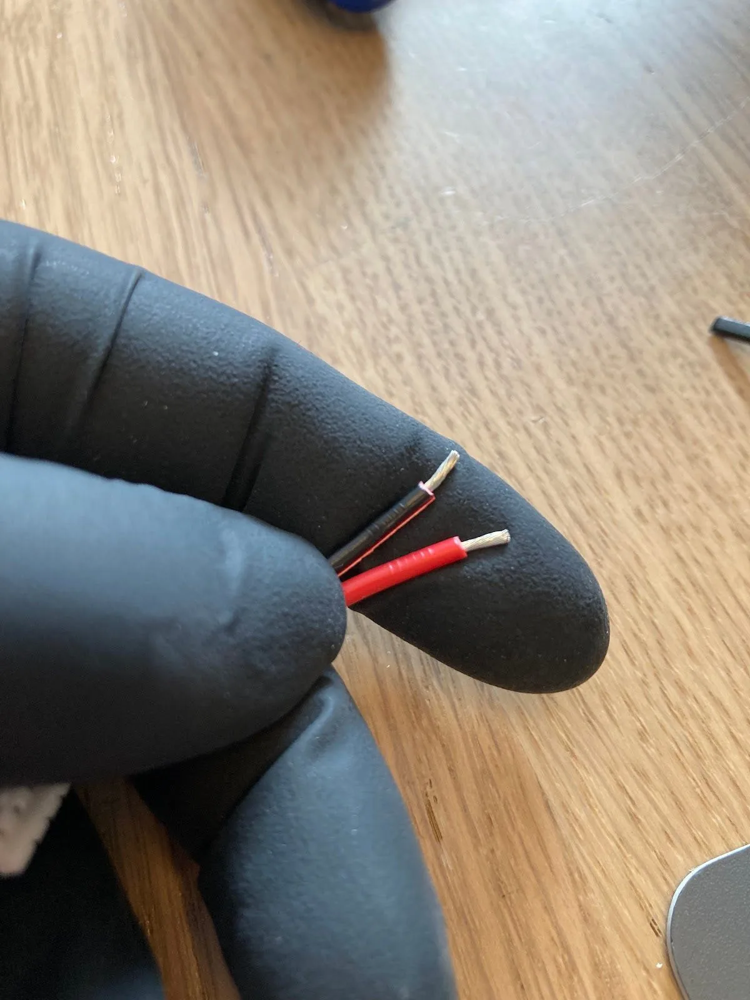

This guide walks you through wiring your OSSM Gold Motor (57AIM30) to the OSSM PCB. If you purchased a motor from R+D, your kit includes all necessary cables and connectors.

## What you'll need

**Tools:**
- Small flat head screwdriver
- Wire strippers
- Snippers

**Included components:**
- Green connector
- PH04 Cable
- 250mm Power cable
- Wiring sleeve (optional)

## Wiring the green connector

<Steps>
<Step title="Open the connector terminals">
Use your screwdriver to open all terminals on the green connector. The terminals arrive in the closed position by default.

<Frame caption="Connector terminals in closed position (left) and open position (right)">

</Frame>

<Frame>

</Frame>

<Frame>

</Frame>
</Step>

<Step title="Prepare your wires">
Separate the power cable wires and strip all wire ends to approximately 2-3mm (about ⅛").

<Tip>
If you're using a wiring sleeve, thread the wires through it before stripping the ends.
</Tip>

Arrange your wires in this order from left to right:
1. **Power cable:** Red, Black
2. **PH04 cable:** Black, Red, Blue, Grey
</Step>

<Step title="Connect the power cables">
Insert the power cables (red, then black) into the first two terminals. Ensure the screws face the top of the connector.

<Frame caption="Power cables inserted into the first two terminals">

</Frame>

<Frame>

</Frame>

<Warning>
Tighten the terminal screws as firmly as possible. Loose connections can cause intermittent power issues or motor failures.
</Warning>
</Step>

<Step title="Connect the PH04 cables">
Insert the PH04 cable wires (black, red, blue, grey) into the remaining terminals and tighten each screw securely.

<Check>
Your green connector is now complete and ready to plug into the motor.
</Check>
</Step>
</Steps>

## Wiring the OSSM PCB

<Steps>
<Step title="Open the PCB terminals">
Locate the power terminals on your OSSM PCB. They arrive in the closed position.

<Frame caption="PCB terminals: closed (left) vs open (right)">

</Frame>

<Frame>

</Frame>
</Step>

<Step title="Prepare the power cable ends">
Strip and separate the other end of your power cable. Twist the exposed wire strands together to prevent splaying.

<Frame caption="Stripped and twisted wire ends ready for connection">

</Frame>

<Frame>

</Frame>
</Step>

<Step title="Connect power to the PCB">
Insert the wires into the correct terminals:
- **Black wire** → `-` terminal
- **Red wire** → `+` terminal

Tighten both terminal screws securely.
</Step>

<Step title="Complete the connections">
1. Plug the white connector from the PH04 cable into the matching white connector on the PCB
2. Connect the green connector to the green terminal on the motor
3. Plug your 24V power supply into the board

<Check>
When powered on, the motor base displays a green light and the shaft begins rotating.
</Check>
</Step>
</Steps>

## Troubleshooting

<Note>
If you have your OSSM remote connected to the board during testing, the device cannot complete homing. This is expected behavior—homing requires your OSSM to be fully assembled with the rail installed.
</Note>
