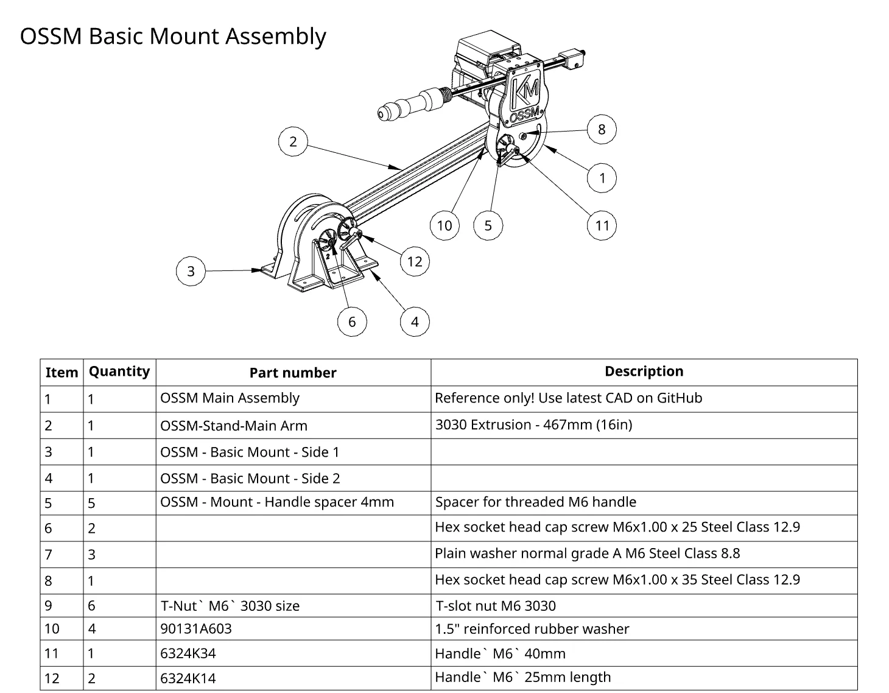
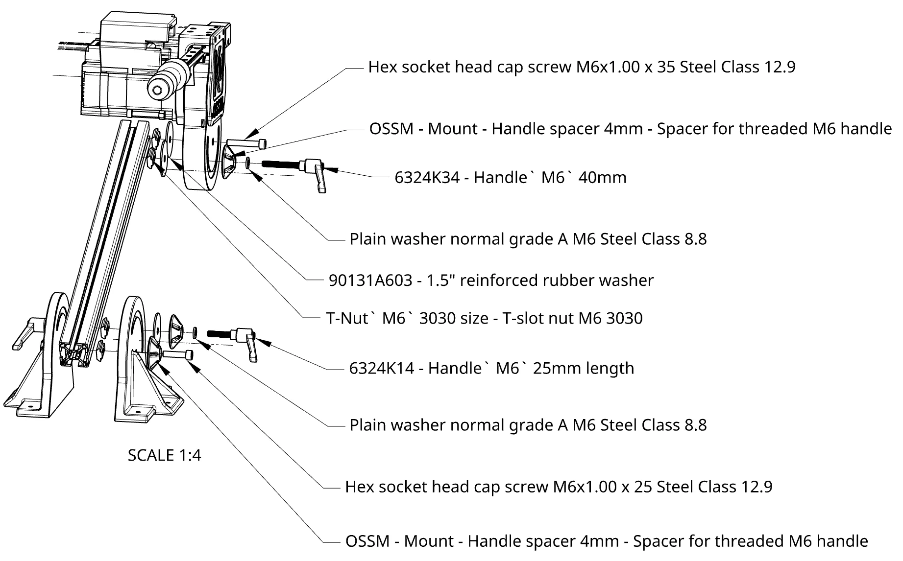
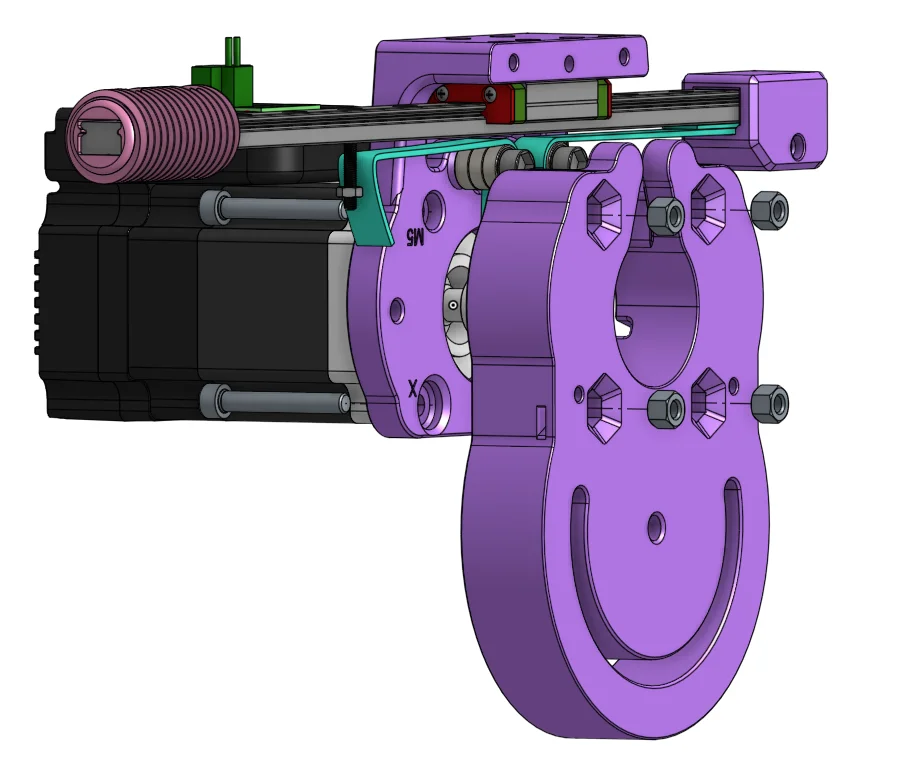

<Warning>
This is a legacy mount design. For new builds, consider the [PitClamp](/ossm/Hardware/standard-printed-parts/pitclamp/README) which offers more adjustability and stability.
</Warning>

The Basic Mount is a simple two-piece bracket system that attaches directly to the OSSM actuator body. It provides a straightforward mounting solution with minimal printed parts.

## Overview

The Basic Mount consists of two mirrored side brackets that clamp onto the OSSM body, plus an optional spacer for use with extrusion-based stands.

<Frame caption="Basic Mount exploded view">
  
</Frame>

<Frame caption="Basic Mount assembly detail">
  
</Frame>

<Frame caption="Basic Mount installed">
  
</Frame>

## CAD Files

<Card title="OnShape Document" icon="cube" href="https://cad.onshape.com/documents/d520ea9a8cadb4ae8681f59b/w/00b211a6fa3b76c59ef28f4e/e/5654fc1d5711d69f94174aaa">
  View the latest exploded views and Bill of Materials in OnShape
</Card>

## Required Printed Parts

| Part | Quantity |
|------|----------|
| [Basic Mount - Side 1](/ossm/Hardware/ossm-mods/basic-mount/side-1) | 1 |
| [Basic Mount - Side 2](/ossm/Hardware/ossm-mods/basic-mount/side-2) | 1 |
| [Extrusion Mount Spacer](/ossm/Hardware/ossm-mods/basic-mount/spacer) (optional) | As needed |

## Print Settings

<Note>
Print all parts without supports using OSSM standard settings.
</Note>

| Setting | Value |
|---------|-------|
| Walls | 4-6 |
| Infill | 15-20% gyroid or crosshatch |
| Supports | None |
| Layer height | 0.2mm |

## Download All Files

<CardGroup cols={2}>
  <Card title="STL Files" icon="cube" href="https://github.com/KinkyMakers/OSSM-hardware/tree/main/Hardware/%5BLEGACY%5D%20OSSM%20Printed%20Parts/OSSM%20Mounting/OSSM%20-%20Basic%20Mount">
    Download STL files for printing
  </Card>
  <Card title="Source Files" icon="drafting-compass" href="https://github.com/KinkyMakers/OSSM-hardware/tree/main/Hardware/%5BLEGACY%5D%20OSSM%20Printed%20Parts/OSSM%20Mounting/OSSM%20-%20Basic%20Mount/Source%20Files">
    STEP and Fusion 360 files for modification
  </Card>
</CardGroup>
