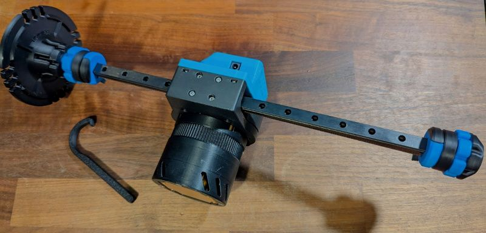
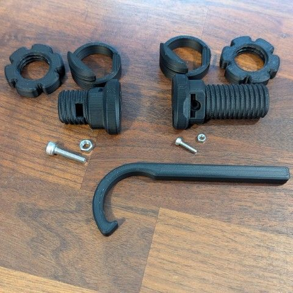

<Frame caption="PitClamp Mini Reinforced 3030 Hinges - Assembled">
  
</Frame>

## Assembly video

Watch the full assembly walkthrough to see how all components fit together.

<iframe
  className="w-full aspect-video rounded-xl"
  src="https://www.youtube.com/embed/lNvTg5JwCek"
  title="PitClamp Mini Reinforced 3030 Hinges - Assembly"
  frameBorder="0"
  allow="accelerometer; autoplay; clipboard-write; encrypted-media; gyroscope; picture-in-picture"
  allowFullScreen
></iframe>

## Printing

This variant uses the standard PitClamp Mini print settings with an additional wall on the Ring component.

### Print settings

| Setting | Value |
|---------|-------|
| Walls | 6 (Ring: 7 walls) |
| Infill type | Cross Hatch or Gyroid |
| Infill percentage | 10% |
| Supports | Normal (Snug) with 3° threshold angle |
| Support placement | Allow supports on part |
| Seam | Nearest (or your preference) |

<Note>
**Recommended filament:** PLA+ for optimal strength and durability.
</Note>

<Warning>
All parts must print in the default file orientation. Printing Base components in other orientations causes structural weakness that may lead to failure under load.
</Warning>

### Print-in-place option

If your printer is well calibrated and your material has optimal layer adhesion, you can use the print-in-place Upper+Handle variant. Find this in the `/Non-Standard` folder—it's included in the Generic 3MF file by default.

### Critical area reinforcement

For maximum strength, use a cube modifier to force 100% infill at the critical stress area shown below.

<Tip>
Adding 100% infill at high-stress areas significantly increases the load capacity and longevity of your mount.
</Tip>

## Bill of materials

This BOM is **per side**—double all quantities for a complete two-sided installation.

### Hinge pin hardware

| Quantity | Part |
|----------|------|
| 1x | M5x20 Socket Cap Screw |
| 1x | M5 Hex Nut |

### Lever dogbones and handle

<Tabs>
  <Tab title="Print-in-place Upper+Handle">
    | Quantity | Part |
    |----------|------|
    | 2x | M4x25 Socket Cap Screw |
    | 2x | M4 Hex Nut |
  </Tab>
  <Tab title="Separate Upper + Handle">
    | Quantity | Part |
    |----------|------|
    | 2x | M4x25 Socket Cap Screw |
    | 1x | M4x10 or M4x12 Socket Cap Screw |
    | 3x | M4 Hex Nut |
  </Tab>
</Tabs>

### Lower reinforced sidemount and ring

| Quantity | Part |
|----------|------|
| 4x | 77x16mm Flat Mending Plate (Straight Braces) |
| 4x | M5x35 Socket Cap Screw |
| 4x | M5 T-Nut |

<Warning>
**77x16mm plate compatibility:** These plates vary between manufacturers. Verify that:
- Holes are 5mm diameter to fit the M5 hardware
- Outer hole spacing is between 59mm and 61mm
</Warning>

## Pre-made kits

If you prefer a complete kit with printed parts and hardware, you can purchase one from the community:

<Card title="PitClamp Mini Reinforced 3030 Hinge Kit" icon="shopping-cart" href="https://www.etsy.com/listing/1885144462/pitclamp-mini-reinforced-3030-hinge">
  Complete print and hardware kit available on Etsy
</Card>

## Reference images

<Frame caption="Component overview">
  
</Frame>
