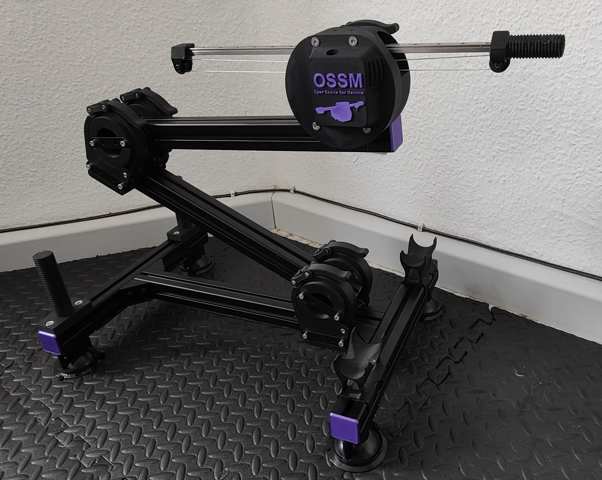
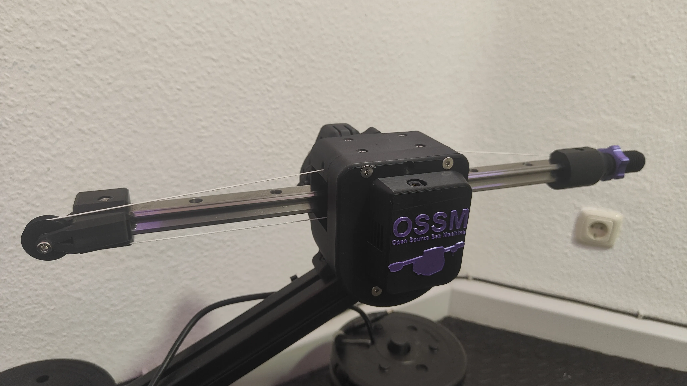
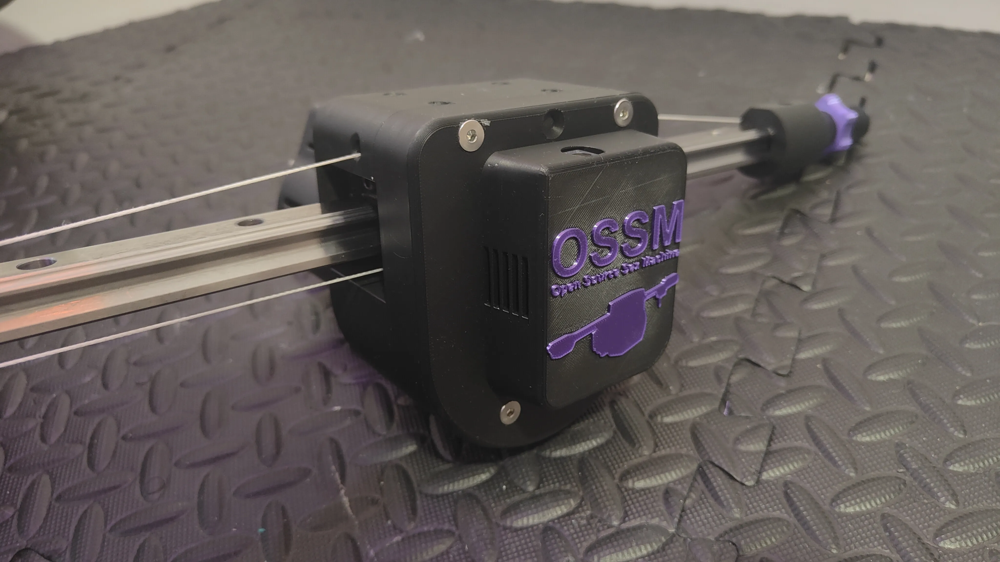

<Frame>
  
</Frame>

<Frame caption="HG20 variant, front view with AIO cover and OSSM branding">
  
</Frame>

<Frame caption="HG20 variant, side view showing capstan rope routing and motor cover">
  
</Frame>

<Note>
The AIO version shown in these pictures mounts the control board in the front with cables routing to the motor in the back, based on a concept by @thearmpit. The AIO Cover part used here is a custom design not covered under CC BY-NC-SA 4.0 license.
</Note>

This modification replaces the standard belt drive with a capstan-based system, enabling higher load capacity with the more powerful 60AIM40F motor.

## What is a capstan drive?

A capstan drive uses rope and a pulley to transmit motion. For an excellent explanation of the mechanism, watch this video by Aaed Musa:

<Card title="Capstan Drive Explained" icon="play" href="https://www.youtube.com/watch?v=MwIBTbumd1Q">
  Learn how capstan drives work and why they're effective for high-torque applications.
</Card>

## Why choose capstan over belt?

The standard belt-driven OSSM can experience slipping at higher torques. While this may result from build errors, the capstan drive eliminates this issue entirely.

### Comparison to standard OSSM

<Tabs>
  <Tab title="Advantages">
    - Same form factor as standard OSSM
    - Equal or quieter operation
    - Only 13cm effective rail length loss (450mm rail = 32cm stroke)
    - **2.7x stronger** (32kg vs 12kg capacity)
    - Same maximum speed
    - No belt slipping
    - No custom PCBs required
    - PitClamp compatible
    - Compatible with all custom end effectors
  </Tab>
  <Tab title="Disadvantages">
    - More complex build process
    - Larger motor increases cost (~110€ shipped including tax to Germany)
    - More parts to print
    - Rail may slip in extreme use cases (resolved by re-homing)
  </Tab>
</Tabs>

<Tip>
This design has been tested extensively by the creator over several months with excellent results. Share your feedback in the Discord threads linked below.
</Tip>

## MGN12H vs HG20

There are two rail variants for this build. The HG20 version is recommended if your budget allows.

<Tabs>
  <Tab title="HG20 (Recommended)">
    MGN12H rails and carriages reach their limits with 30cm+ cantilevers combined with heavy toys (~1.5kg and up). This results in louder operation, bearing wear over time, and deflection issues.

    The HG20 version addresses all of these and includes additional improvements such as a bigger drum and better rope guiding for smoother operation.

    **Additional cost:** ~40€ more than the MGN12H version.
  </Tab>
  <Tab title="MGN12H">
    The MGN12H version works well for lighter loads and shorter cantilevers. It is considered the legacy variant -- if you can afford the extra cost, go with HG20.
  </Tab>
</Tabs>

## Configuration options

### AIO vs normal version

<Tabs>
  <Tab title="AIO (Recommended)">
    The AIO mod version mounts the control board in the front of the motor head with integrated cable routing. This is the recommended configuration.
  </Tab>
  <Tab title="Normal">
    The normal version includes no mounting solution for the control board. Choose this if you want to create your own custom mounting arrangement.
  </Tab>
</Tabs>

### Pulley versions

<Tabs>
  <Tab title="Bushing Pulley (Recommended)">
    The bushing pulley is superior in every way:
    - Better durability
    - No deformation over time
    - Supports rail lengths up to 450mm (500mm likely possible)
    
    **Requirements**: Appropriately sized bushing and epoxy glue for assembly.
  </Tab>
  <Tab title="3D Printed Pulley">
    Use the 3D printed pulley if you cannot source a suitable bushing:
    - Functional but will deform over time under constant force
    - Requires periodic replacement
    - Maximum supported rail length: 400mm
  </Tab>
</Tabs>

### Supported rail lengths

| Pulley Type | Tested Length | Maximum Recommended |
|-------------|---------------|---------------------|
| Bushing | 450mm | 500mm (untested) |
| 3D Printed | 400mm | 400mm |

<Warning>
Rail lengths above 500mm are not recommended for this design.
</Warning>

## Rope selection

<Warning>
Use only the specified rope type. Incorrect rope selection will result in stretching and failure.
</Warning>

**Required rope**: Liros DC pro 161 (or equivalent Dyneema DM20, SK99, SK75 with max 1mm diameter)

<AccordionGroup>
  <Accordion title="Why rope selection matters">
    The rope must have minimal stretch under load. Testing by community member @neos demonstrated that generic UHMWPE rope from AliExpress stretches excessively and breaks under load. The specified Dyneema rope maintains consistent tension for reliable operation.
  </Accordion>
  <Accordion title="Alternative rope specifications">
    If you cannot source Liros DC pro 161, look for:
    - Material: Dyneema DM20, SK99, or SK75
    - Maximum diameter: 1mm
    - Verified low-stretch construction
    
    Deviate from these specifications at your own risk.
  </Accordion>
</AccordionGroup>

## Print settings

<Note>
Pre-configured .3mf files are included for most parts with optimal settings.
</Note>

| Setting | Value |
|---------|-------|
| Walls | 6 |
| Infill | 20% |
| Supports | Try without for AIO_cover (bridges only); enable if needed |

## Bill of materials

<Tabs>
  <Tab title="HG20 (~380€)">
    | Part | Estimated Cost | Source |
    |------|----------------|--------|
    | 60AIM40F Motor | ~110€ | [Superbuy/Taobao](https://www.superbuy.com/en/page/buy/?url=https://item.taobao.com/item.htm?id=668578585661) |
    | OSSM Control Board + Remote | $91 USD (excl. tax/shipping) | [Research and Desire](https://www.researchanddesire.com/products/ossm-reference-board) |
    | MR115 Bearings (4x) | ~3€ | [AliExpress](https://de.aliexpress.com/item/1005007175995775.html) |
    | Hardware kit | ~30€ | See fastener list below |
    | PLA Filament (1kg) | ~8€/kg | [AliExpress](https://de.aliexpress.com/item/1005006639640810.html) |
    | Liros DC pro 161 Rope (5m) | ~15€ | [Kite Line Shop](https://www.kitelineshop.com/ligne-liros-dcpro161-au-metre-c2x38222201) |
    | Bushing 20x24x40mm (id x od x l) | ~5€ | [AliExpress](https://de.aliexpress.com/item/1005009236377507.html) |
    | HG20 Linear Rail + HGH20HA Carriage | ~50€ (depending on length) | [AliExpress (400/500mm)](https://de.aliexpress.com/item/4001272098866.html) |
    | Epoxy Glue | ~3€ | [AliExpress](https://de.aliexpress.com/item/1005007115129874.html) |
    | 4-pin JST Header Cable (30cm) | ~2€ | [AliExpress](https://de.aliexpress.com/item/1005007389108799.html) |
    | 2-pin AWG 18+ Wire (30cm) | ~2€ | [AliExpress](https://de.aliexpress.com/item/1005006614755156.html) |
    | Shrink tube (24mm ID) or Kinesio Tape | ~3€ | [AliExpress](https://de.aliexpress.com/item/4000211463126.html) or local drug store |
    | 36V 5+A Power Supply | ~68€ | [Voelkner (PSU)](https://www.voelkner.de/products/2995507/MW-Mean-Well-GST220A36-R7B-Tischnetzteil-Festspannung-36-V-DC-6.1A-219.6W.html) + [Adapter](https://www.voelkner.de/products/6716585/MW-Mean-Well-DC-PLUG-R7BF-P1J-Adapter.html) |
    | **Total** | **~380€** | |

    <Accordion title="HG20 fastener list">
      | Fastener | Quantity |
      |----------|----------|
      | M4x12 ISO7380 | 4 |
      | M5x45 Countersunk | 2 |
      | M5x75 Countersunk | 4 |
      | M5x20 Hex Cap | 4 |
      | M5x25 Hex Cap | 2 |
      | M5x30 Hex Cap | 3 |
      | M5x65 Hex Cap | 4 |
      | M5x110 Hex Cap (fully threaded) | 1 |
      | M5 Nuts | 11 |
      | M4 Nuts | 4 |

      <Info>
      The M5x110 fully threaded hex cap can be sourced from [AliExpress](https://de.aliexpress.com/item/1005005879037174.html).
      </Info>
    </Accordion>
  </Tab>
  <Tab title="MGN12H (~345€)">
    | Part | Estimated Cost | Source |
    |------|----------------|--------|
    | 60AIM40F Motor | ~110€ | [Superbuy/Taobao](https://www.superbuy.com/en/page/buy/?url=https://item.taobao.com/item.htm?id=668578585661) |
    | OSSM Control Board + Remote | $91 USD (excl. tax/shipping) | [Research and Desire](https://www.researchanddesire.com/products/ossm-reference-board) |
    | MR115 Bearings (5x) | ~3€ | [AliExpress](https://de.aliexpress.com/item/1005007175995775.html) |
    | Hardware kit | ~30€ | See fastener list below |
    | PLA Filament (1kg) | ~8€/kg | [AliExpress](https://de.aliexpress.com/item/1005006639640810.html) |
    | Liros DC pro 161 Rope (5m) | ~15€ | [Kite Line Shop](https://www.kitelineshop.com/ligne-liros-dcpro161-au-metre-c2x38222201) |
    | Bushing 20x23x30mm (id x od x l) | ~5€ | [Agrolager](https://www.agrolager.de/product_info.php?products_id=91534519) |
    | MGN12H Linear Rail + Wagon | ~10-15€ | [AliExpress (450mm)](https://de.aliexpress.com/item/1000007480470.html) |
    | Epoxy Glue | ~3€ | [AliExpress](https://de.aliexpress.com/item/1005007115129874.html) |
    | 4-pin JST Header Cable | ~2€ | [AliExpress](https://de.aliexpress.com/item/1005007389108799.html) |
    | 2-pin AWG 18+ Wire (30cm) | ~2€ | [AliExpress](https://de.aliexpress.com/item/1005006614755156.html) |
    | Kinesio Tape | ~3€ | Local drug store |
    | 36V 5+A Power Supply | ~68€ | [Voelkner (PSU)](https://www.voelkner.de/products/2995507/MW-Mean-Well-GST220A36-R7B-Tischnetzteil-Festspannung-36-V-DC-6.1A-219.6W.html) + [Adapter](https://www.voelkner.de/products/6716585/MW-Mean-Well-DC-PLUG-R7BF-P1J-Adapter.html) |
    | **Total** | **~345€** | |

    <Accordion title="MGN12H fastener list">
      | Fastener | Quantity |
      |----------|----------|
      | M3x12 Hex Cap | 5 |
      | M3x16 Hex Cap | 2 |
      | M4x12 ISO7380 | 4 |
      | M5x45 Hex Cap | 4 |
      | M5x80 Hex Cap (fully threaded) | 1 |
      | M5x45 Countersunk | 6 |
      | M5x12 ISO7380 | 1 |
      | M5x20 ISO7380 | 2 |
      | M5 Nuts | 13 |
      | M3 Nuts | 3 |
      | M4 Nuts | 4 |
    </Accordion>
  </Tab>
</Tabs>

## Assembly guides

Detailed step-by-step assembly guides are available as PDFs:

<CardGroup cols={2}>
  <Card title="HG20 Assembly Guide" icon="file-pdf" href="https://github.com/KinkyMakers/OSSM-hardware/blob/main/Printed%20Parts/OSSM%20Mods/SaladDressing%27s%20Mods/Capstan%20OSSM%20XL/Assembly%20Guide%20HGR.pdf">
    PDF assembly instructions for the HG20 variant.
  </Card>
  <Card title="MGN12H Assembly Guide" icon="file-pdf" href="https://github.com/KinkyMakers/OSSM-hardware/blob/main/Printed%20Parts/OSSM%20Mods/SaladDressing%27s%20Mods/Capstan%20OSSM%20XL/Assembly%20Guide%20MGN12H.pdf">
    PDF assembly instructions for the MGN12H variant.
  </Card>
</CardGroup>

## Printed parts and CAD files

All printable files and STEP sources are hosted on GitHub. Pre-configured .3mf files include recommended slicer settings.

<Tabs>
  <Tab title="HG20">
    **Printable parts (STL/3MF):**

    | Part | Files |
    |------|-------|
    | Capstan Drum | [3MF](https://github.com/KinkyMakers/OSSM-hardware/blob/main/Printed%20Parts/OSSM%20Mods/SaladDressing%27s%20Mods/Capstan%20OSSM%20XL/Hardware/3D%20printed%20parts/HG20/CapstanDrum.3mf) / [Upper STL](https://github.com/KinkyMakers/OSSM-hardware/blob/main/Printed%20Parts/OSSM%20Mods/SaladDressing%27s%20Mods/Capstan%20OSSM%20XL/Hardware/3D%20printed%20parts/HG20/CapstanDrumUpper.stl) / [Lower STL](https://github.com/KinkyMakers/OSSM-hardware/blob/main/Printed%20Parts/OSSM%20Mods/SaladDressing%27s%20Mods/Capstan%20OSSM%20XL/Hardware/3D%20printed%20parts/HG20/CapstanDrumLower.stl) |
    | Motor Head Front | [3MF](https://github.com/KinkyMakers/OSSM-hardware/blob/main/Printed%20Parts/OSSM%20Mods/SaladDressing%27s%20Mods/Capstan%20OSSM%20XL/Hardware/3D%20printed%20parts/HG20/MotorHead_Front.3mf) / [STL](https://github.com/KinkyMakers/OSSM-hardware/blob/main/Printed%20Parts/OSSM%20Mods/SaladDressing%27s%20Mods/Capstan%20OSSM%20XL/Hardware/3D%20printed%20parts/HG20/MotorHead_Front.stl) |
    | Motor Head Back | [3MF](https://github.com/KinkyMakers/OSSM-hardware/blob/main/Printed%20Parts/OSSM%20Mods/SaladDressing%27s%20Mods/Capstan%20OSSM%20XL/Hardware/3D%20printed%20parts/HG20/MotorHead_Back.3mf) / [STL](https://github.com/KinkyMakers/OSSM-hardware/blob/main/Printed%20Parts/OSSM%20Mods/SaladDressing%27s%20Mods/Capstan%20OSSM%20XL/Hardware/3D%20printed%20parts/HG20/MotorHead_Back.stl) |
    | Motor Head Cover | [3MF](https://github.com/KinkyMakers/OSSM-hardware/blob/main/Printed%20Parts/OSSM%20Mods/SaladDressing%27s%20Mods/Capstan%20OSSM%20XL/Hardware/3D%20printed%20parts/HG20/MotorHead_Cover.3mf) / [STL](https://github.com/KinkyMakers/OSSM-hardware/blob/main/Printed%20Parts/OSSM%20Mods/SaladDressing%27s%20Mods/Capstan%20OSSM%20XL/Hardware/3D%20printed%20parts/HG20/MotorHead_Cover.stl) |
    | End Effector | [3MF](https://github.com/KinkyMakers/OSSM-hardware/blob/main/Printed%20Parts/OSSM%20Mods/SaladDressing%27s%20Mods/Capstan%20OSSM%20XL/Hardware/3D%20printed%20parts/HG20/EndEffector.3mf) / [STL](https://github.com/KinkyMakers/OSSM-hardware/blob/main/Printed%20Parts/OSSM%20Mods/SaladDressing%27s%20Mods/Capstan%20OSSM%20XL/Hardware/3D%20printed%20parts/HG20/EndEffector.stl) |
    | Pulleys | [3MF](https://github.com/KinkyMakers/OSSM-hardware/blob/main/Printed%20Parts/OSSM%20Mods/SaladDressing%27s%20Mods/Capstan%20OSSM%20XL/Hardware/3D%20printed%20parts/HG20/Pulleys.3mf) / [End Effector STL](https://github.com/KinkyMakers/OSSM-hardware/blob/main/Printed%20Parts/OSSM%20Mods/SaladDressing%27s%20Mods/Capstan%20OSSM%20XL/Hardware/3D%20printed%20parts/HG20/PulleyEndEffector.stl) / [Rail End STL](https://github.com/KinkyMakers/OSSM-hardware/blob/main/Printed%20Parts/OSSM%20Mods/SaladDressing%27s%20Mods/Capstan%20OSSM%20XL/Hardware/3D%20printed%20parts/HG20/Pulley_RailEnd.stl) |
    | Rail End | [3MF](https://github.com/KinkyMakers/OSSM-hardware/blob/main/Printed%20Parts/OSSM%20Mods/SaladDressing%27s%20Mods/Capstan%20OSSM%20XL/Hardware/3D%20printed%20parts/HG20/RailEnd.3mf) / [STL](https://github.com/KinkyMakers/OSSM-hardware/blob/main/Printed%20Parts/OSSM%20Mods/SaladDressing%27s%20Mods/Capstan%20OSSM%20XL/Hardware/3D%20printed%20parts/HG20/RailEnd.stl) |
    | Tensioner | [3MF](https://github.com/KinkyMakers/OSSM-hardware/blob/main/Printed%20Parts/OSSM%20Mods/SaladDressing%27s%20Mods/Capstan%20OSSM%20XL/Hardware/3D%20printed%20parts/HG20/Tensioner.3mf) / [Upper STL](https://github.com/KinkyMakers/OSSM-hardware/blob/main/Printed%20Parts/OSSM%20Mods/SaladDressing%27s%20Mods/Capstan%20OSSM%20XL/Hardware/3D%20printed%20parts/HG20/TensionerUpper.stl) / [Lower STL](https://github.com/KinkyMakers/OSSM-hardware/blob/main/Printed%20Parts/OSSM%20Mods/SaladDressing%27s%20Mods/Capstan%20OSSM%20XL/Hardware/3D%20printed%20parts/HG20/TensionerLower.stl) |
    | Standoffs | [STL 1](https://github.com/KinkyMakers/OSSM-hardware/blob/main/Printed%20Parts/OSSM%20Mods/SaladDressing%27s%20Mods/Capstan%20OSSM%20XL/Hardware/3D%20printed%20parts/HG20/Standoff1.stl) / [STL 2](https://github.com/KinkyMakers/OSSM-hardware/blob/main/Printed%20Parts/OSSM%20Mods/SaladDressing%27s%20Mods/Capstan%20OSSM%20XL/Hardware/3D%20printed%20parts/HG20/Standoff2.stl) / [STL 3](https://github.com/KinkyMakers/OSSM-hardware/blob/main/Printed%20Parts/OSSM%20Mods/SaladDressing%27s%20Mods/Capstan%20OSSM%20XL/Hardware/3D%20printed%20parts/HG20/Standoff3.stl) |
    | PitClamp Motor Ring (60AIM40F) | [STL](https://github.com/KinkyMakers/OSSM-hardware/blob/main/Printed%20Parts/OSSM%20Mods/SaladDressing%27s%20Mods/Capstan%20OSSM%20XL/Hardware/3D%20printed%20parts/HG20/Pitclamp_MotorRing_60AIM40F.stl) |

    **STEP source files:**

    | Part | STEP |
    |------|------|
    | Motor Head | [MotorHead_60AIM40F_HGR.step](https://github.com/KinkyMakers/OSSM-hardware/blob/main/Printed%20Parts/OSSM%20Mods/SaladDressing%27s%20Mods/Capstan%20OSSM%20XL/Hardware/3D%20printed%20parts/HG20/STEP/MotorHead_60AIM40F_HGR.step) |
    | Capstan Drum | [CapstanDrum.step](https://github.com/KinkyMakers/OSSM-hardware/blob/main/Printed%20Parts/OSSM%20Mods/SaladDressing%27s%20Mods/Capstan%20OSSM%20XL/Hardware/3D%20printed%20parts/HG20/STEP/CapstanDrum.step) |
    | End Effector | [EndEffector.step](https://github.com/KinkyMakers/OSSM-hardware/blob/main/Printed%20Parts/OSSM%20Mods/SaladDressing%27s%20Mods/Capstan%20OSSM%20XL/Hardware/3D%20printed%20parts/HG20/STEP/EndEffector.step) |
    | End Pulley | [EndPulley.step](https://github.com/KinkyMakers/OSSM-hardware/blob/main/Printed%20Parts/OSSM%20Mods/SaladDressing%27s%20Mods/Capstan%20OSSM%20XL/Hardware/3D%20printed%20parts/HG20/STEP/EndPulley.step) |
    | Rail End | [RailEnd.step](https://github.com/KinkyMakers/OSSM-hardware/blob/main/Printed%20Parts/OSSM%20Mods/SaladDressing%27s%20Mods/Capstan%20OSSM%20XL/Hardware/3D%20printed%20parts/HG20/STEP/RailEnd.step) |
    | Tensioner | [60AIMTensioner_HGR.step](https://github.com/KinkyMakers/OSSM-hardware/blob/main/Printed%20Parts/OSSM%20Mods/SaladDressing%27s%20Mods/Capstan%20OSSM%20XL/Hardware/3D%20printed%20parts/HG20/STEP/60AIMTensioner_HGR.step) |
    | Bushing Pulley (Fusion 360) | [BushingPulley60AIM_HGR.f3d](https://github.com/KinkyMakers/OSSM-hardware/blob/main/Printed%20Parts/OSSM%20Mods/SaladDressing%27s%20Mods/Capstan%20OSSM%20XL/Hardware/3D%20printed%20parts/HG20/BushingPulley60AIM_HGR.f3d) |
  </Tab>
  <Tab title="MGN12H">
    **Printable parts (STL/3MF):**

    | Part | Files |
    |------|-------|
    | End Effector | [3MF](https://github.com/KinkyMakers/OSSM-hardware/blob/main/Printed%20Parts/OSSM%20Mods/SaladDressing%27s%20Mods/Capstan%20OSSM%20XL/Hardware/3D%20printed%20parts/MGN12H/EndEffector.3mf) / [STL](https://github.com/KinkyMakers/OSSM-hardware/blob/main/Printed%20Parts/OSSM%20Mods/SaladDressing%27s%20Mods/Capstan%20OSSM%20XL/Hardware/3D%20printed%20parts/MGN12H/EndEffector.stl) |
    | Rail End | [3MF](https://github.com/KinkyMakers/OSSM-hardware/blob/main/Printed%20Parts/OSSM%20Mods/SaladDressing%27s%20Mods/Capstan%20OSSM%20XL/Hardware/3D%20printed%20parts/MGN12H/RailEnd.3mf) / [STL](https://github.com/KinkyMakers/OSSM-hardware/blob/main/Printed%20Parts/OSSM%20Mods/SaladDressing%27s%20Mods/Capstan%20OSSM%20XL/Hardware/3D%20printed%20parts/MGN12H/RailEnd.stl) / [Alt 3MF](https://github.com/KinkyMakers/OSSM-hardware/blob/main/Printed%20Parts/OSSM%20Mods/SaladDressing%27s%20Mods/Capstan%20OSSM%20XL/Hardware/3D%20printed%20parts/MGN12H/RailEnd_alternative.3mf) |
    | 8mm End Pulley | [3MF](https://github.com/KinkyMakers/OSSM-hardware/blob/main/Printed%20Parts/OSSM%20Mods/SaladDressing%27s%20Mods/Capstan%20OSSM%20XL/Hardware/3D%20printed%20parts/MGN12H/8mmEndPulley.3mf) / [STL](https://github.com/KinkyMakers/OSSM-hardware/blob/main/Printed%20Parts/OSSM%20Mods/SaladDressing%27s%20Mods/Capstan%20OSSM%20XL/Hardware/3D%20printed%20parts/MGN12H/8mmEndPulley.stl) |
    | 12mm End Pulley | [3MF](https://github.com/KinkyMakers/OSSM-hardware/blob/main/Printed%20Parts/OSSM%20Mods/SaladDressing%27s%20Mods/Capstan%20OSSM%20XL/Hardware/3D%20printed%20parts/MGN12H/12mmEndPulley.3mf) / [STL](https://github.com/KinkyMakers/OSSM-hardware/blob/main/Printed%20Parts/OSSM%20Mods/SaladDressing%27s%20Mods/Capstan%20OSSM%20XL/Hardware/3D%20printed%20parts/MGN12H/12mmEndPulley.stl) |
    | Pulley | [3MF](https://github.com/KinkyMakers/OSSM-hardware/blob/main/Printed%20Parts/OSSM%20Mods/SaladDressing%27s%20Mods/Capstan%20OSSM%20XL/Hardware/3D%20printed%20parts/MGN12H/pulley.3mf) / [STL](https://github.com/KinkyMakers/OSSM-hardware/blob/main/Printed%20Parts/OSSM%20Mods/SaladDressing%27s%20Mods/Capstan%20OSSM%20XL/Hardware/3D%20printed%20parts/MGN12H/Pulley.stl) |
    | Bushing Pulley | [Top STL](https://github.com/KinkyMakers/OSSM-hardware/blob/main/Printed%20Parts/OSSM%20Mods/SaladDressing%27s%20Mods/Capstan%20OSSM%20XL/Hardware/3D%20printed%20parts/MGN12H/BushingPulleyTop.stl) / [Bottom STL](https://github.com/KinkyMakers/OSSM-hardware/blob/main/Printed%20Parts/OSSM%20Mods/SaladDressing%27s%20Mods/Capstan%20OSSM%20XL/Hardware/3D%20printed%20parts/MGN12H/BushingPulleyBottom.stl) |
    | Tensioner | [Upper STL](https://github.com/KinkyMakers/OSSM-hardware/blob/main/Printed%20Parts/OSSM%20Mods/SaladDressing%27s%20Mods/Capstan%20OSSM%20XL/Hardware/3D%20printed%20parts/MGN12H/TensionerUpper.stl) / [Lower STL](https://github.com/KinkyMakers/OSSM-hardware/blob/main/Printed%20Parts/OSSM%20Mods/SaladDressing%27s%20Mods/Capstan%20OSSM%20XL/Hardware/3D%20printed%20parts/MGN12H/TensionerLower.stl) |
    | PitClamp Mini Ring (60AIM40F) | [STL](https://github.com/KinkyMakers/OSSM-hardware/blob/main/Printed%20Parts/OSSM%20Mods/SaladDressing%27s%20Mods/Capstan%20OSSM%20XL/Hardware/3D%20printed%20parts/MGN12H/PitClamp%20Mini%20-%20Ring%20-%2060AIM40F%20-%207mm%20Offset%20%2B%20Bigger%20Passthru%20-%20by%20%40armpit.stl) |

    **AIO Mod parts (recommended):**

    | Part | Files |
    |------|-------|
    | Motor Head Front (AIO) | [3MF](https://github.com/KinkyMakers/OSSM-hardware/blob/main/Printed%20Parts/OSSM%20Mods/SaladDressing%27s%20Mods/Capstan%20OSSM%20XL/Hardware/3D%20printed%20parts/MGN12H/AIO%20Mod/MotorHead_FrontAIO.3mf) / [STL](https://github.com/KinkyMakers/OSSM-hardware/blob/main/Printed%20Parts/OSSM%20Mods/SaladDressing%27s%20Mods/Capstan%20OSSM%20XL/Hardware/3D%20printed%20parts/MGN12H/AIO%20Mod/MotorHead_FrontAIO.stl) |
    | Motor Head Back (AIO) | [3MF](https://github.com/KinkyMakers/OSSM-hardware/blob/main/Printed%20Parts/OSSM%20Mods/SaladDressing%27s%20Mods/Capstan%20OSSM%20XL/Hardware/3D%20printed%20parts/MGN12H/AIO%20Mod/MotorHead_BackAIO.3mf) / [STL](https://github.com/KinkyMakers/OSSM-hardware/blob/main/Printed%20Parts/OSSM%20Mods/SaladDressing%27s%20Mods/Capstan%20OSSM%20XL/Hardware/3D%20printed%20parts/MGN12H/AIO%20Mod/MotorHead_BackAIO.stl) |
    | AIO Cover | [3MF](https://github.com/KinkyMakers/OSSM-hardware/blob/main/Printed%20Parts/OSSM%20Mods/SaladDressing%27s%20Mods/Capstan%20OSSM%20XL/Hardware/3D%20printed%20parts/MGN12H/AIO%20Mod/AIO_Cover.3mf) / [STL](https://github.com/KinkyMakers/OSSM-hardware/blob/main/Printed%20Parts/OSSM%20Mods/SaladDressing%27s%20Mods/Capstan%20OSSM%20XL/Hardware/3D%20printed%20parts/MGN12H/AIO%20Mod/AIO_Cover.stl) |
    | Standoffs | [3MF](https://github.com/KinkyMakers/OSSM-hardware/blob/main/Printed%20Parts/OSSM%20Mods/SaladDressing%27s%20Mods/Capstan%20OSSM%20XL/Hardware/3D%20printed%20parts/MGN12H/AIO%20Mod/Standoffs.3mf) / [STL 1](https://github.com/KinkyMakers/OSSM-hardware/blob/main/Printed%20Parts/OSSM%20Mods/SaladDressing%27s%20Mods/Capstan%20OSSM%20XL/Hardware/3D%20printed%20parts/MGN12H/AIO%20Mod/Standoff1.stl) / [STL 2](https://github.com/KinkyMakers/OSSM-hardware/blob/main/Printed%20Parts/OSSM%20Mods/SaladDressing%27s%20Mods/Capstan%20OSSM%20XL/Hardware/3D%20printed%20parts/MGN12H/AIO%20Mod/Standoff2.stl) / [STL 3](https://github.com/KinkyMakers/OSSM-hardware/blob/main/Printed%20Parts/OSSM%20Mods/SaladDressing%27s%20Mods/Capstan%20OSSM%20XL/Hardware/3D%20printed%20parts/MGN12H/AIO%20Mod/Standoff3.stl) |

    **Normal (non-AIO) motor head:**

    | Part | Files |
    |------|-------|
    | Motor Head Front | [STL](https://github.com/KinkyMakers/OSSM-hardware/blob/main/Printed%20Parts/OSSM%20Mods/SaladDressing%27s%20Mods/Capstan%20OSSM%20XL/Hardware/3D%20printed%20parts/MGN12H/Normal/MotorHeadFront.stl) |
    | Motor Head Back | [STL](https://github.com/KinkyMakers/OSSM-hardware/blob/main/Printed%20Parts/OSSM%20Mods/SaladDressing%27s%20Mods/Capstan%20OSSM%20XL/Hardware/3D%20printed%20parts/MGN12H/Normal/MotorHeadBack.stl) |

    **STEP source files:**

    | Part | STEP |
    |------|------|
    | Motor Head | [MotorHead_60AIM40F.step](https://github.com/KinkyMakers/OSSM-hardware/blob/main/Printed%20Parts/OSSM%20Mods/SaladDressing%27s%20Mods/Capstan%20OSSM%20XL/Hardware/3D%20printed%20parts/MGN12H/STEP/MotorHead_60AIM40F.step) |
    | Capstan Pulley | [CapstanPulley60AIM40F.step](https://github.com/KinkyMakers/OSSM-hardware/blob/main/Printed%20Parts/OSSM%20Mods/SaladDressing%27s%20Mods/Capstan%20OSSM%20XL/Hardware/3D%20printed%20parts/MGN12H/STEP/CapstanPulley60AIM40F.step) |
    | Bushing Pulley | [BushingPulley.step](https://github.com/KinkyMakers/OSSM-hardware/blob/main/Printed%20Parts/OSSM%20Mods/SaladDressing%27s%20Mods/Capstan%20OSSM%20XL/Hardware/3D%20printed%20parts/MGN12H/STEP/BushingPulley.step) |
    | Bushing Pulley (corrugated, by @Beelsebob) | [STEP](https://github.com/KinkyMakers/OSSM-hardware/blob/main/Printed%20Parts/OSSM%20Mods/SaladDressing%27s%20Mods/Capstan%20OSSM%20XL/Hardware/3D%20printed%20parts/MGN12H/Bushing%20Pulley%20Corrigated%20Bottom%20-%20by%20%40Beelsebob.step) |
    | End Effector | [EndEffector.step](https://github.com/KinkyMakers/OSSM-hardware/blob/main/Printed%20Parts/OSSM%20Mods/SaladDressing%27s%20Mods/Capstan%20OSSM%20XL/Hardware/3D%20printed%20parts/MGN12H/STEP/EndEffector.step) |
    | 8mm End Pulley | [EndPulley8mm.step](https://github.com/KinkyMakers/OSSM-hardware/blob/main/Printed%20Parts/OSSM%20Mods/SaladDressing%27s%20Mods/Capstan%20OSSM%20XL/Hardware/3D%20printed%20parts/MGN12H/STEP/EndPulley8mm.step) |
    | 12mm End Pulley | [EndPulley12mm.step](https://github.com/KinkyMakers/OSSM-hardware/blob/main/Printed%20Parts/OSSM%20Mods/SaladDressing%27s%20Mods/Capstan%20OSSM%20XL/Hardware/3D%20printed%20parts/MGN12H/STEP/EndPulley12mm.step) |
    | Rail End | [RailEnd.step](https://github.com/KinkyMakers/OSSM-hardware/blob/main/Printed%20Parts/OSSM%20Mods/SaladDressing%27s%20Mods/Capstan%20OSSM%20XL/Hardware/3D%20printed%20parts/MGN12H/STEP/RailEnd.step) |
    | Tensioner | [Tensioner.step](https://github.com/KinkyMakers/OSSM-hardware/blob/main/Printed%20Parts/OSSM%20Mods/SaladDressing%27s%20Mods/Capstan%20OSSM%20XL/Hardware/3D%20printed%20parts/MGN12H/STEP/Tensioner.step) |
  </Tab>
</Tabs>

## Community support

<Tabs>
  <Tab title="MGN12H">
    <Card title="MGN12H Discord Thread" icon="discord" href="https://discord.com/channels/559409652425687041/1395456804464623817">
      Join the discussion, share feedback, and get help with your MGN12H Capstan build.
    </Card>
  </Tab>
  <Tab title="HG20">
    <Card title="HG20 Discord Thread" icon="discord" href="https://discord.com/channels/559409652425687041/1437149434143182959">
      Join the discussion, share feedback, and get help with your HG20 Capstan build.
    </Card>
  </Tab>
</Tabs>

<Check>
Special thanks to everyone who provided suggestions and helped overcome challenges during development!
</Check>
