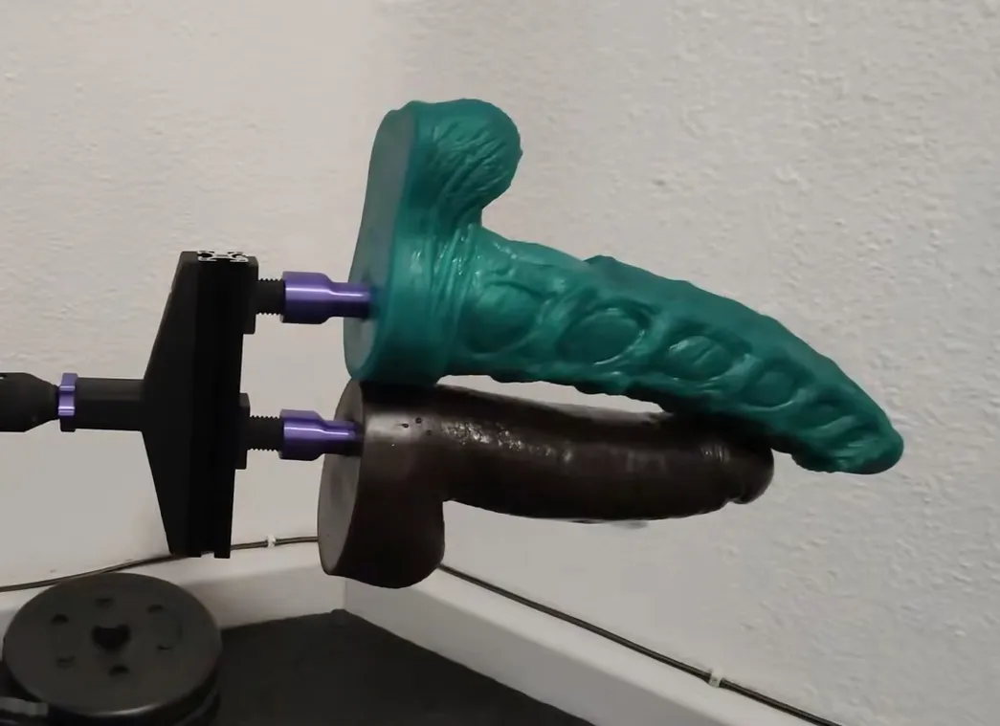
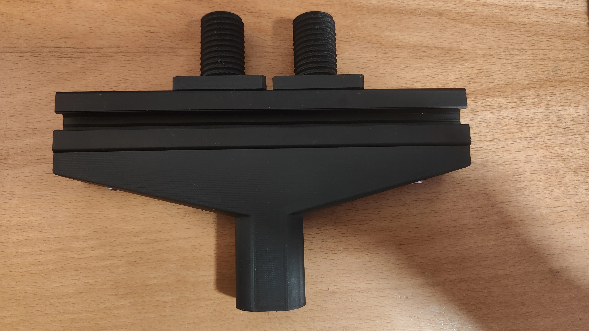

<Frame>
  
</Frame>

<Frame caption="Top-down view of the bracket with 3030 extrusion and dual 24mm threads">
  
</Frame>

A double penetration attachment for 24mm threading. Uses a 200mm 3030 aluminum extrusion for extra stability and two slidable 24mm threads mounted on T-nuts.

<Tip>
Recommended for use with the Capstan XL HG20 version for maximum rigidity, but compatible with any OSSM build.
</Tip>

## Bill of materials

| Part | Quantity | Notes |
|------|----------|-------|
| 3030 Aluminum Extrusion (200mm) | 1 | Provides the structural backbone |
| M5x10 Hex Cap Screw | 4 | Secures the 24mm threads |
| M5x20 Hex Cap Screw | 4 | Connects the main part to the 3030 extrusion |
| M5 T-Nut | 8 | For both thread mounts and extrusion attachment |

## Printed parts and CAD files

| Part | Files |
|------|-------|
| DP Attachment Body | [3MF](https://github.com/KinkyMakers/OSSM-hardware/blob/main/Printed%20Parts/OSSM%20Mods/SaladDressing%27s%20Mods/24mm%20DP%20Attachment/DP_Attachment.3mf) / [STL](https://github.com/KinkyMakers/OSSM-hardware/blob/main/Printed%20Parts/OSSM%20Mods/SaladDressing%27s%20Mods/24mm%20DP%20Attachment/DP_Attachment.stl) |
| DP Attachment Thread | [3MF](https://github.com/KinkyMakers/OSSM-hardware/blob/main/Printed%20Parts/OSSM%20Mods/SaladDressing%27s%20Mods/24mm%20DP%20Attachment/DP_Attachment_Thread.3mf) / [STL](https://github.com/KinkyMakers/OSSM-hardware/blob/main/Printed%20Parts/OSSM%20Mods/SaladDressing%27s%20Mods/24mm%20DP%20Attachment/DP_Attachment_Thread.stl) |
| STEP Source | [DP_Attachment.step](https://github.com/KinkyMakers/OSSM-hardware/blob/main/Printed%20Parts/OSSM%20Mods/SaladDressing%27s%20Mods/24mm%20DP%20Attachment/STEP/DP_Attachment.step) |

## Community support

<Card title="Discord Thread" icon="discord" href="https://discord.com/channels/559409652425687041/1437143419607847083">
  Join the discussion and share your experience with the DP attachment.
</Card>
