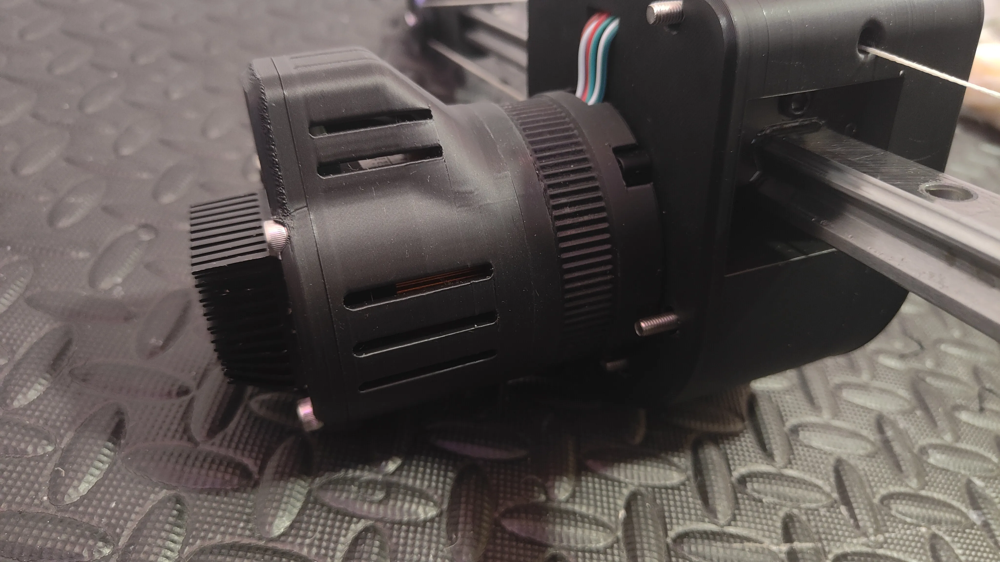
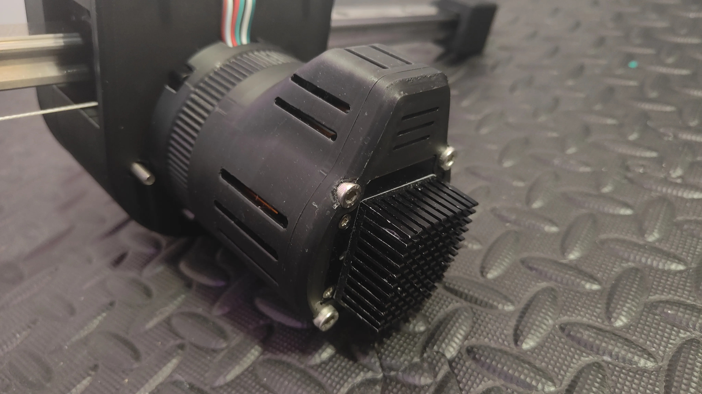
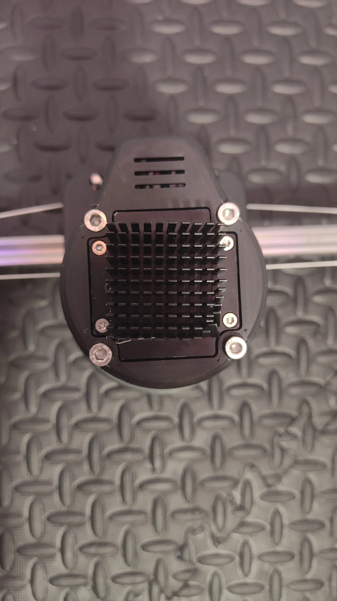

<Frame>
  
</Frame>

<Frame caption="Rear view showing heatsink clearance and ventilation slots">
  
</Frame>

<Frame caption="Back view showing heatsink mounting through the cover">
  
</Frame>

A protective cover designed for the 60AIM40F motor. Recommended for use with a heatsink attached to the back of the motor, where it gets the hottest during operation.

## Compatibility

This cover connects to @thearmpit's experimental 60AIM40F motor ring. To use it, you need to replace the nuts in the motor ring with M5x20 coupling nuts, then screw the cover onto the motor.

<Note>
You must replace the standard nuts in the motor ring with M5x20 coupling nuts before attaching this cover.
</Note>

## Bill of materials

| Part | Quantity |
|------|----------|
| M5x45 Hex Cap Screw | 4 |
| M5x20 Coupling Nut | 4 |

## Printed parts and CAD files

| Part | Files |
|------|-------|
| Motor Cover Front | [3MF](https://github.com/KinkyMakers/OSSM-hardware/blob/main/Printed%20Parts/OSSM%20Mods/SaladDressing%27s%20Mods/60AIM40F%20Motor%20Cover/MotorCoverFront.3mf) / [STL](https://github.com/KinkyMakers/OSSM-hardware/blob/main/Printed%20Parts/OSSM%20Mods/SaladDressing%27s%20Mods/60AIM40F%20Motor%20Cover/MotorCoverFront.stl) |
| Motor Cover Back | [3MF](https://github.com/KinkyMakers/OSSM-hardware/blob/main/Printed%20Parts/OSSM%20Mods/SaladDressing%27s%20Mods/60AIM40F%20Motor%20Cover/MotorCoverBack.3mf) / [STL](https://github.com/KinkyMakers/OSSM-hardware/blob/main/Printed%20Parts/OSSM%20Mods/SaladDressing%27s%20Mods/60AIM40F%20Motor%20Cover/MotorCoverBack.stl) |
| STEP Source | [MotorCover_60AIM40F.step](https://github.com/KinkyMakers/OSSM-hardware/blob/main/Printed%20Parts/OSSM%20Mods/SaladDressing%27s%20Mods/60AIM40F%20Motor%20Cover/STEP/MotorCover_60AIM40F.step) |

## Community support

<Card title="Discord Thread" icon="discord" href="https://discord.com/channels/559409652425687041/1437144846510063636">
  Join the discussion and share your experience with the motor cover.
</Card>
