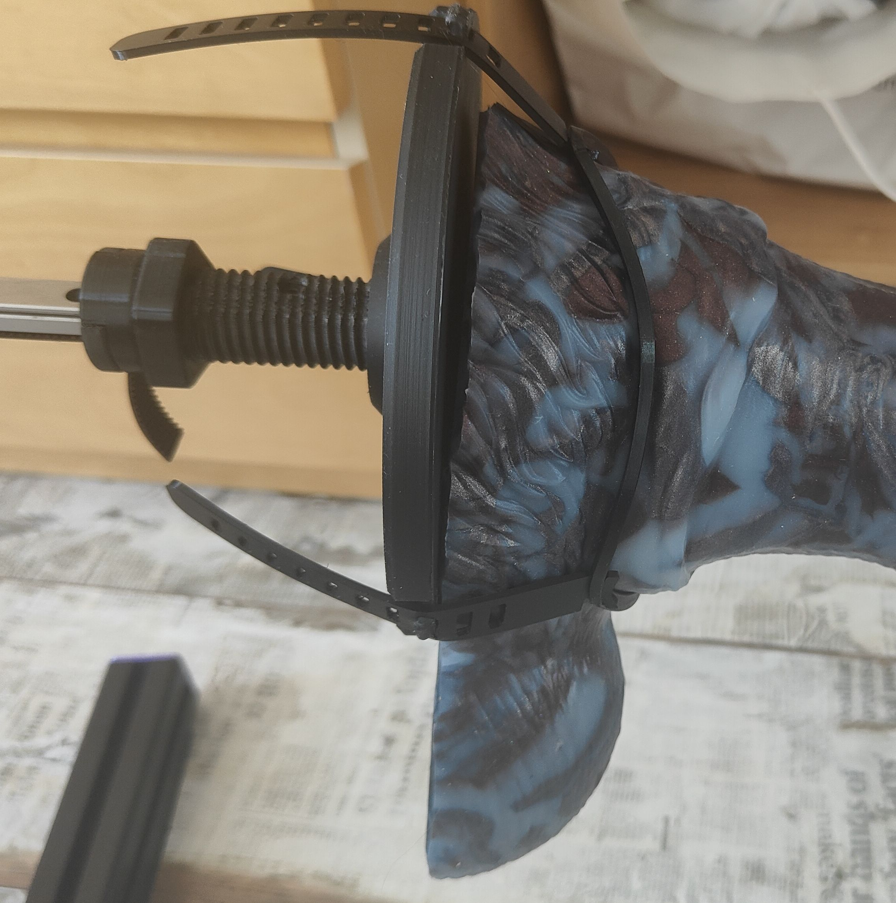

<Frame>
  
</Frame>

This remix of the Quick Change Strap Toy Mount by @arctan and @marc_o_v features detachable straps that separate from the ring, making it compatible with smaller print beds.

## Features

- **Smaller print bed compatibility**: Detachable strap design fits on more printers
- **Secure connection**: Very secure hold under normal use conditions
- **Based on proven design**: Remix of the original Quick Change Strap Toy Mount

<Warning>
The connection may slip under high load when lubricant comes into contact with the strap-ring interface. Ensure the connection area stays clean and dry during use.
</Warning>

## Requirements

<Note>
You need TPU filament to print the strap components. TPU provides the flexibility required for secure attachment and comfortable use.
</Note>

## Original design

This remix is based on the [Quick Change Strap Toy Mount](https://discord.com/channels/559409652425687041/1278049440787337226) by @arctan and @marc_o_v.

## Community support

<Card title="Discord Thread" icon="discord" href="https://discord.com/channels/559409652425687041/1279814763257397298">
  Join the discussion and share your experience with this mount design.
</Card>
