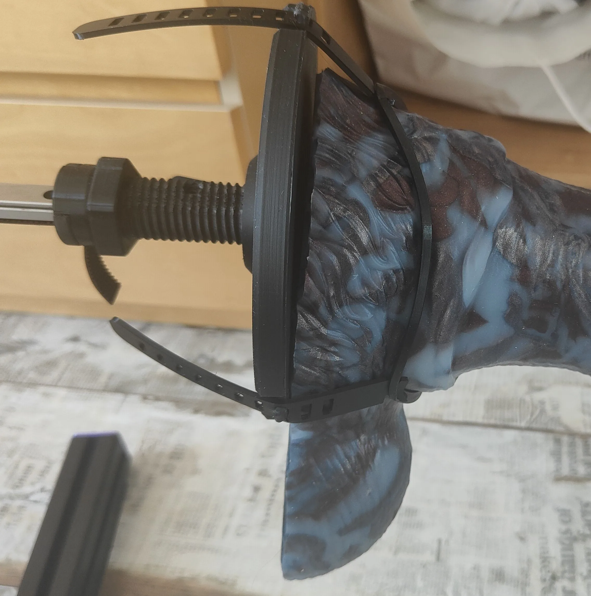

<Frame>
  
</Frame>

This remix of the Quick Change Strap Toy Mount by @arctan and @marc_o_v features detachable straps that separate from the ring, making it compatible with smaller print beds.

## Features

- **Smaller print bed compatibility**: Detachable strap design fits on more printers
- **Secure connection**: Very secure hold under normal use conditions
- **Based on proven design**: Remix of the original Quick Change Strap Toy Mount

<Warning>
The connection may slip under high load when lubricant comes into contact with the strap-ring interface. Ensure the connection area stays clean and dry during use.
</Warning>

## Requirements

<Note>
You need TPU filament to print the strap components. TPU provides the flexibility required for secure attachment and comfortable use.
</Note>

## Original design

This remix is based on the [Quick Change Strap Toy Mount](https://discord.com/channels/559409652425687041/1278049440787337226) by @arctan and @marc_o_v.

## Printed parts and CAD files

**Ring sizes (STL):**

| Part | File |
|------|------|
| Ring 30mm | [STL](https://github.com/KinkyMakers/OSSM-hardware/blob/main/Printed%20Parts/OSSM%20Mods/SaladDressing%27s%20Mods/Quick%20Change%20Strap%20Toy%20Mount%20Remix/Ring30mm.stl) |
| Ring 50mm | [STL](https://github.com/KinkyMakers/OSSM-hardware/blob/main/Printed%20Parts/OSSM%20Mods/SaladDressing%27s%20Mods/Quick%20Change%20Strap%20Toy%20Mount%20Remix/Ring50mm.stl) |
| Ring 60mm | [STL](https://github.com/KinkyMakers/OSSM-hardware/blob/main/Printed%20Parts/OSSM%20Mods/SaladDressing%27s%20Mods/Quick%20Change%20Strap%20Toy%20Mount%20Remix/Ring60mm.stl) |
| Ring 70mm | [STL](https://github.com/KinkyMakers/OSSM-hardware/blob/main/Printed%20Parts/OSSM%20Mods/SaladDressing%27s%20Mods/Quick%20Change%20Strap%20Toy%20Mount%20Remix/Ring70mm.stl) |
| Ring 80mm | [STL](https://github.com/KinkyMakers/OSSM-hardware/blob/main/Printed%20Parts/OSSM%20Mods/SaladDressing%27s%20Mods/Quick%20Change%20Strap%20Toy%20Mount%20Remix/Ring80mm.stl) |

**Straps (TPU -- print in flexible filament):**

| Part | File |
|------|------|
| Universal Strap (3mm notch) | [STL](https://github.com/KinkyMakers/OSSM-hardware/blob/main/Printed%20Parts/OSSM%20Mods/SaladDressing%27s%20Mods/Quick%20Change%20Strap%20Toy%20Mount%20Remix/universal_strap_3mm_notch.stl) |
| Universal Strap (4mm notch) | [STL](https://github.com/KinkyMakers/OSSM-hardware/blob/main/Printed%20Parts/OSSM%20Mods/SaladDressing%27s%20Mods/Quick%20Change%20Strap%20Toy%20Mount%20Remix/universal_strap_4mm_notch.stl) |
| Strap Source (Fusion 360) | [F3D](https://github.com/KinkyMakers/OSSM-hardware/blob/main/Printed%20Parts/OSSM%20Mods/SaladDressing%27s%20Mods/Quick%20Change%20Strap%20Toy%20Mount%20Remix/tpuStrap.f3d) |

## Community support

<Card title="Discord Thread" icon="discord" href="https://discord.com/channels/559409652425687041/1279814763257397298">
  Join the discussion and share your experience with this mount design.
</Card>
