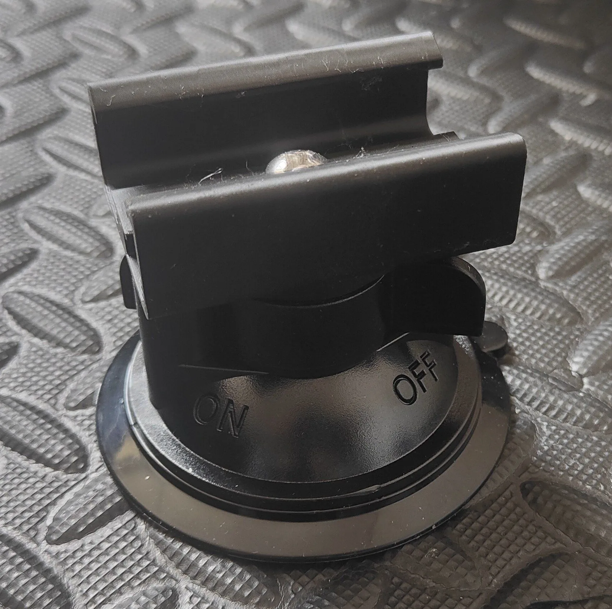

<Frame>
  
</Frame>

This bracket lets you attach heavy‑duty suction cups to 4040 aluminum extrusion, creating a solid, repositionable mounting point on smooth, non‑porous surfaces.

## Features

- Strong, temporary hold on smooth, non‑porous surfaces (glass, sealed metal, glazed tile)
- Maintains extrusion‑mount stability when properly installed
- Compatible with 4040 aluminum extrusion; validated with Type I profile
- Installs in minutes using basic hand tools

<Tip>
For maximum stability on an extrusion‑based stand, use four suction cups distributed across your mount.
</Tip>

## Compatibility

- Extrusion: 4040 aluminum extrusion (Type I profile recommended)
- Suction cup: 1/4‑20 threaded stud or 1/4‑20 female insert
- Hardware interface: 1/4‑20 fastener for the cup; M6 T‑nuts/bolts for typical 4040 extrusion slots

<Info>
The bracket mounts to your existing extrusion hardware. If you need spares, keep two M6 T‑nuts and two M6×12 (or similar) bolts on hand for each bracket.
</Info>

## Bill of materials

You need the following parts for each bracket:

| Part | Quantity | Notes |
|---|---:|---|
| Heavy‑duty suction cup with 1/4‑20 interface | 1 | Stud or female insert, rated for smooth, non‑porous surfaces |
| 1/4‑20 × 5/8" screw | 1 | Button or hex head; use with threadlocker if desired |
| M6 T‑nut (for 4040 extrusion) | 2 | Optional if you don’t already have spares |
| M6×12 bolt | 2 | Optional; matches the T‑nuts above |

<Warning>
Suction cups can release unexpectedly if the surface is dirty, textured, or if temperature/humidity changes occur. Do not use for overhead loads or in situations where unexpected release could cause injury or damage.
</Warning>

## Installation

<Steps>
<Step title="Prepare the surface and parts">
- Clean the target surface with isopropyl alcohol and a lint‑free cloth; let it dry.
- Inspect the suction cup for nicks or debris on the sealing lip.
- Gather: bracket, suction cup, 1/4‑20 × 5/8" screw, two M6 T‑nuts, two M6×12 bolts, hex keys.

<Check>
The surface should be smooth, dry, and free of dust or oils.
</Check>
</Step>

<Step title="Attach the suction cup to the bracket">
- Insert the 1/4‑20 screw through the bracket and into the suction cup’s threaded interface.
- Tighten until snug (finger‑tight plus a quarter‑turn). Avoid over‑tightening which can deform the cup mount.
</Step>

<Step title="Mount the bracket to the extrusion">
- Slide two M6 T‑nuts into the 4040 extrusion slot.
- Align the bracket holes with the T‑nuts and install the M6×12 bolts.
- Tighten evenly until the bracket is secure and cannot slide.
</Step>

<Step title="Set the suction cup and verify hold">
- Lightly moisten the cup’s rim (water only, no oils), press firmly against the surface, and engage the cup’s lever (if present).
- Perform a firm pull test to confirm a solid seal.

<Check>
After 5 minutes, re‑check for any movement or loss of vacuum. Re‑seat if needed.
</Check>
</Step>
</Steps>

## Best practices

- Place cups on flat, non‑textured, non‑porous surfaces only
- Distribute multiple cups to spread load and reduce peel forces
- Re‑seat cups if they have been loaded continuously for a long period
- Use medium‑strength threadlocker on the 1/4‑20 screw if you see loosening from vibration

<Tabs>
<Tab title="Glass">
- Ensure the glass is tempered/thick enough for expected forces
- Avoid mounting near edges where peel forces are highest
</Tab>
<Tab title="Metal or tile">
- Remove waxes/polishes; they can cause slow leaks
- On tile, avoid grout lines and textures
</Tab>
<Tab title="Sealed wood or laminate">
- Verify the finish is smooth and fully cured
- Test adhesion in an inconspicuous spot first
</Tab>
</Tabs>

## Troubleshooting

<AccordionGroup>
<Accordion title="Cup won’t stick or releases quickly">
- Clean both the surface and cup rim thoroughly
- Try a different surface; micro‑texture or matte coatings reduce adhesion
- Lightly moisten the rim with water and re‑seat with firm pressure
</Accordion>

<Accordion title="Bracket slides in the extrusion slot">
- Confirm you are using the correct T‑nuts for 4040
- Tighten both bolts evenly; add a star washer if needed for extra bite
</Accordion>

<Accordion title="Fastener loosening from vibration">
- Apply medium threadlocker to the 1/4‑20 screw and M6 bolts
- Re‑check tightness at the start of each session
</Accordion>
</AccordionGroup>

## Related

<CardGroup cols={2}>
<Card title="OSSM Mounting" icon="wrench" href="/open-source-sex-machine/ossm-mounting">
  Overview of extrusion and basic mounts for OSSM.
</Card>

<Card title="OSSM Extrusion Mount" icon="layers" href="/open-source-sex-machine/ossm-mounting/ossm-extrusion-mount">
  Bill of materials and hardware used across our extrusion‑based mounts.
</Card>
</CardGroup>

<Info>
Looking for community tips and real‑world mounting examples? Join our Kinky Makers Discord.

<DiscordInvite community="kinky-makers" />
</Info>
