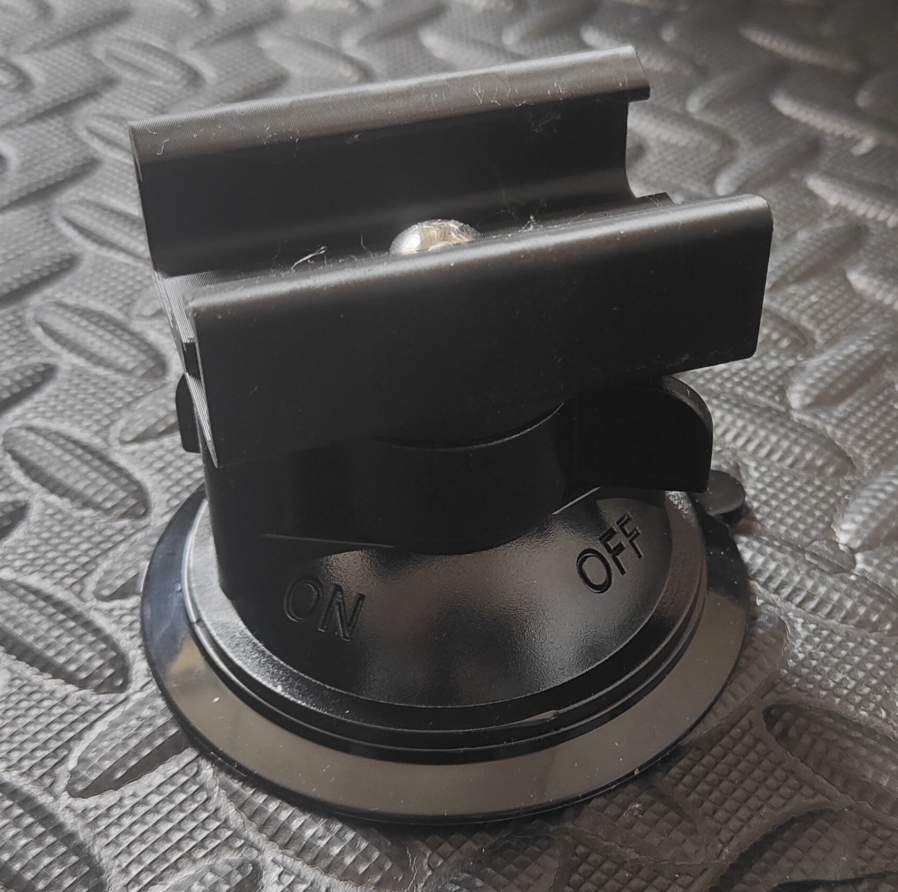

<Frame>
  
</Frame>

This bracket allows you to mount heavy-duty suction cups to 4040 aluminum extrusion, providing a stable and removable mounting solution.

## Features

- **Strong hold**: The suction cups provide excellent holding power on smooth surfaces
- **No stability loss**: Maintains full stability of the Shicks mount design
- **4040 extrusion compatible**: Tested with aluxprofile Type I extrusion

<Tip>
For maximum stability, use 4 suction cups total on your Shicks mount configuration.
</Tip>

## Bill of materials

You need the following parts for each bracket:

| Part | Quantity | Source |
|------|----------|--------|
| Suction Cup | 1 | [AliExpress](https://de.aliexpress.com/item/1005006355052746.html) |
| UNC-1/4 20 5/8" Screw | 1 | Hardware store |

## Community support

<Card title="Discord Thread" icon="discord" href="https://discord.com/channels/559409652425687041/1395419104231559361">
  Join the discussion and share your mounting setup.
</Card>
