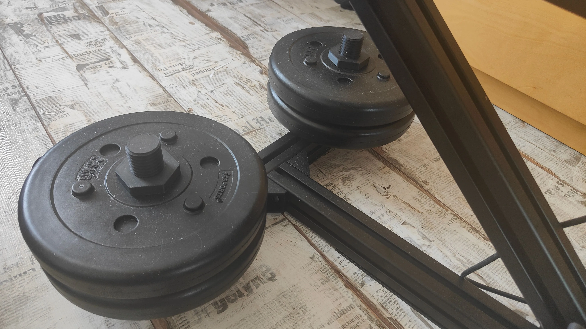

<Frame>
  
</Frame>

Use this bracket to add ballast to your extrusion-based stand. Mount a standard gym weight plate to your aluminum extrusion to lower the center of gravity, increase stability, and reduce movement during operation.

<Warning>
Adding ballast changes the load paths on your stand. Confirm your extrusion, fasteners, and mounting surface can safely support the added mass. Keep feet, cables, and soft tissue clear of the plate and bracket during use.
</Warning>

## Compatibility

- Weight plates: Standard 28–30 mm inner diameter plates (not Olympic/50 mm)
- Extrusion: Aluminum extrusion that accepts M5 T‑nuts
- Fasteners: M5 socket cap or button head screws

<Info>
This accessory is intended for ballast only. It is not a lifting or load‑bearing safety device.
</Info>

## Bill of materials

You need the following hardware for each bracket:

| Part | Quantity |
|------|----------|
| M5 × 12 screw | 2 |
| M5 T‑nut | 2 |

<Tip>
If your extrusion has a deeper slot or you stack multiple plates, upgrade to M5 × 14–16 mm screws for additional thread engagement. Use medium‑strength threadlocker to resist vibration loosening.
</Tip>

## Tools required

- 4 mm hex key (for most M5 fasteners)
- Torque driver (recommended)
- Threadlocker, medium strength (optional)

## Installation

<Steps>
<Step title="Plan placement">
Choose a low position on the base extrusion to keep the center of gravity near the floor and away from moving parts.

<Check>
Verify the bracket does not interfere with device motion throughout the full range of travel.
</Check>
</Step>

<Step title="Attach the bracket to the extrusion">
Insert two M5 T‑nuts into the extrusion slot. Align the bracket holes with the T‑nuts and start both M5 screws by hand.

<Check>
Ensure each T‑nut rotates and bites the slot when tightened. If a T‑nut spins freely, loosen slightly, reseat, and try again.
</Check>
</Step>

<Step title="Torque the fasteners">
Tighten both screws evenly until the bracket is snug. If available, torque to 4–5 N·m for typical steel M5 hardware in aluminum extrusion.

<Warning>
Do not overtighten—stripping the T‑nut or deforming the extrusion slot reduces holding strength.
</Warning>
</Step>

<Step title="Load the weight plate">
Slide a 28–30 mm ID plate fully onto the post and seat it against the bracket. If your plate rattles, add a thin rubber washer or tape shim between the plate and bracket.

<Check>
Try to rock the stand in all directions. The base should feel noticeably more stable with no bracket movement.
</Check>
</Step>
</Steps>

## Best practices

- Place weight as low and as centered as practical on the base to maximize stability.
- For heavier setups, use two brackets on opposite sides of the base to keep balance.
- Start with a lighter plate and increase gradually until stability meets your needs.
- Re‑check screw tightness before each session; vibration can loosen hardware over time.

## Troubleshooting

<AccordionGroup>
<Accordion title="The plate wobbles or rattles">
- Add a rubber washer or gasket between the plate and bracket
- Confirm the plate fully seats on the post
- Retorque the M5 screws and apply threadlocker
</Accordion>

<Accordion title="T‑nuts don’t engage the slot">
- Ensure you’re using T‑nuts sized for your extrusion profile
- Loosen, realign, and retighten so each T‑nut rotates 90° and bites the slot face
</Accordion>

<Accordion title="Stand still shifts under load">
- Add a second bracket on the opposite side or increase plate mass
- Verify the mounting surface has sufficient friction (add rubber feet or a mat)
- Confirm the device motion isn’t colliding with the plate or bracket
</Accordion>
</AccordionGroup>

## FAQs

- Does this fit Olympic plates? No. Olympic plates have a ~50 mm center hole. Use standard plates with a 28–30 mm inner diameter.
- What’s the maximum weight I can use? This depends on your extrusion, fasteners, and base design. Increase weight gradually and stop if you see any movement or deformation.
- Can I 3D print this bracket? If you print your own, use a strong material (PETG, ABS, ASA, or nylon) with high infill and multiple perimeters. Inspect regularly for wear or cracking.

## Related guides

<CardGroup cols={2}>
<Card title="OSSM: Basic Mount V2" icon="wrench" href="/ossm/guides/getting-started/quickstart">
Assembly notes and tips for the standard extrusion mount.
</Card>

<Card title="OSSM Ready‑to‑Play: Info Sheet" icon="info" href="/ossm/guides/getting-started/ready-to-play/info-sheet">
Safety considerations and setup checklist, including ballast guidance.
</Card>
</CardGroup>

## Community support

<Card title="Discord Thread" icon="discord" href="https://discord.com/channels/559409652425687041/1279819188390596669">
  Join the discussion and share your weight plate mounting setup.
</Card>
