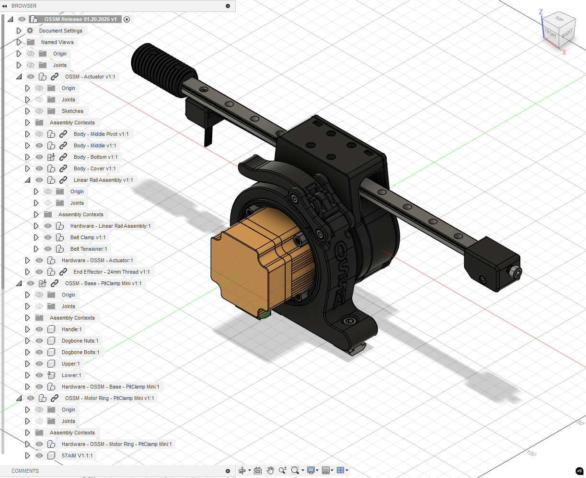
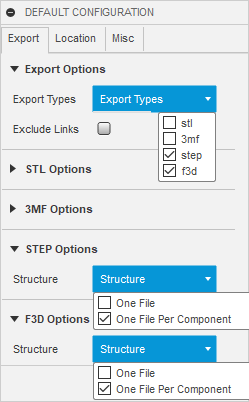
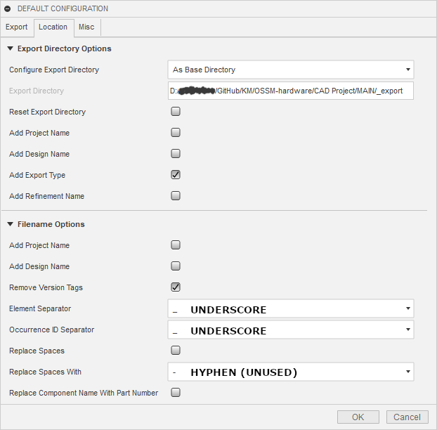
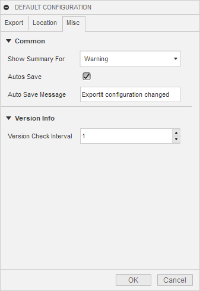

<Note>
This page is a work in progress.

**TODO:**
- 3030 Extrusion Stand Assembly
- Add "OSSM - Mod" multiple-component project template
- Determine if Hardware components should be "independent" (for now, designer's preference—independent could allow a scripted hardware count)
</Note>

Follow these guidelines when contributing user-designed projects to ensure easy incorporation into an official OSSM release.

<Frame caption="Overview of the OSSM standard printed parts structure">
  
</Frame>

## Project template

Use the contribution template located in [./Templates/](Templates) as your starting point. Replace "Project Name" in the Document and Component with your actual project name.

## Fusion file structure

Organize your Fusion 360 project following this hierarchy:

```
ProjectName
    (Bodies)
      <empty>
    (Component)ComponentNameOne
      (Bodies)
        ...
    (Component)ComponentNameTwo
      (Bodies)
        ...
    (Component)Hardware - ProjectName 
      (Bodies)
        <empty>
      (Component)HardwareName:1
        (Bodies)
          ...
      (Component)HardwareName:2
        (Bodies)
          ...
```

## Naming conventions

### Reserved characters

<Warning>
These characters have special behavior in documentation scripting. Follow these rules when naming Documents or Components.
</Warning>

| Character | Purpose | Usage rules |
|-----------|---------|-------------|
| `.` (dot) | Designates file extension | Allowed for versioning, e.g., `V1.1` |
| `-` (hyphen) | Designates parent-child Component relationship | Allowed in hardware names, e.g., `M5 T-Nut` |
| `_` (underscore) | Designates a Component | **Disallowed** |
| `[]` (brackets) | Designates reuse of hardware | Special use only |
| `()` (parentheses) | Designates special hardware instructions | Special use only |

### Single component projects

If your project contains only one printable Component, name that Component identically to the ProjectName.

### Parent-child component relationships

To designate a part as a child of a Parent Component, use the Parent Component's exact name followed by ` - ` and the Child Component name.

<Tip>
Example: `End Effector - 24mm Short` places the release file in the "End Effector" directory, named "24mm Short".
</Tip>

<Note>
Only one Parent-child relationship is allowed per Document, and it must be on a single level. For more complex relationships, nest Documents as linked Components.
</Note>

### Version increments

When updating a part from its initial release, append ` V#.#` (uppercase, case sensitive) to the Component Name, representing Major.Minor updates.

**Example:** `Ring V1.1`

### Hardware requirements

If your part requires hardware, nest all hardware as Components within a single top-level Component named `Hardware - ProjectName`.

**Example:** `Hardware - Body - Middle` where `Body - Middle` is the ProjectName.

### Reused hardware

When your part reuses hardware from a part it replaces, append ` [From:{Component}]` to the Component name.

**Example:** `M3 x 8 Cap Head Bolt [From:OSSM - Body - Middle]`

### Alternative hardware

When an alternative hardware option exists, append ` ({Specification} alternative)` to the Component Name.

**Example:** `M4x12 Cap Head Screw (M4 x 10 alternative)`

### Variant hardware

When hardware varies based on the user's setup, use `({Specification} for {variant},{Specification2} for {variant2})` in the Component Name.

**Example:** `(M6 x 15 Cap Head Screw for 3030 Extrusion,M6 x 20 Cap Head Screw for 4040 Extrusion)`

## Running a release from Fusion

<Note>
This section is for OSSM Project Leads only. The release process is a proof of concept that may evolve over time, but it relies on the above conventions being followed strictly.
</Note>

### Future work

- Convert `.stp` to `.stl` at high-quality refinement and bundle into `OSSM-Hardware/Hardware/OSSM Printed Parts` release
- Generate hardware documentation from `Hardware` named component structures

### Release steps

<Steps>
  <Step title="Update the Document name">
    Rename your Fusion Document to `OSSM Release $MM.DD.YYYY`.
  </Step>

  <Step title="Export the Document">
    Export your Fusion Document as `OSSM.f3z` to overwrite the current file.
  </Step>

  <Step title="Run ExportIt">
    Run the Add-In "ExportIt" using the settings shown below. This populates the `_export` directory with `f3d` and `step` folders.
  </Step>

  <Step title="Run the organization script">
    Run `OrganizeForRelease.ps1` in a PowerShell terminal from the directory containing the `_export` folder, next to `OSSM.f3z`.

    This creates a `RELEASE` folder with the date appended, organizing files in release configuration:
    - `.f3d` files are grouped based on Fusion nested structure
    - `.stp` files are grouped based on naming convention, with children grouped into parent directories
    - **Future:** Documentation framework generated referencing files in `Hardware` directories
  </Step>

  <Step title="Manual cleanup">
    Complete these final tasks:
    - Move the previous release to the `_archive` folder
    - Check for loose files in `_export` and remove them

    <Warning>
    Loose files in `_export` may indicate something went wrong during release generation.
    </Warning>
  </Step>
</Steps>

### ExportIt settings

Configure ExportIt with these settings:

#### Export tab

<Frame caption="ExportIt Export tab configuration">
  
</Frame>

#### Location tab

<Frame caption="ExportIt Location tab configuration">
  
</Frame>

#### Misc tab

<Frame caption="ExportIt Misc tab configuration">
  
</Frame>
