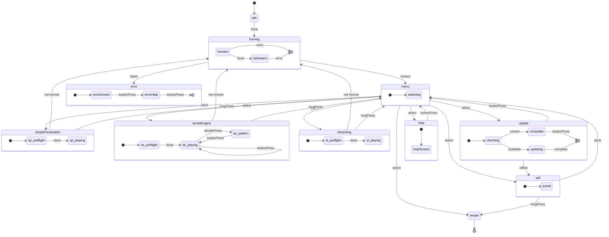

import { MermaidControls } from '/snippets/shared/mermaid-controls.jsx';

# State Machine Architecture

The OSSM firmware uses a declarative state machine to manage device behavior. This ensures predictable transitions between operating modes and prevents invalid states that could cause unexpected behavior.

## State Diagram

The following diagram shows all states and transitions in the OSSM state machine:

<MermaidControls />



## Design Overview

The state machine is implemented using [Boost.SML](https://boost-ext.github.io/sml/) (State Machine Language), a header-only C++14 library that provides a domain-specific language for defining state machines.

### Why Boost.SML?

Boost.SML was chosen for OSSM because it offers:

- **Compile-time verification** - Invalid transitions are caught at compile time, not runtime
- **Zero runtime overhead** - Performance equivalent to hand-written switch/case
- **Declarative syntax** - The transition table reads like documentation
- **Thread safety** - Built-in support for concurrent access via policies
- **Small footprint** - Single header, ~2000 lines of code, no dependencies

### Transition Table Syntax

Each row in the transition table follows this pattern:

```cpp
source_state + event [guard] / action = target_state
```

For example:

```cpp
"menu.idle"_s + buttonPress[(isOption(Menu::SimplePenetration))] = "simplePenetration"_s
```

This reads as: "When in `menu.idle` state and a `buttonPress` event occurs, if the guard `isOption(Menu::SimplePenetration)` returns true, transition to `simplePenetration` state."

<Info>
For a complete tutorial on transition table syntax, see the [Boost.SML Tutorial](https://boost-ext.github.io/sml/tutorial.html).
</Info>

## Events

Events trigger state transitions. They are simple structs defined in `Events.h` and can be dispatched from anywhere in the codebase.

| Event | Description | Typical Source |
|-------|-------------|----------------|
| `ButtonPress` | Single button click | Rotary encoder button |
| `LongPress` | Button held for extended duration | Rotary encoder button (held) |
| `DoublePress` | Two rapid button clicks | Rotary encoder button |
| `Done` | Async operation completed | Homing task, preflight check |
| `Error` | Operation failed | Homing failure, stroke too short |
| `EmergencyStop` | Immediate halt required | Safety systems |
| `Home` | Request homing sequence | External command |

### Dispatching Events

Events are dispatched using the `process_event` method:

```cpp
// From anywhere with access to the OSSM instance
ossm->sm->process_event(ButtonPress{});
ossm->sm->process_event(Done{});
```

<Tip>
Events are defined as empty structs. The type itself carries the meaning - no data payload is needed.
</Tip>

## Guards

Guards are conditional checks that determine whether a transition should occur. They return `true` to allow the transition or `false` to block it.

| Guard | Description | Returns `true` when... |
|-------|-------------|------------------------|
| `isOnline` | Check WiFi connection | Device is connected to WiFi |
| `isUpdateAvailable` | Check for firmware updates | Server reports newer version available |
| `isStrokeTooShort` | Validate homing result | Measured stroke is below minimum threshold |
| `isOption(Menu)` | Check selected menu item | Current menu selection matches the specified option |
| `isPreflightSafe` | Validate speed knob position | Speed potentiometer is in the dead zone (safe to start) |
| `isFirstHomed` | One-time initial homing check | This is the first successful homing since boot |
| `isNotHomed` | Check homing status | Device has not been homed or homing was invalidated |

### Guard Implementation

Guards are defined as lambda functions that receive the OSSM instance:

```cpp
auto isPreflightSafe = [](OSSM &o) {
    return getAnalogAveragePercent({Pins::Remote::speedPotPin, 50}) <
           Config::Advanced::commandDeadZonePercentage;
};
```

<Info>
For more on guard patterns, see the [Boost.SML Guards documentation](https://boost-ext.github.io/sml/user-guide.html#guards).
</Info>

## Actions

Actions are functions executed during state transitions. They perform side effects like updating the display, starting motors, or resetting settings.

### Display Actions

| Action | Description |
|--------|-------------|
| `drawHello` | Show welcome/boot screen |
| `drawMenu` | Render the main menu |
| `drawPlayControls` | Show speed/stroke/depth controls |
| `drawPatternControls` | Show pattern selection UI |
| `drawPreflight` | Show "reduce speed to start" warning |
| `drawHelp` | Display help/support information |
| `drawWiFi` | Show WiFi configuration screen |
| `drawUpdate` | Show "checking for updates" screen |
| `drawNoUpdate` | Show "firmware is up to date" message |
| `drawUpdating` | Show update progress |
| `drawError` | Display error state with message |

### Motion Actions

| Action | Description |
|--------|-------------|
| `startHoming` | Begin the homing sequence |
| `clearHoming` | Reset homing state variables |
| `startSimplePenetration` | Start Simple Penetration mode task |
| `startStrokeEngine` | Start Stroke Engine mode task |
| `startStreaming` | Start Streaming mode task |
| `emergencyStop` | Force stop motor and disable outputs |

### Settings Actions

| Action | Description |
|--------|-------------|
| `resetSettingsStrokeEngine` | Initialize defaults for Stroke Engine (speed=0, stroke=50, depth=10, sensation=50) |
| `resetSettingsSimplePen` | Initialize defaults for Simple Penetration (speed=0, stroke=0, depth=50) |
| `incrementControl` | Cycle through control parameters (stroke → depth → sensation) |
| `setHomed` | Mark device as successfully homed |
| `setNotHomed` | Invalidate homing (requires re-home before play) |

### System Actions

| Action | Description |
|--------|-------------|
| `restart` | Restart the ESP32 |
| `resetWiFi` | Clear saved WiFi credentials |
| `updateOSSM` | Download and install firmware update |

### Action Implementation

Actions are lambda functions that receive the OSSM instance and perform side effects:

```cpp
auto emergencyStop = [](OSSM &o) {
    o.stepper->forceStop();
    o.stepper->disableOutputs();
};
```

<Warning>
Actions must not block the main thread. Long-running operations should spawn FreeRTOS tasks instead.
</Warning>

<Info>
For more on action patterns, see the [Boost.SML Actions documentation](https://boost-ext.github.io/sml/user-guide.html#actions).
</Info>

## Thread Safety

The OSSM state machine is configured with thread-safe policies to handle events from multiple FreeRTOS tasks:

```cpp
sml::sm<OSSMStateMachine, sml::thread_safe<ESP32RecursiveMutex>, sml::logger<StateLogger>>
```

This uses a recursive mutex to protect state transitions, allowing safe event dispatch from:

- The main loop
- Button interrupt handlers
- BLE command handlers
- Background tasks

<Info>
For more on thread safety policies, see the [Boost.SML Policies documentation](https://boost-ext.github.io/sml/user-guide.html#policies).
</Info>

## State Logging

The firmware includes a `StateLogger` that logs all state transitions for debugging:

```cpp
sml::logger<StateLogger>
```

This outputs transition information via ESP-IDF logging, making it easy to trace state machine behavior during development.

## Further Reading

<CardGroup cols={2}>
<Card title="Boost.SML Tutorial" icon="graduation-cap" href="https://boost-ext.github.io/sml/tutorial.html">
  Step-by-step guide to building state machines with Boost.SML.
</Card>

<Card title="Boost.SML User Guide" icon="book" href="https://boost-ext.github.io/sml/user-guide.html">
  Complete reference for all Boost.SML features.
</Card>

<Card title="Operating Modes" icon="play" href="/ossm/Software/getting-started/operating-modes">
  Learn about Simple Penetration, Stroke Engine, and Streaming modes.
</Card>

<Card title="Safety Features" icon="shield" href="/ossm/Software/getting-started/safety-features">
  Understand preflight checks, disconnect safety, and emergency stop.
</Card>
</CardGroup>
