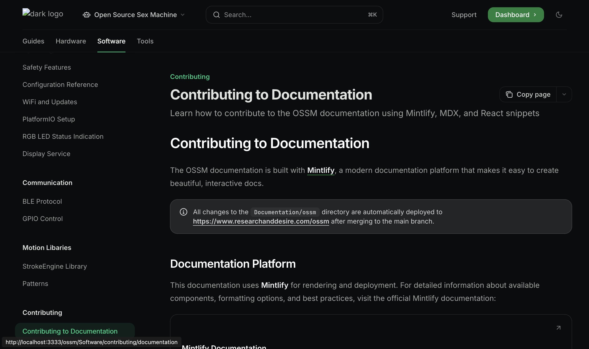

# Contributing to Documentation

The OSSM documentation is built with [Mintlify](https://www.mintlify.com/docs), a modern documentation platform that makes it easy to create beautiful, interactive docs.

<Info>
All changes to the `Documentation/ossm` directory are automatically deployed to [https://www.researchanddesire.com/ossm](https://www.researchanddesire.com/ossm) after merging to the main branch.
</Info>

## Documentation Platform

This documentation uses **Mintlify** for rendering and deployment. For detailed information about available components, formatting options, and best practices, visit the official Mintlify documentation:

<Card title="Mintlify Documentation" icon="book" href="https://www.mintlify.com/docs">
  Complete guide to Mintlify features, components, and configuration
</Card>

## Local Development Setup

To preview documentation changes locally before submitting a pull request:

<Steps>
<Step title="Navigate to the Documentation directory">
```bash
cd Documentation
```
</Step>

<Step title="Install dependencies">
```bash
pnpm i
```
</Step>

<Step title="Start the local preview server">
```bash
pnpm mint
```

This starts a local development server with hot-reload enabled.
</Step>

<Step title="View the preview">
Open your browser and navigate to:

```
http://localhost:3333
```

<Check>
The preview updates automatically as you edit MDX files.
</Check>
</Step>
</Steps>

<Warning>
The Mintlify web editor is **not available** for this project. All editing must be done locally using your preferred text editor.
</Warning>

### Local Preview

Once you have the local server running, you'll see the full documentation site with navigation, search, and all Mintlify features:



The preview includes the complete navigation sidebar, showing all sections including the new "Contributing" section under the Software tab.

## Writing Documentation

### MDX Format

All documentation pages use **MDX** (Markdown + JSX), which allows you to combine standard Markdown with React components for rich, interactive content.

**Example MDX structure:**

```mdx
---
title: "Page Title"
description: "Brief description for SEO and previews"
---

# Main Heading

Regular Markdown content works here.

<Info>
You can use Mintlify components like this.
</Info>

## Another Section

More content here...
```

### Image Guidelines

Images should be **co-located** with the documentation that uses them:

<CodeGroup>
```plaintext Structure
ossm/Software/communication/
├── ble.mdx
├── gpio.mdx
└── _images/
    ├── ble-diagram.png
    └── gpio-pinout.jpg
```

```mdx Usage

```
</CodeGroup>

<Tip>
Don't worry about image optimization—images are automatically optimized during the deployment process.
</Tip>

## React Snippets

For interactive examples and demonstrations, you can embed React components using the snippet system.

### Snippet Location

All React snippets are stored in:

```
Documentation/snippets/ossm/
```

### Snippet Requirements

<AccordionGroup>
<Accordion title="Pure React Only" icon="react">
Snippets must use **pure React** with no external frameworks or build tools. The React version is provided by the Mintlify runtime.

```jsx
// ✅ Good - Pure React
import { useState } from 'react';

export const Counter = () => {
  const [count, setCount] = useState(0);
  return <button onClick={() => setCount(count + 1)}>Count: {count}</button>;
};
```

```jsx
// ❌ Bad - External dependencies
import { useQuery } from 'react-query';
import axios from 'axios';
```
</Accordion>

<Accordion title="TailwindCSS Styling" icon="palette">
**TailwindCSS** is included and ready to use for styling. No additional CSS imports needed.

```jsx
export const StyledComponent = () => {
  return (
    <div className="p-4 bg-gray-100 rounded-lg shadow-md">
      <h2 className="text-xl font-bold text-gray-800">Hello</h2>
      <p className="mt-2 text-gray-600">Styled with Tailwind</p>
    </div>
  );
};
```
</Accordion>

<Accordion title="Single Export Rule" icon="code">
Each snippet file must have **exactly one** export or declared function. Multiple exports are not supported.

```jsx
// ✅ Good - Single export
export const MyComponent = () => {
  return <div>Content</div>;
};
```

```jsx
// ❌ Bad - Multiple exports
export const ComponentA = () => <div>A</div>;
export const ComponentB = () => <div>B</div>;
```
</Accordion>
</AccordionGroup>

### Example Snippet

Here's a complete example showing the proper structure:

<CodeGroup>
```jsx snippets/ossm/example-snippet.jsx
import { useState } from 'react';

export const ExampleSnippet = () => {
  const [isActive, setIsActive] = useState(false);

  return (
    <div className="p-6 bg-gradient-to-r from-blue-50 to-purple-50 rounded-xl">
      <h3 className="text-2xl font-bold text-gray-800 mb-4">
        Interactive Example
      </h3>
      <button
        onClick={() => setIsActive(!isActive)}
        className={`px-4 py-2 rounded-lg font-medium transition-colors ${
          isActive
            ? 'bg-green-500 text-white'
            : 'bg-gray-200 text-gray-700'
        }`}
      >
        {isActive ? 'Active' : 'Inactive'}
      </button>
      {isActive && (
        <p className="mt-4 text-gray-600">
          The component is now active!
        </p>
      )}
    </div>
  );
};
```

```mdx Usage in documentation
import ExampleSnippet from '/snippets/ossm/example-snippet.jsx';

<ExampleSnippet />
```
</CodeGroup>

## Development Tools

<Card title="Cursor Rules Included" icon="wand-magic-sparkles">
  This project includes Cursor AI rules to help you follow documentation best practices automatically while editing.
</Card>

## Next Steps

<CardGroup cols={2}>
<Card title="Mintlify Components" icon="puzzle-piece" href="https://www.mintlify.com/docs/components/accordions">
  Explore available components for creating rich documentation
</Card>

<Card title="How to Contribute" icon="code-pull-request" href="/ossm/guides/contributing/how-to-become-a-contributor">
  Learn the full contribution workflow for OSSM
</Card>

<Card title="BLE Protocol Docs" icon="file-code" href="/ossm/Software/communication/ble">
  Example of well-structured technical documentation
</Card>

<Card title="Forking Guide" icon="code-fork" href="/ossm/guides/contributing/forking">
  Set up your own copy of the repository to work on
</Card>
</CardGroup>
