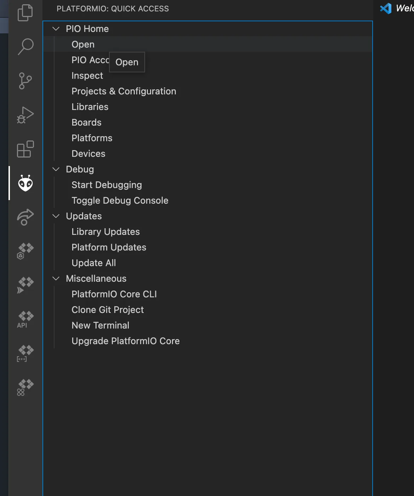

OSSM is developed using PlatformIO. If you're familiar with the Arduino IDE, transitioning to PlatformIO may seem daunting at first. Trust us—it's simpler than it looks and works far better than the Arduino IDE as the project grows.

<Tip>
PlatformIO excels at managing libraries and dependencies, which becomes critical as projects scale. Earlier OSSM builds could be adapted for the Arduino IDE, but the project has grown beyond that point. Learning PlatformIO is now easier than repackaging OSSM for Arduino with each release.
</Tip>

## Why PlatformIO?

- **More time for features** — Less time wrestling with dependency management
- **Easier collaboration** — Consistent development environment across contributors
- **Automatic downloads** — Libraries and dependencies pulled from GitHub automatically
- **Code intelligence** — Autocomplete, linting, and error detection built-in

## Installation

<Steps>
<Step title="Install VS Code and PlatformIO">
Install VS Code and the PlatformIO extension. You can find guides for this on the web.
</Step>

<Step title="Open PlatformIO">
Restart VS Code and wait until PlatformIO has started. Look for this button on the sidebar:

<Frame>

</Frame>
</Step>

<Step title="Click Open">
Click the "Open" button in the PlatformIO welcome screen.

<Frame>

</Frame>
</Step>

<Step title="Open the PlatformIO Home">
The PlatformIO Home interface will appear:

<Frame>

</Frame>
</Step>

<Step title="Open the OSSM project">
Click "Open Project" and navigate to the OSSM directory containing `platformIO.ini`.

<Frame>

</Frame>

<Frame>

</Frame>
</Step>

<Step title="Open main.cpp">
In the `src` directory, locate and click on `main.cpp`:

<Frame>

</Frame>
</Step>

<Step title="Compile and upload">
Near the bottom of the window, locate the tick icon (compile) and arrow icon (upload):

<Frame>

</Frame>

You can compile first to check for errors, or skip directly to upload.
</Step>
</Steps>

## Troubleshooting

<AccordionGroup>
<Accordion title="Upload fails or board not detected">
The most common issues are incorrect COM port selection or wrong board configuration.

### Check your COM port

The COM port (or `/dev/tty` on macOS/Linux) varies between machines. Set it in PlatformIO here:

<Frame>

</Frame>

<Note>
The reference OSSM board uses an embedded **Espressif ESP32 Dev Module**.
</Note>
</Accordion>

<Accordion title="Build fails due to library updates">
If the project fails to build, an external library update may have introduced compatibility issues.

Try pinning the platform version by changing this line in `platformIO.ini`:

```ini platformIO.ini
# Change this:
platform = espressif32

# To this:
platform = espressif32@3.5.0
```

<Warning>
Always check the project's release notes for the recommended platform version.
</Warning>
</Accordion>
</AccordionGroup>
