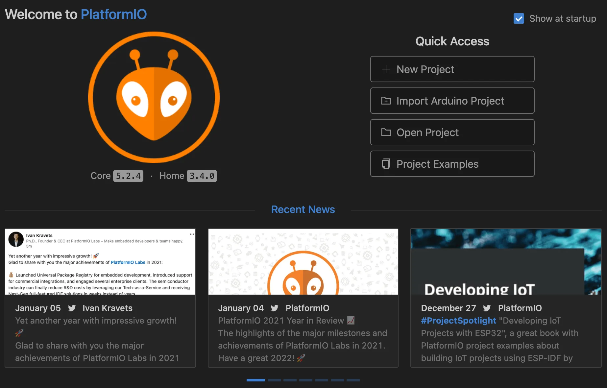
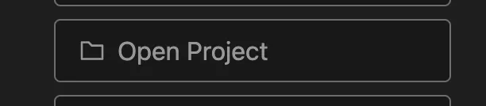
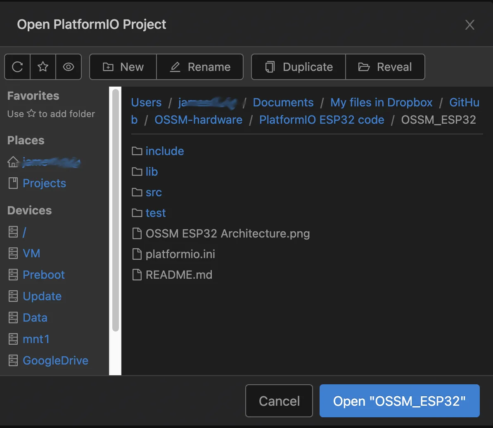
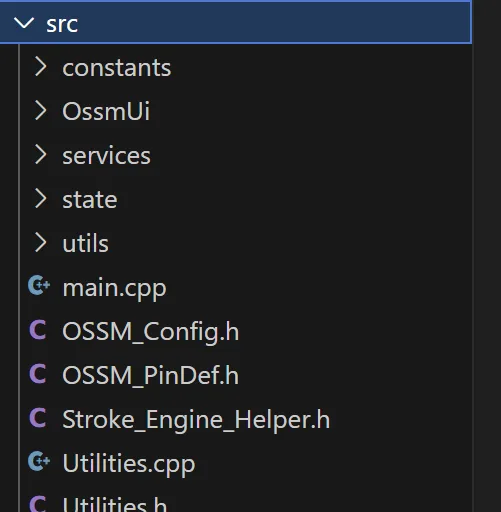
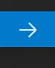
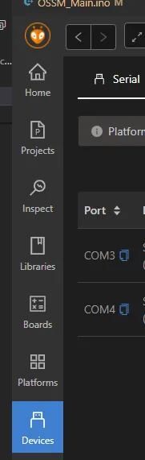

OSSM is built with PlatformIO on top of VS Code. If you're coming from the Arduino IDE, the transition can look unfamiliar at first—but you'll get faster builds, better dependency management, and a consistent setup across contributors.

<Tip>
PlatformIO manages libraries, toolchains, and build environments for you. Earlier OSSM releases could be adapted to Arduino, but the project has outgrown that approach. Learning PlatformIO takes less time than repackaging OSSM for Arduino every release.
</Tip>

## Why PlatformIO?

- More time for features — less time wrestling with dependencies
- Easier collaboration — consistent development environment for every contributor
- Automatic dependency resolution — libraries fetched and pinned for reproducible builds
- Code intelligence — autocomplete, linting, and inline error detection

## Prerequisites

- VS Code installed
- USB data cable for your board (charge-only cables will fail to upload)
- Board drivers installed if required by your OS (e.g., CP210x or CH340)

<Note>
The reference OSSM board uses an embedded <strong>Espressif ESP32 Dev Module</strong>.
</Note>

## Installation

<Steps>
<Step title="Install VS Code and PlatformIO">
Install VS Code, then add the "PlatformIO IDE" extension from the VS Code Marketplace. After installation, restart VS Code to activate PlatformIO.

<Check>
You should see the alien-head PlatformIO icon in the Activity Bar on the left.
</Check>
</Step>

<Step title="Open PlatformIO Home">
Click the PlatformIO icon to open PlatformIO Home.

<Frame>

</Frame>

<Frame>

</Frame>
</Step>

<Step title="Open the OSSM project">
From PlatformIO Home, select "Open Project" and choose the OSSM folder that contains `platformio.ini` (lowercase).

<Frame>

</Frame>

<Frame>

</Frame>

<Check>
The Explorer should show `platformio.ini`, a `src/` folder, and a `lib/` folder.
</Check>
</Step>

<Step title="Select the correct environment (if applicable)">
If the project defines multiple environments in `platformio.ini` (e.g., different boards or build options), use the environment selector in the VS Code Status Bar (usually labeled with the active environment) to pick the one that matches your board.

<Note>
If there is only one environment, PlatformIO selects it automatically.
</Note>
</Step>

<Step title="Open the firmware entry point">
Open `src/main.cpp` to review the firmware source.

<Frame>

</Frame>
</Step>

<Step title="Build and upload the firmware">
Use the ✓ (Build) icon to compile and the → (Upload) icon to flash the board. These controls are in the Status Bar at the bottom of VS Code.

<Frame>

</Frame>

- Build first to catch errors locally, or upload directly to compile and flash in one step.
- Ensure your board is connected and the correct serial port is selected.

<Check>
A successful build ends with `SUCCESS` in the terminal. A successful upload shows `Hash of data verified` or a similar confirmation from the ESP32 uploader.
</Check>
</Step>
</Steps>

## Common tasks

- Select serial port: PlatformIO → Quick Access → "Select Serial Port".
- Monitor serial output: Click the plug icon (Monitor) in the Status Bar, or run `PlatformIO: Monitor` from the Command Palette.
- Clean build: Run `PlatformIO: Clean` to remove compiled artifacts before rebuilding.

## Troubleshooting

<AccordionGroup>
<Accordion title="Upload fails or board not detected">
The most common causes are an incorrect serial port or board configuration.

### Check your serial port

On Windows, the board appears as `COMx`. On macOS/Linux, it appears under `/dev/tty.*` or `/dev/cu.*`.

Set the port in PlatformIO:

<Frame>

</Frame>

<Tip>
If you don't see a port, try a different USB cable, a different USB port, or install the appropriate USB-to-UART driver for your board.
</Tip>

<Note>
The reference OSSM board target is **Espressif ESP32 Dev Module**. Ensure your `platformio.ini` environment uses the correct `board` setting for ESP32.
</Note>
</Accordion>

<Accordion title="Build fails due to library or platform updates">
An update to a platform or library may introduce breaking changes. Pin versions in `platformio.ini` to restore a known-good configuration.

```ini platformio.ini
; Example: pin the Espressif32 platform
platform = espressif32@3.5.0
```

<Warning>
Always check the project's release notes for the recommended platform and library versions.
</Warning>
</Accordion>

<Accordion title="Serial monitor shows gibberish">
This usually indicates a baud rate mismatch.

- Check `monitor_speed` in `platformio.ini` (e.g., `115200`)
- Make sure the firmware and Serial Monitor use the same baud rate
</Accordion>

<Accordion title="Stuck in connecting… during upload">
- Hold or tap the board's BOOT/EN buttons as required by your ESP32 module
- Press reset after upload completes if the board does not auto-restart
- Disconnect other apps that might be using the same serial port
</Accordion>
</AccordionGroup>

<Info>
If you run into issues not covered here, capture the full PlatformIO build/upload log from the VS Code Terminal and include it when asking for help. The log contains the selected environment, platform versions, and exact error messages.
</Info>
