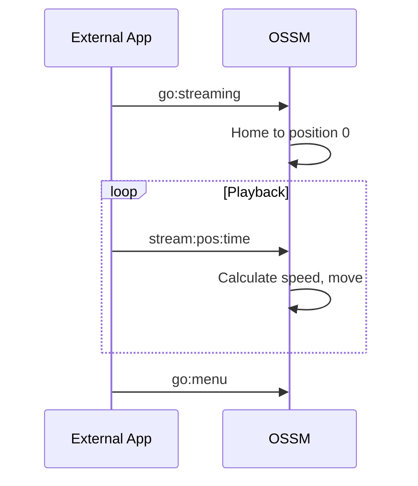

The OSSM firmware provides three main operating modes, each designed for different use cases. This guide explains how to navigate the menu system and use each mode effectively.

## Menu navigation

After homing completes, the OSSM displays the main menu on the remote's OLED screen.

| Action | Result |
|--------|--------|
| **Rotate encoder** | Scroll through menu options |
| **Press encoder** | Select the highlighted option |
| **Long-press encoder** | Return to menu (from any operating mode) |

<Info>
The menu wraps around—scrolling past the last item brings you back to the first.
</Info>

## Main menu options

| Option | Description |
|--------|-------------|
| **Simple Penetration** | Basic operation with speed and stroke controls |
| **Stroke Engine** | Advanced pattern-based control with depth, stroke, and sensation |
| **Streaming (experimental)** | External control mode for funscript playback and third-party applications |
| **Update** | Check for and install firmware updates (requires WiFi) |
| **WiFi Setup** | Configure wireless network connection |
| **Get Help** | Display QR code linking to setup documentation |
| **Restart** | Restart the controller and re-home |

## Simple Penetration mode

Simple Penetration provides straightforward control with minimal parameters. It's ideal for users who want reliable operation without complexity.

### Default settings

| Parameter | Default Value |
|-----------|---------------|
| Speed | 0% |
| Stroke | 0% |
| Depth | 50% |
| Sensation | 50% |

### Controls

<Tabs>
<Tab title="Speed">
The **left knob** (potentiometer) controls speed from 0% to 100%.

- Turn clockwise to increase speed
- Turn counterclockwise to decrease speed
- Speed must be near zero to enter the mode (safety feature)
</Tab>

<Tab title="Stroke">
The **right encoder** controls stroke length from 0% to 100%.

- Turn clockwise to increase stroke length
- Turn counterclockwise to decrease stroke length
- Stroke determines how far the actuator travels on each cycle
</Tab>
</Tabs>

### Session statistics

Simple Penetration tracks three statistics during your session:

| Statistic | Description |
|-----------|-------------|
| **Stroke count** | Number of complete strokes performed |
| **Distance** | Total distance traveled (displayed in meters or feet) |
| **Time** | Duration since the session started |

These statistics display at the bottom of the screen and reset when you return to the menu.

<Tip>
Simple Penetration is best for straightforward use cases where you want consistent, predictable motion without pattern variations.
</Tip>

## Stroke Engine mode

Stroke Engine provides advanced pattern-based control with four adjustable parameters. It uses the [StrokeEngine library](/ossm/Software/motion/stroke-engine/introduction) to generate varied motion patterns.

### Default settings

| Parameter | Default Value |
|-----------|---------------|
| Speed | 0% |
| Stroke | 50% |
| Depth | 10% |
| Sensation | 50% |

<Note>
Stroke Engine starts with different defaults than Simple Penetration—notably a lower depth (10%) and higher stroke (50%)—to provide a gentler initial experience with pattern-based motion.
</Note>

### Controls

<Tabs>
<Tab title="Speed">
The **left knob** (potentiometer) controls speed from 0% to 100%.

Speed affects how fast the patterns execute, measured in cycles per minute.
</Tab>

<Tab title="Parameters">
The **right encoder** controls three parameters. Press the encoder to cycle between them:

| Parameter | Description |
|-----------|-------------|
| **Depth** | How far into the body the actuator travels at its deepest point |
| **Stroke** | The distance the actuator retracts from the deepest point |
| **Sensation** | A pattern-specific modifier that changes behavior (see [Patterns](/ossm/Software/motion/stroke-engine/Pattern)) |

The currently selected parameter displays with a full-width bar; inactive parameters show as smaller indicators.
</Tab>

<Tab title="Pattern selection">
**Double-press** the right encoder to open pattern selection.

Use the encoder to scroll through available patterns, then press to select. The pattern changes immediately.

Press the encoder or double-press again to return to parameter controls.
</Tab>
</Tabs>

### Available patterns

Stroke Engine provides 7 motion patterns:

| Index | Pattern | Behavior |
|-------|---------|----------|
| 0 | Simple Stroke | Balanced acceleration, coasting, and deceleration |
| 1 | Teasing Pounding | Speed shifts based on sensation; balances faster strokes |
| 2 | Robo Stroke | Sensation varies acceleration from robotic to gradual |
| 3 | Half'n'Half | Alternates between full and half depth strokes |
| 4 | Deeper | Stroke depth increases each cycle; sensation sets cycle count |
| 5 | Stop'n'Go | Pauses between strokes; sensation adjusts pause length |
| 6 | Insist | Modifies stroke length while maintaining speed |

<Info>
For detailed pattern descriptions and sensation effects, see the [Pattern documentation](/ossm/Software/motion/stroke-engine/Pattern).
</Info>

## Streaming mode (experimental)

<Warning>
Streaming mode is experimental and not recommended for general play. The protocol and behavior may change in future firmware updates. Only use streaming with trusted applications from known sources.
</Warning>

Streaming mode allows external applications to send real-time position commands to the OSSM via BLE. Unlike Simple Penetration and Stroke Engine which generate motion patterns internally, Streaming mode receives exact position targets from an external source—enabling synchronized playback with video content, funscripts, or custom control applications.

### How streaming works

1. Select **Streaming** from the main menu (or send `go:streaming` via BLE)
2. The OSSM homes to position 0 (fully retracted) and waits for commands
3. External applications send `stream:<position>:<time>` commands
4. The OSSM moves to each target position within the specified time
5. The display shows the current streaming state

### When to use Streaming mode

- **Funscript playback**: Sync motion with video content using the [Funscript Player](/ossm/tools/funscript-player)
- **Third-party integrations**: Applications that generate real-time position data
- **Custom automation**: Developers building BLE control applications

### Safety considerations

<Warning>
Streaming mode accepts commands from external sources. Only use applications you trust, and always test at low intensity before full engagement. Keep your physical stop controls accessible.
</Warning>

- The OSSM validates incoming commands but relies on the external application for safe motion planning
- If the BLE connection is lost, the OSSM ramps down speed over 2 seconds and stops
- Local controls remain accessible—use the emergency stop (long-press encoder) if needed

### Controls

While in Streaming mode:
- **Speed knob**: Not used for streaming (external commands control motion)
- **Encoder rotation**: Not used for streaming
- **Long-press encoder**: Emergency stop and return to menu

### Technical details

| Property | Value |
|----------|-------|
| Command format | `stream:<position>:<time>` |
| Position range | 0-100 (percentage of stroke) |
| Time unit | Milliseconds |
| Minimum firmware | Version 3.0+ |

<CardGroup cols={2}>
<Card title="Funscript Player" icon="play" href="/ossm/tools/funscript-player">
  Play funscript files synchronized with video.
</Card>

<Card title="BLE Protocol" icon="bluetooth" href="/ossm/Software/communication/ble">
  Full streaming command reference and protocol details.
</Card>
</CardGroup>

## Exiting any mode

From any operating mode, **long-press the encoder for approximately 3 seconds** to trigger an emergency stop and return to the main menu.

<Warning>
Emergency stop immediately halts motion and marks the device as "not homed." You may need to restart and re-home before operating again.
</Warning>

## Related pages

<CardGroup cols={2}>
<Card title="Safety Features" icon="shield" href="/ossm/Software/getting-started/safety-features">
  Learn about preflight checks, disconnect safety, and emergency stop.
</Card>

<Card title="StrokeEngine Patterns" icon="wave-pulse" href="/ossm/Software/motion/stroke-engine/Pattern">
  Detailed descriptions of each motion pattern and sensation effects.
</Card>

<Card title="Funscript Player" icon="play" href="/ossm/tools/funscript-player">
  Play funscript files synchronized with video using streaming mode.
</Card>

<Card title="BLE Protocol" icon="bluetooth" href="/ossm/Software/communication/ble">
  Technical reference for BLE commands including streaming.
</Card>
</CardGroup>
