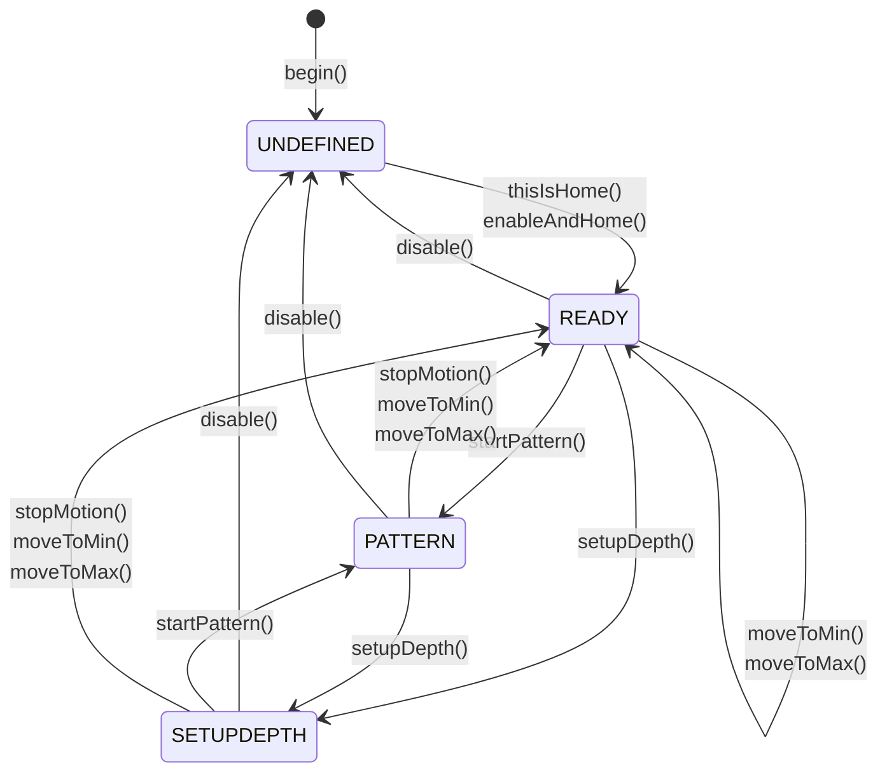

StrokeEngine is a library for creating a variety of stroking motions with stepper or servo motors on an ESP32. You can use it with any DIY machine featuring a linear position drive powered by a stepper or servo motor.

<CardGroup cols={2}>
  <Card title="FuckIO Example" icon="code" href="https://github.com/theelims/FuckIO">
    Reference implementation using StrokeEngine
  </Card>
  <Card title="OSSM Project" icon="gear" href="https://github.com/KinkyMakers/OSSM-hardware">
    Popular open-source implementation by Kinky Makers
  </Card>
</CardGroup>

## Core concepts

StrokeEngine takes full advantage of servo and stepper driven machines over fixed cam-driven designs. Under the hood, it uses the [FastAccelStepper](https://github.com/gin66/FastAccelStepper) library to interface with motors using standard STEP/DIR signals.

<Tip>
Understanding these concepts helps you get up and running with StrokeEngine faster.
</Tip>

### Coordinate system

The machine uses an internal coordinate system that converts real-world metric units into encoder/stepper steps. This abstraction works with all machine sizes regardless of the motor you choose.

<Frame caption="StrokeEngine coordinate system showing physical travel, keepout boundaries, and stroke parameters">
  
</Frame>

**Key coordinate concepts:**

| Term | Description |
|------|-------------|
| **physicalTravel** | The real physical travel from one hard endstop to the other |
| **keepoutBoundary** | Safety distance subtracted from each side to prevent crashes |
| **_travel** | Working distance: `physicalTravel - (2 * keepoutBoundary)` |
| **Home** | Position at `-keepoutBoundary` (typically at the rear) |
| **MIN = 0** | Zero position, `keepoutBoundary` away from home |
| **Depth** | The furthest point the machine extends (adjustable at runtime) |
| **Stroke** | The working distance of a stroking motion (adjustable at runtime) |

<Note>
Think of **Stroke** as the amplitude and **Depth** as a linear offset added to it. The positive move direction is towards the front (towards the body).
</Note>

### Patterns

StrokeEngine uses a pattern generator to provide a wide variety of sensations. Patterns dynamically adjust parameters like speed, stroke, and depth on a motion-by-motion basis using trapezoidal motion profiles.

Each pattern accepts four parameters:
- **depth** — Maximum extension point
- **stroke** — Motion amplitude  
- **speed** — Cycles per minute
- **sensation** — Arbitrary modifier for pattern behavior (-100 to 100)

<Info>
See the [Pattern documentation](/ossm/Software/motion/stroke-engine/Pattern) for detailed descriptions of available patterns and instructions for creating your own.
</Info>

### Graceful error handling

StrokeEngine handles invalid parameters gracefully without interrupting operation:

- All setter functions use `constrain()` to limit inputs to the machine's physical capabilities
- Values outside bounds are automatically cropped
- Pattern commands that exceed machine limits result in shortened strokes or adjusted ramps
- Motion completes over the full distance but may take slightly longer than expected

### Mid-stroke parameter updates

You can update depth, stroke, speed, and pattern parameters mid-stroke for a responsive, fluid user experience. Built-in safeguards ensure the machine stays within bounds at all times.

### State machine

An internal finite state machine manages the machine states:



| State | Description |
|-------|-------------|
| **UNDEFINED** | Initial state before homing. Motor is disabled and position is unknown. |
| **READY** | Homing complete. Machine accepts motion commands. |
| **PATTERN** | Pattern generator is running cyclic motions. |
| **SETUPDEPTH** | Motor follows the depth position for interactive adjustment. |

## Usage

StrokeEngine provides a simple yet powerful API. Specify all input parameters in real-world metric units.

### Initialize the library

<Steps>
  <Step title="Define pin configurations">
    Set up the pins for your motor driver and optional homing switch:

```cpp main.cpp
#include <StrokeEngine.h>

// Pin Definitions
#define SERVO_PULSE       4
#define SERVO_DIR         16
#define SERVO_ENABLE      17
#define SERVO_ENDSTOP     25        // Optional: Only needed with a homing switch
```
  </Step>

  <Step title="Configure motor properties">
    Calculate steps per millimeter based on your hardware:

```cpp main.cpp
// Calculation Aid:
#define STEP_PER_REV      2000      // Steps per revolution (check driver DIP switches)
#define PULLEY_TEETH      20        // Teeth on the drive pulley
#define BELT_PITCH        2         // Timing belt pitch in mm
#define MAX_RPM           3000.0    // Maximum motor RPM
#define STEP_PER_MM       STEP_PER_REV / (PULLEY_TEETH * BELT_PITCH)
#define MAX_SPEED         (MAX_RPM / 60.0) * PULLEY_TEETH * BELT_PITCH

static motorProperties servoMotor {
  .maxSpeed = MAX_SPEED,              // Maximum speed in mm/s
  .maxAcceleration = 10000,           // Maximum acceleration in mm/s²
  .stepsPerMillimeter = STEP_PER_MM,  // Steps per millimeter 
  .invertDirection = true,            // Flip direction if motor moves wrong way
  .enableActiveLow = true,            // Enable signal polarity      
  .stepPin = SERVO_PULSE,             // STEP signal pin
  .directionPin = SERVO_DIR,          // DIR signal pin
  .enablePin = SERVO_ENABLE           // Enable signal pin
};
```
  </Step>

  <Step title="Define machine geometry">
    Specify the physical dimensions of your machine:

```cpp main.cpp
static machineGeometry strokingMachine = {
  .physicalTravel = 160.0,            // Total travel between hard endstops (mm)
  .keepoutBoundary = 5.0              // Safety margin on each side (mm)
};
```
  </Step>

  <Step title="Configure homing">
    Set up the endstop switch properties:

```cpp main.cpp
static endstopProperties endstop = {
  .homeToBack = true,                 // Endstop at rear of machine
  .activeLow = true,                  // Switch wired active low
  .endstopPin = SERVO_ENDSTOP,        // Endstop pin number
  .pinMode = INPUT                    // Use INPUT with external pull-up
};

StrokeEngine Stroker;
```
  </Step>

  <Step title="Initialize in setup()">
    Call the initialization functions and wait for homing to complete:

```cpp main.cpp
void setup() {
  // Initialize StrokeEngine
  Stroker.begin(&strokingMachine, &servoMotor);
  Stroker.enableAndHome(&endstop);
  
  // Your other initialization code here
  
  // Wait for homing to complete
  while (Stroker.getState() != READY) {
    delay(100);
  }
}
```

<Check>
When `getState()` returns `READY`, the machine is homed and ready for motion commands.
</Check>
  </Step>
</Steps>

### Manual homing (no endstop switch)

<Warning>
Manual homing is dangerous. Calling `thisIsHome()` when not at the physical endstop causes an incorrect coordinate system, resulting in a crash that could damage your machine.
</Warning>

If your machine lacks a homing switch, you can use manual homing:

1. Physically move the machine to the rear endstop
2. Call `Stroker.thisIsHome()`

```cpp
Stroker.thisIsHome();
```

This enables the driver, sets the current position as `-keepoutBoundary`, and slowly moves to position 0.

### Retrieve available patterns

Use `getNumberOfPattern()` and `getPatternName()` to enumerate available patterns:

```cpp patterns.cpp
String getPatternJSON() {
    String JSON = "[{\"";
    for (size_t i = 0; i < Stroker.getNumberOfPattern(); i++) {
        JSON += String(Stroker.getPatternName(i));
        JSON += "\": ";
        JSON += String(i, DEC);
        if (i < Stroker.getNumberOfPattern() - 1) {
            JSON += "},{\"";
        } else {
            JSON += "}]";
        }
    }
    Serial.println(JSON);
    return JSON;
}
```

## Motion control

### Start and stop motion

| Function | Description |
|----------|-------------|
| `Stroker.startPattern()` | Start the pattern-based stroking motion |
| `Stroker.stopMotion()` | Stop immediately with maximum deceleration |

### Position commands

Move to either end of the machine for setup purposes:

```cpp
Stroker.moveToMin();        // Move to rear (home) position
Stroker.moveToMax();        // Move to front (maximum) position
Stroker.moveToMax(10.0);    // Move at 10 mm/s (default speed)
```

<Note>
These functions can be called from `PATTERN` or `READY` states and stop any current motion. They return `false` if called in an invalid state.
</Note>

### Interactive depth setup

Enter depth setup mode where the motor follows the depth position in real-time:

```cpp
Stroker.setupDepth();           // Default 10 mm/s
Stroker.setupDepth(10.0);       // Specify speed
```

Update the depth position with `Stroker.setDepth(float)` and read the current value with `Stroker.getDepth()`.

<Tip>
**Fancy Mode:** Call `Stroker.setupDepth(10.0, true)` to adjust both depth and stroke interactively. The sensation slider maps to the interval `[depth-stroke, depth]`:
- `sensation = 100` — Adjusts depth position
- `sensation = -100` — Adjusts stroke position  
- `sensation = 0` — Positions at stroke midpoint
</Tip>

### Parameter functions

Update parameters at any time. Values are automatically constrained to machine limits:

```cpp
// Setter functions
Stroker.setSpeed(float speed, bool applyNow);      // 0.5–6000 cycles/min
Stroker.setDepth(float depth, bool applyNow);      // 0 to _travel (mm)
Stroker.setStroke(float stroke, bool applyNow);    // 0 to _travel (mm)
Stroker.setSensation(float sensation, bool applyNow); // -100 to 100
Stroker.setPattern(int index, bool applyNow);      // 0 to getNumberOfPattern()-1
```

<Info>
Set `applyNow` to `true` to apply changes immediately mid-stroke. Otherwise, changes take effect after the current stroke completes.
</Info>

Read back the constrained values actually used by StrokeEngine:

```cpp
// Getter functions
float speed = Stroker.getSpeed();         // Cycles per minute
float depth = Stroker.getDepth();         // Depth in mm
float stroke = Stroker.getStroke();       // Stroke length in mm
float sensation = Stroker.getSensation(); // -100 to 100
int pattern = Stroker.getPattern();       // Pattern index
```

## Advanced features

### Telemetry callback

Register a callback to receive telemetry data for each trapezoidal move:

```cpp
void callbackTelemetry(float position, float speed, bool clipping) {
  // Handle telemetry data
}

Stroker.registerTelemetryCallback(callbackTelemetry);
```

<Note>
Consult [StrokeEngine.h](https://github.com/theelims/StrokeEngine/blob/main/src/StrokeEngine.h) in the source repository for the complete API reference, including overloaded functions and additional features.
</Note> 
