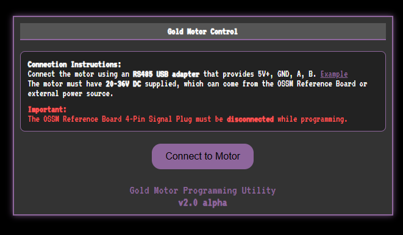
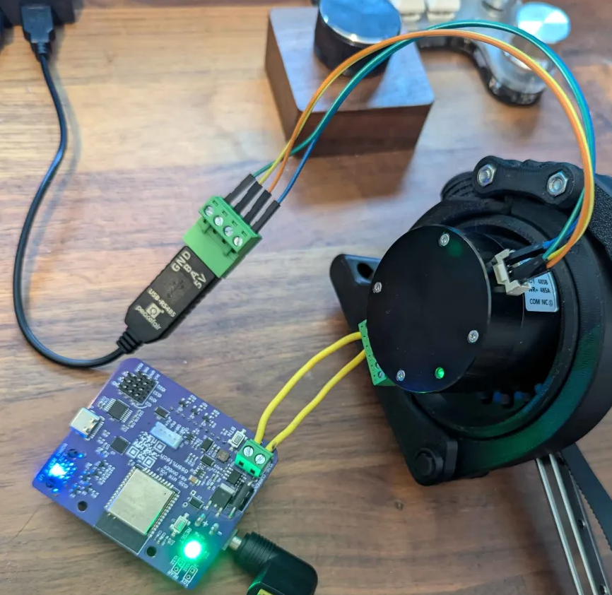
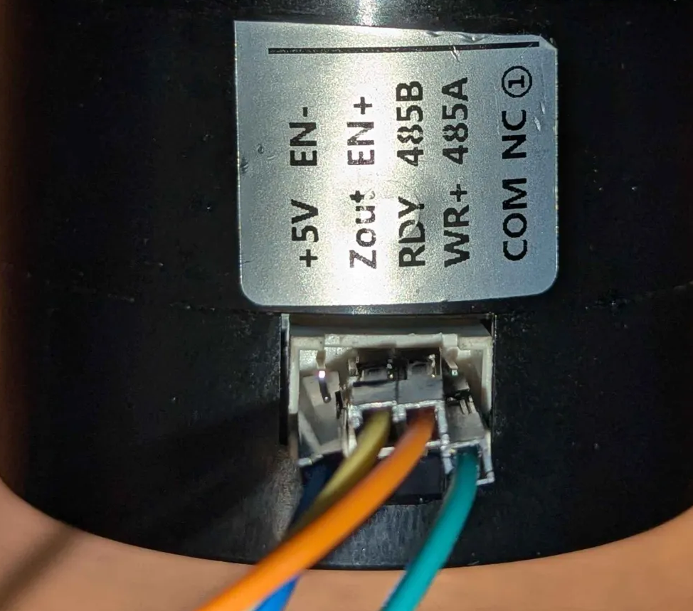

<h1> Gold Motor Programming Tool </h1>

## Web-Based GMP Tool

The easiest way to program your Gold Motor is using the web-based tool:

**🔗 [https://armpitmfg.com/ossm/gmp/](https://armpitmfg.com/ossm/gmp/)**

This tool runs entirely in your browser using the Web Serial API (Chrome, Edge, or other Chromium-based browsers).

## Connection Instructions

0. **⚠️ IMPORTANT: Disconnect the Signal Cable**
   - The **OSSM Reference Board 4-Pin Signal Plug must be disconnected** while programming
   - Only reconnect after programming is complete

1. **Connect the RS485 USB Adapter**
   - Use an RS485 to USB adapter that provides: **5V+, GND, A, B**
   - [Example adapter on Amazon](https://www.amazon.com/CERRXIAN-Terminal-Converter-Serial-Windows/dp/B09JMT9D59)
   - Match the pins correctly (A to A, B to B)

2. **Power the Motor**
   - The motor **must** have **20-36V DC** power supplied
   - This can come from the OSSM Reference Board or an external power source
   - Look for the **green light** on the rear of the servo to confirm power

## Using the Tool

1. Open the web tool and click **"Connect to Motor"**
2. Select your USB serial port from the browser dialog
3. The tool will read the current motor settings and display them
4. Adjust settings as needed:
   - **Basic settings** are shown by default (recommended for OSSM)
   - **Advanced settings** can be shown but may make the motor unusable if changed incorrectly
5. Click **"Write Settings"** to program the motor
6. The tool writes settings multiple times for reliability
7. Verify the updated values are displayed correctly

Example wiring if you don't have the special plug that fits the AIM series motor programming port:

## Running Locally

You can also run the tool locally from the `GMP` folder. Open `index.html` in a browser that supports Web Serial API (Chrome, Edge, etc.).

<!-- 

<h1> Old Python Script </h1>
This pyhton script will write the default changes to the gold motor and show all the current settings in mostly english

the settings we change by default are

Watch out, I got tired of using the tool provided by the vendor and this was done quickly one night with ChatGPT as my copilot... -->
