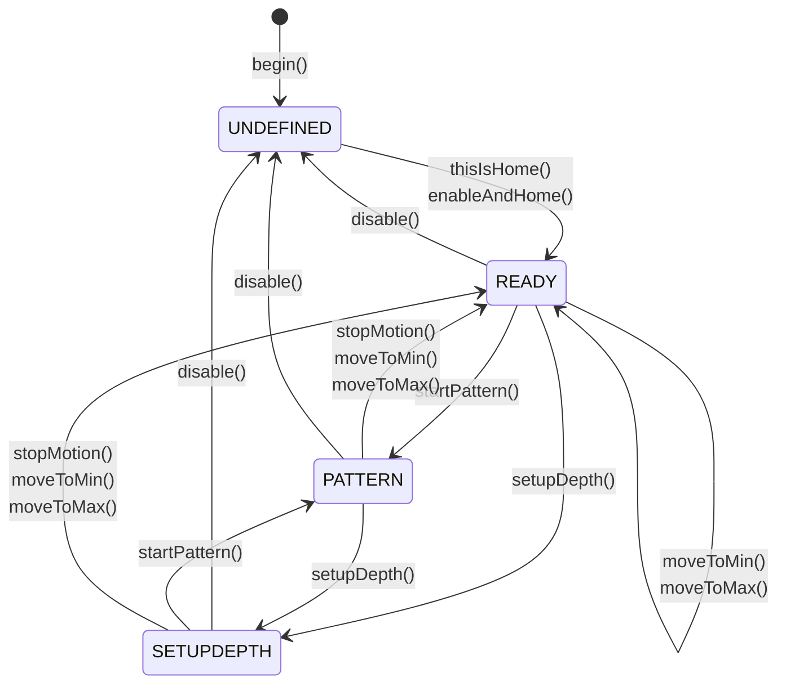

# StrokeEngine
A library to create a variety of stroking motions with a stepper or servo motor on an ESP32. A usage example can be found in my other related project: [FuckIO](https://github.com/theelims/FuckIO). It will work with all kinds of stepper / servo operated fucking and stroking machines. An other popular example is the Kinky Makers [OSSM-Project](https://github.com/KinkyMakers/OSSM-hardware)

Every DIY fucking machine with a linear position drive powered by a stepper or servo motor can be used with this library. 

## Concepts
StrokeEngine takes full advantage of the freedom a servo / stepper driven stroking or fucking machine can provide over fixed cam-driven designs. To this date there are only few commercial offerings using this advantage. And often so the implementation is rather boring, not utilizing the full possibilities of such a linear position drive. 

Under the hood it uses the fabulous [FastAccelStepper](https://github.com/gin66/FastAccelStepper) library to interface stepper or servo motors with commonly found STEP / DIR interfaces.

Understanding the underlying concepts will help you to get up and running with StrokeEngine faster. 

### Coordinate System
The machine spans it's own internal coordinate system. It takes the real world (metric) units and converts them into the internal coordinate system just counting the encoder / stepper steps of the motor and vice versa. This offers the advantage, that this is independent of a specific implementation and works with all machine sizes and regardless of the motor chosen. 


* The system is 1-dimensional and the positive move direction is towards the front a.k.a. towards the body.
* The __physicalTravel__ is the real physical travel the machine has from one hard endstop to the other. 
* From `physicalTravel` a safety distance called __keepoutBoundary__ is subtracted on each side giving the real working distance **_travel**: 
  ```
  _travel = physicalTravel - (2 * keepoutBoundary)
  ``` 
  This gives a safety margin to avoid crashes into a hard endstop.
* The __Home__-position is expected to be at `-keepoutBoundary`. Albeit not recommended for safety reasons, it is possible to mount the home switch in the front at `physicalTravel` as well.
* Zero __MIN = 0__ is `keepoutBoundary` away from the home position.
* Pattern make use of __Depth__ and __Stroke__. These values are dynamic parameter and may be adjusted during runtime:
  * __Depth__ is the furthest point the machine can extract at any given time. This is useful to find a sweet spot in positioning the body relative to the machine.
  * __Stroke__ is the longest working distance a stroking motion will have.

Think of __Stroke__ as the amplitude and __Depth__ a linear offset that is added.

### Pattern
One of the biggest benefits of a linear position drive over a cam-driven motion is its versatility. StrokeEngine uses a pattern generator to provide a wide variety of sensations where parameters like speed, stroke and depth are adjusted dynamically on a motion by motion basis. It uses a trapezoidal motion profile with a defined acceleration and deceleration distance. In between it moves with a constant speed. Pattern take __depth__, __stroke__, __speed__ and an arbitrary __sensation__ parameter. In [Pattern.md](./Pattern.md) you can find a detailed description of each available pattern. Also some information how to write your own patterns and contribute them to this project.

### Graceful Behavior
One design goal was to have a unobtrusive failure handling when invalid parameters are given. Either from the user with values that lay outside the physics of the machine, or from a pattern commanding an impossible speed, position or acceleration. All set-functions make use of a `constrain()`-function to limit the input to the physical capabilities of the given machine. Values outside the bounds are simply cropped. 

Also on the pattern side `constrain()` is used to ensure no impossible motion commands leading to crashes or step losses are executed. This manifests in a distortion of the motion. Strokes may be shortened when position targets outside of the machine bounds are requested (e.g. `stroke > depth`). Acceleration and speed are limited leading to  distorted ramps. The motion is executed over the full distance, but may take slightly longer then expected to reach the target position. 

### Mid-Stroke Parameter Update
It is possible to update any parameter like depth, stroke, speed and pattern mid-stroke. This gives a very responsive and fluid user experience. Safeguards are in place to ensure the move stays inside the bounds of the machine at any time.

### State Machine
An internal finite state machine handles the different states of the machine. See the below graph with all functions relating to the state machine and how to cause transitions:

* __UNDEFINED:__ The initial state prior to homing. Stepper / Servo are disabled and the position is undefined.
* __READY:__ Homing defines the position inside the internal coordinate system. Machine is now ready to be used and accepts motion commands.
* __PATTERN:__ The cyclic motion has started and the pattern generator is commanding a sequence of trapezoidal motions until stopped.
* __SETUPDEPTH:__ The servo always follows the depth position. This can be used to setup the optimal stroke depth. 

## Usage
StrokeEngine aims to have a simple and straight forward, yet powerful API. The following describes the minimum case to get up and running. All input parameters need to be specified in real world (metric) units.
### Initialize
First all parameters of the machine and the servo need to be set. Including the pins for interacting with the driver and an (optionally) homing switch.
```cpp
#include <StrokeEngine.h>

// Pin Definitions
#define SERVO_PULSE       4
#define SERVO_DIR         16
#define SERVO_ENABLE      17
#define SERVO_ENDSTOP     25        // Optional: Only needed if you have a homing switch

// Calculation Aid:
#define STEP_PER_REV      2000      // How many steps per revolution of the motor (S1 off, S2 on, S3 on, S4 off)
#define PULLEY_TEETH      20        // How many teeth has the pulley
#define BELT_PITCH        2         // What is the timing belt pitch in mm
#define MAX_RPM           3000.0    // Maximum RPM of motor
#define STEP_PER_MM       STEP_PER_REV / (PULLEY_TEETH * BELT_PITCH)
#define MAX_SPEED         (MAX_RPM / 60.0) * PULLEY_TEETH * BELT_PITCH

static motorProperties servoMotor {
  .maxSpeed = MAX_SPEED,              // Maximum speed the system can go in mm/s
  .maxAcceleration = 10000,           // Maximum linear acceleration in mm/s²
  .stepsPerMillimeter = STEP_PER_MM,  // Steps per millimeter 
  .invertDirection = true,            // One of many ways to change the direction,  
                                      // should things move the wrong way
  .enableActiveLow = true,            // Polarity of the enable signal      
  .stepPin = SERVO_PULSE,             // Pin of the STEP signal
  .directionPin = SERVO_DIR,          // Pin of the DIR signal
  .enablePin = SERVO_ENABLE           // Pin of the enable signal
};

static machineGeometry strokingMachine = {
  .physicalTravel = 160.0,            // Real physical travel from one hard endstop to the other
  .keepoutBoundary = 5.0              // Safe distance the motion is constrained to avoiding crashes
};

// Configure Homing Procedure
static endstopProperties endstop = {
  .homeToBack = true,                 // Endstop sits at the rear of the machine
  .activeLow = true,                  // switch is wired active low
  .endstopPin = SERVO_ENDSTOP,        // Pin number
  .pinMode = INPUT                    // pinmode INPUT with external pull-up resistor
};

StrokeEngine Stroker;
```
Inside `void setup()` call the following functions to initialize the StrokeEngine:
```cpp
void setup() 
{
  // Setup Stroke Engine
  Stroker.begin(&strokingMachine, &servoMotor);
  Stroker.enableAndHome(&endstop);    // pointer to the homing config struct
  
  // other initialization code
  
  // wait for homing to complete
  while (Stroker.getState() != READY) {
    delay(100);
  }
}
```

#### Alternate Manual Homing Procedure __[Dangerous]__
Some machines may not have a homing switch mounted. For these you may use a manual homing procedure instead of `Stroker.enableAndHome(&endstop);`. Manually move back until the physical endstop and then call:
```cpp
Stroker.thisIsHome();
```
This enables the driver and sets the current position as `-keepoutBoundary`. It then slowly moves to 0. 

__Be sure to know what you do. If this function is called while not at the physical endstop the internal coordinate system is off resulting in a certain crash! This could damage your machine!__

#### Retrieve Available Patterns as JSON-String
This is an example snippet showing how `Stroker.getNumberOfPattern()` and `Stroker.getPatternName(i)` may be used to iterate through the available patterns and composing a JSON-String.
```cpp
String getPatternJSON() {
    String JSON = "[{\"";
    for (size_t i = 0; i < Stroker.getNumberOfPattern(); i++) {
        JSON += String(Stroker.getPatternName(i));
        JSON += "\": ";
        JSON += String(i, DEC);
        if (i < Stroker.getNumberOfPattern() - 1) {
            JSON += "},{\"";
        } else {
            JSON += "}]";
        }
    }
    Serial.println(JSON);
    return JSON;
}
```

### Running
#### Start & Stop the Stroking Action
Use `Stroker.startPattern();` and `Stroker.stopMotion();` to start and stop the motion. Stop is immediate and with the highest possible acceleration.

#### Move to the Minimum or Maximum Position
You can move to either end of the machine for setting up reaches. Call `Stroker.moveToMin();` to move all they way back towards home. With `Stroker.moveToMax();` it moves all the way out. Takes the speed in mm/s as an argument: e.g. `Stroker.moveToMax(10.0);` Speed defaults to 10 mm/s. Can be called from states `SERVO_RUNNING` and `SERVO_READY` and stops any current motion. Returns `false` if called in a wrong state.

#### Setup Optimal Depth Interactively
In a special setup mode it will always follow the __Depth__ position. By evoking `Stroker.setupDepth();` it will start to follow the depth position whenever `Stroker.setDepth(float);` is updated. Takes the speed in mm/s as an argument: e.g. `Stroker.setupDepth(10.0);` Speed defaults to 10 mm/s. With `float Stroker.getDepth()` one may obtain the current set depth to calculate incremental updates for `Stroker.setDepth(float)`. Can be called from states `SERVO_RUNNING` and `SERVO_READY` and stops any current motion. Returns `false` if called in a wrong state. 

##### Fancy Mode
To setup the optimal depth and reach of the machine `Stroker.setupDepth(10.0, true)` evokes a special fancy adjustment mode. This allows not only to interactively adjust `depth`, but also `stroke` by using the sensation slider. `sensation` gets mapped into the interval `[depth-stroke, depth]`: `sensation = 100` adjusts `depth`-position, whereas `sensation = -100` adjusts the `stroke`-position. `sensation = 0` yields the midpoint of the stroke.

#### Change Parameters
Parameters can be updated in any state and are stored internally. On `Stroker.startMotion();` they will be used to initialize the pattern. Each one may be called individually. The argument given to the function is constrained to the physical limits of the machine:
```cpp
Stroker.setSpeed(float speed, bool applyNow);          // Speed in Cycles (in & out) per minute, constrained from 0.5 to 6000
Stroker.setDepth(float depth, bool applyNow);          // Depth in mm, constrained to [0, _travel]
Stroker.setStroke(float stroke, bool applyNow);        // Stroke length in mm, constrained to [0, _travel]
Stroker.setSensation(float sensation, bool applyNow);  // Sensation (arbitrary value a pattern may use to alter its behavior), 
                                                       // constrained to [-100, 100] with 0 being neutral.
Stroker.setPattern(int index, bool applyNow);          // Pattern, index must be < Stroker.getNumberOfPattern()
```
Normally a parameter change is only executed after the current stroke has finished. However, sometimes it is desired to have the changes take effect immediately, even mid-stroke. In that case set the argument `bool applyNow` to `true`. 

#### Readout Parameters
Each set-function has a corresponding get-function to read out what parameters are currently set. As each set-function constrains it's input one can read back the truncated value that is actually used by the StrokeEngine. This is useful for implementing UI's.

```cpp
float Stroker.getSpeed();          // Speed in Cycles (in & out) per minute, constrained from 0.5 to 6000
float Stroker.getDepth();          // Depth in mm, constrained to [0, _travel]
float Stroker.getStroke();         // Stroke length in mm, constrained to [0, _travel]
float Stroker.getSensation();      // Sensation (arbitrary value a pattern may use to alter its behavior), 
                                   // constrained to [-100, 100] with 0 being neutral.
int Stroker.getPattern();          // Pattern, index is [o, Stroker.getNumberOfPattern()[
```

### Advanced Functions
Consult [StrokeEngine.h](./src/StrokeEngine.h) for further functions and a more detailed documentation of each function. Some functions are overloaded and may provide additional useful functionalities.
#### Telemetry
It is possible to receive telemetry information's about each trapezoidal move a pattern generates. You may register a callback function y calling `Stroker.registerTelemetryCallback(callbackTelemetry)` with the following signature `void callbackTelemetry(float position, float speed, bool clipping)`. 
