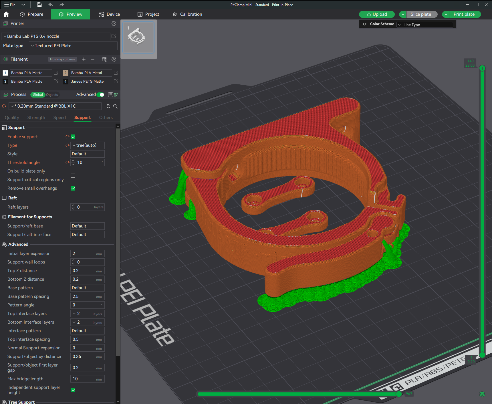

# (EXPERIMENTAL) PitClamp Mini (Print-In-Place)

### [Bill Of Materials](BOM.md)  
### [Preconfigured 3mf Files](Preconfigured%203mf%20Files/) has slicer file that contains support and other print settings preconfigured.

## Summary    
This is the same as PitClamp Mini, but reduces hardware requirements by replacing the rear hinge (M6x20) and Handle Lever hinge (M4x12) with hinges that are printed in place.  

The clearance used in the hinge gaps is 0.15mm, you should have your printer dialed in before trying this print.   

The hinges should break loose after printing without much difficulty.   

## Other Parts:
You will also need (from the main file directory):

    PitClamp Mini - Common - Dogbone Bolts
    PitClamp Mini - Common - Dogbone Nuts
    Ring of your choice

## Printing:
The entire project is intended for:  
  - 0.4mm nozzle (Wider should not cause problems)
  - 0.2mm layer height (Necessary for some built-in helper features)
  - Standard strength (5 wall) profile
  - 15% gyroid or crosshatch infill
    - Higher infill optional

Print in the provided STL orientation

### Supports
Required under the handle and by the hinge.  
I used organic/tree supports, set to 10 degree threshold. 

Recommended supports are all visible in this image:
