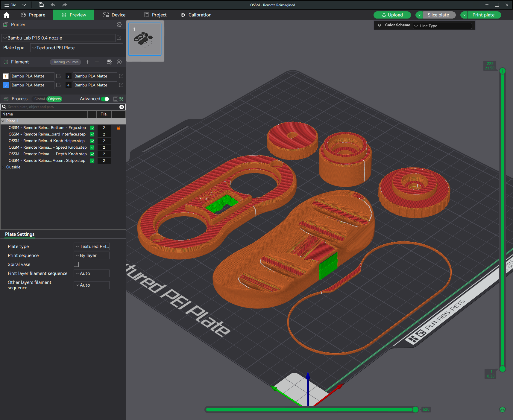

# OSSM Remote Reimagined

## Summary    
Reimagines the OSSM Remote in single-handed form factor allowing control of Speed and Depth knobs (and click) with just one thumb.  
To be used in the right hand.

"Fail-safe" by still allowing traditional use of both knobs.

### [Print Files](Files/)  

### [Demonstration Video (SFW)](https://www.youtube.com/watch?v=5V_SXpUnVo4) 

### Bill Of Materials
    2x M4-10mm
    ~80mm x ~4mm rubber band

### Notes:
 - Double check ***ALL*** support remnants are cleaned off the screen frame portion of the Board Interface before tightening down
     - Use caution/common-sense when placing the "Board Interface" on, if it feels like it's touching the screen component don't force it.  
Please message me and I will add additional clearance, I'm unsure the clearance needed to cover variance in boards but wanted to keep it tight-ish
 - I found that putting a single twist in the rubberband improves grip between the knobs.
 - There is room for improvement in filament usage and ergonomics for the Bottom, feel free to contribute designs!

### Updates:
  - 01.22.2025 - Added V1.1 Board Interface that gives more space. Untested print. [Images/V1.1.png](Images/V1.1.png)
  - 09.09.2024 - Increase pulley height by 1mm to increase reliability
  - 09.08.2024 - Add **Accent Stripe** file
  - 09.07.2024 - v1 released

## Printing:
  - 0.2mm layer height
  - Standard strength (5 wall) profile
  - 15% gyroid or crosshatch infill

Supports required for:
  - OSSM - Remote Reimagined - Board Interface.stl
  - OSSM - Remote Reimagined - Bottom (any).stl

  
