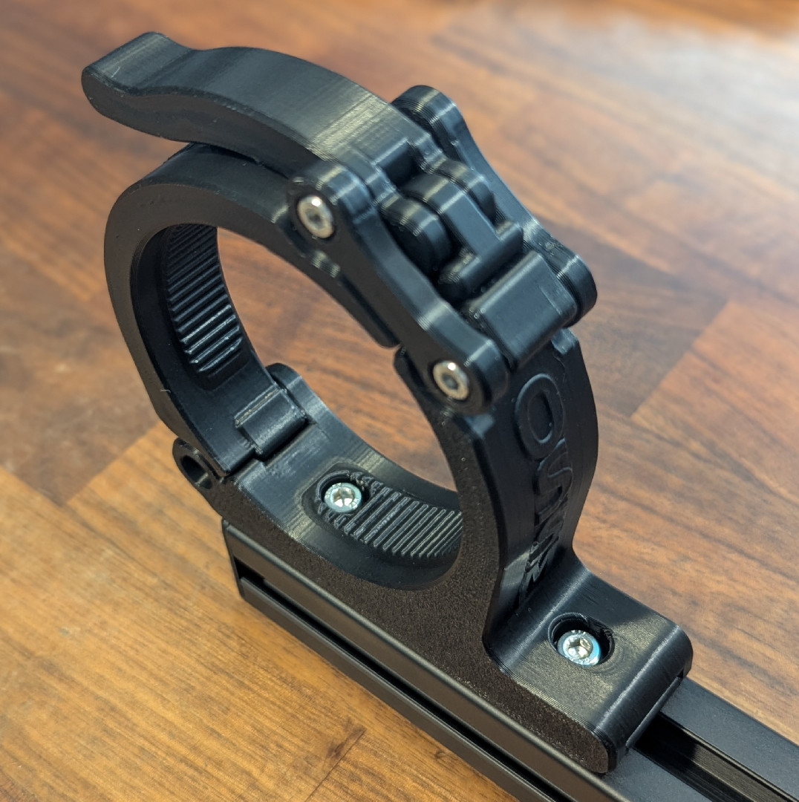
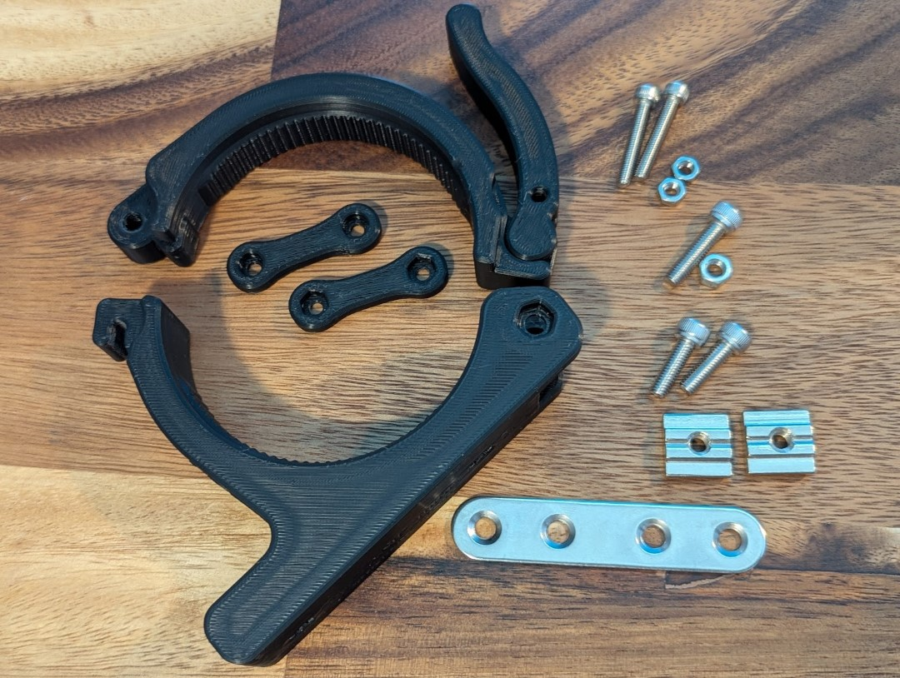
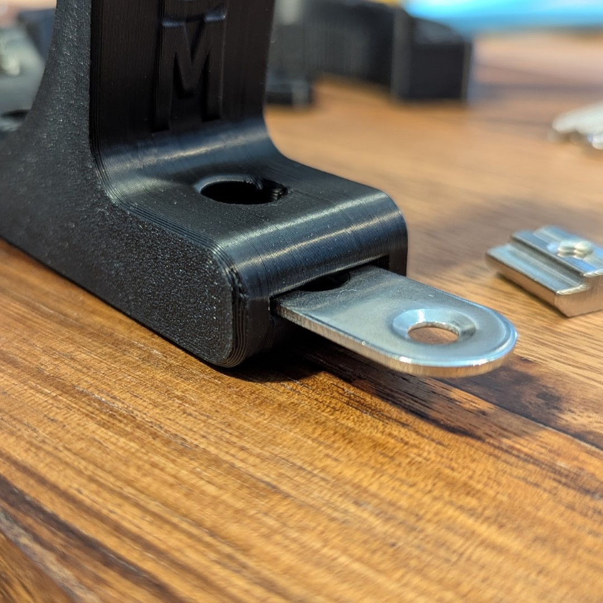

### Printing
PitClamp Mini Standard Settings:

    6 Walls
    Infill type: Cross Hatch (or gyroid) 10%
    Supports: Normal (Snug) Supports with 3 degree threshold angle. Allow supports on part.
    Seam: Nearest (or your personal preference)
 - **Recommended filament:** PLA+
 - All parts are intended to print in the provided file default orientation. 
   - **Printing the Base components in other orientations will cause structural weakness**

If your printer is well calibrated and your material layer strength is optimal, the print-in-place Upper+Handle is recommended, found in the [/Non-Standard](Non-standard) folder.

### Bill Of Materials

Per-side BOM:

PitClamp Mini v1.1 Hinge Pin

	1x M5x20 Socket Cap Screw
	1x M5 Nut

PitClamp Mini Lever Dogbones + Handle

    	1x M4x10 or M4x12 Socket Cap Screw
	2x M4x25 Socket Cap Screw
	3x M4 Nut

PitClamp Mini Lower v1.1 Reinforced Sidemount + Ring

	1x 77x16mm "Flat Mending Plate" AKA "Straight Braces"
	2x M5x16 Socket Cap Screw
	2x M5 T-Nut

77x16mm plate notes: These parts don't quite seem to be universally standard. Holes must be 5mm to support the 5mm hardware. Outer hole spacing needs to fall between 59mm and 61mm.

Print+Part kits: 
https://www.etsy.com/listing/1899330105/pitclamp-mini-reinforced-standard-base

