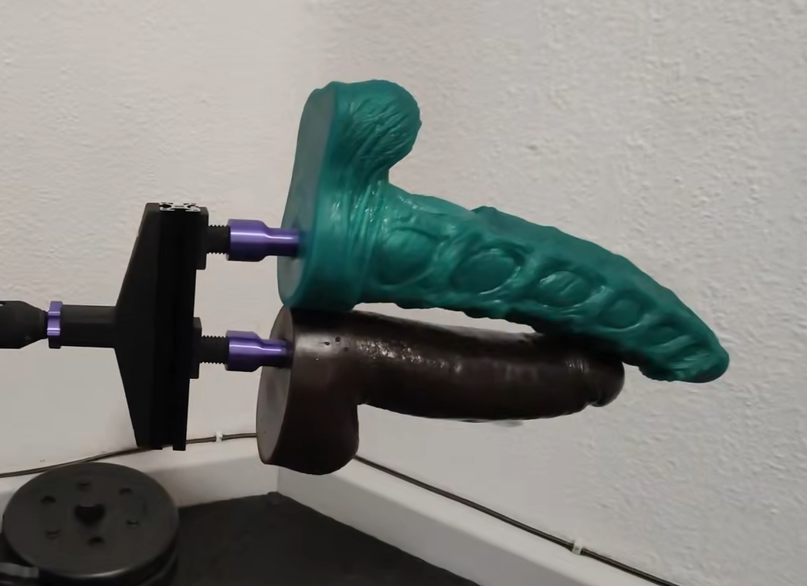

# Double Penetration Attachment

A DP Attachment for 24mm threading. Uses a 200mm 3030 Aluminium Extrusion for extra stability and two on t-nuts slidable 24mm threads. Very heavy duty, very sturdy. Recommended to use with Capstan XL HG20 version but of course not required. Hardware needed are 4x M5x10 Hex Caps for the threads, 4x M5x20 for connecting the main part to the 3030 and 8 M5 T-Nuts.

Thread: https://discord.com/channels/559409652425687041/1437143419607847083