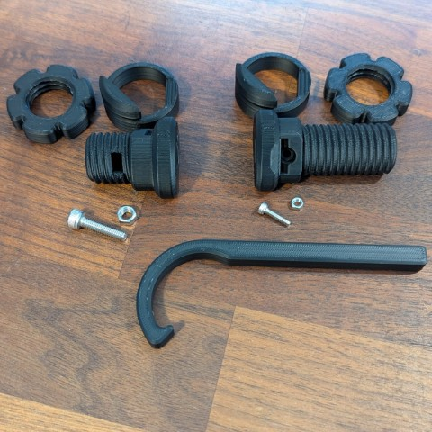

# Threaded Belt Clamp V2

This is a proposed new standard part.  
Addresses printability and strength issues in the current standard.  

This thread is fine-tuned in a way that regardless of printer tolerance quality allows easily threading unmodified 24mm female threaded parts.

### Assembly videos
* **Overview and attaching threaded end:**
  * https://www.youtube.com/watch?v=gquSxSwvuUk  
* **Tensioner and tensioning:** 
  * https://www.youtube.com/watch?v=wU7mKgEMTPk

## Parts

- Threaded Belt Clamp - 24mm Thread
- (Qty 2) Threaded Belt Clamp - Clamp  
- Threaded Belt Clamp - Tensioner
- (Qty 2) 24mm Nut - Hex Flower
- Tool - Hex Flower Wrench
- 24mm Endcap - Hex Flower

### Printing

    No supports  
    OSSM standard settings  
    6 walls, 15% crosshatch/gyroid infill  
    Total print time: ~3 hours  
    Filament: ~71g

### Bill Of Materials

**For the 24mm threaded clamp:**

    1x M3x8 Socket Cap Screw (M3x12 max)
    1x M3 Hex Nut

**For the tensioner:**  

    1x M5x20 Socket Cap Screw
    1x M5 Hex Nut
