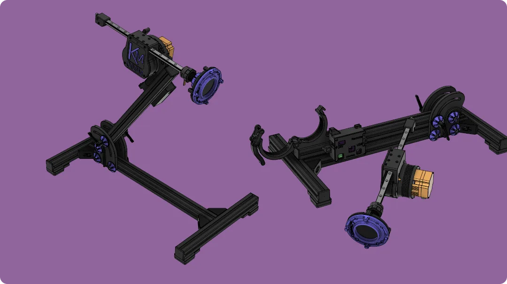
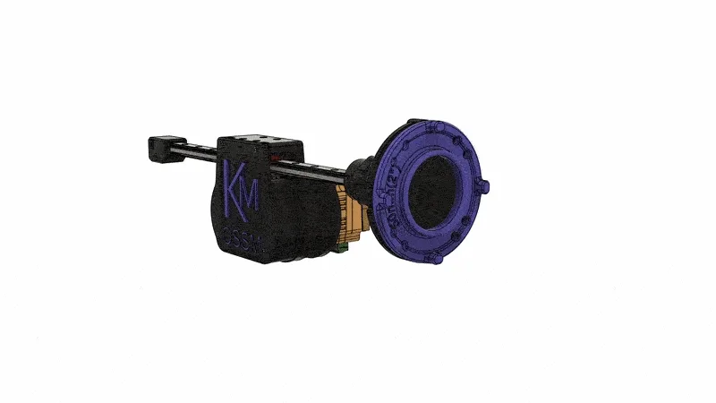

# OSSM - Open Source Sex Machine

**Maintained by [Research and Desire](https://researchanddesire.com), supported by the community.**

[Read the documentation here.](https://docs.researchanddesire.com/ossm)

## What is OSSM?

**OSSM** (pronounced like "awesome") is a user-friendly, open-source sex machine designed for everyday use. Whether you're curious about sex machines or looking to build your own, OSSM provides a powerful, customizable solution you can assemble at home.

OSSM uses a servo-powered belt-driven linear rail, enabling quiet operation, high torque, and software-defined stroke and depth control at speeds up to 1 meter per second.

### Performance Specifications

| Specification | Standard (20V DC) | High Power (36V DC) |
|---------------|-------------------|---------------------|
| Force output  | 32 lbs (14 kg)    | 50 lbs (22 kg)      |
| Stroke length | 8" (20 cm)        | 8" (20 cm)          |
| Rail size     | 350mm             | 350mm               |

### Why Build an OSSM?

- **Full control** over stroke length, depth, and speed through software
- **Quiet operation** suitable for shared living spaces
- **Customization options** through community-developed mods
- **Learning opportunities** in mechanics, electronics, and computing

## Quick Links

| Resource | Description |
|----------|-------------|
| [Documentation](https://docs.researchanddesire.com/ossm) | Complete build guides, hardware specs, and software reference |
| [R+D Store](https://researchanddesire.com) | Purchase motors, PCBs, wire harnesses, and complete kits |
| [KinkyMakers Discord](https://discord.gg/VtZcudpxT6) | Community discussion, build help, and mod development |
| [Troubleshooting](https://docs.researchanddesire.com/ossm/troubleshooting) | Help with hardware, homing, controllers, Bluetooth, and WiFi |

---

## Building Your OSSM

For complete step-by-step instructions, see the [Build Guide](https://ohai.researchanddesire.com/ossm/build/introduction).

### Bill of Materials

For the complete parts list, see [Required Tools and Parts](https://ohai.researchanddesire.com/ossm/build/tools-and-parts).

### Electronics

| Component | Description | Documentation |
|-----------|-------------|---------------|
| Motor | 57AIM30 "Gold Motor" | [Bill of Materials](https://ohai.researchanddesire.com/ossm/build/bill-of-materials) |
| Reference Board | OSSM PCB or ESP32 Development Board | [Board Design](https://dev.researchanddesire.com/ossm/hardware/pcb/board-design) |
| Remote | OSSM Wired Remote | [Controller Documentation](https://docs.researchanddesire.com/ossm/controllers) |
| Wiring | JST-PH 2.0 4-Pin data cable and 16awg power wire | [Wiring Guide](https://ohai.researchanddesire.com/ossm/build/wiring) |

**Power Supply:** 20-36V DC (5.5 x 2.1 Barrel Plug). A 24V 5A supply is recommended. Higher voltage (up to 36V) provides increased force.

> **Portable Option:** USB Power Banks capable of true 100W USB PD generally work well.
> - INIU Power Bank P63-E1 100W (tested, works)
> - INIU B62 Power Bank 65W (tested, powers down on high load)

### Printed Parts

For 3D printing settings and material recommendations, see [3D Printing Parts](https://ohai.researchanddesire.com/ossm/build/printed-parts).

| Assembly | Parts Included | Documentation |
|----------|----------------|---------------|
| [Actuator](Printed%20Parts/Actuator/) | Body, Belt Tensioner, Threaded End Effector | [Assembly Guide](https://ohai.researchanddesire.com/ossm/build/introduction) |
| [Remote](Printed%20Parts/Remote/) | Body, Knobs, Top Cover | [Controller Documentation](https://docs.researchanddesire.com/ossm/controllers) |
| [Toy Mounting](Printed%20Parts/Toy%20Mounting/) | Flange Base, Vac-U-Lock Adapters | [End Effector Guide](https://ohai.researchanddesire.com/ossm/build/end-effector) |
| [Mounting](Printed%20Parts/Mounting/) | PitClamp Mini Ring/Base, PCB Enclosure | [Mounting Files](Printed%20Parts/Mounting/) |
| [Stand](Printed%20Parts/Stand/) | 3030 Extrusion Base Components | [Stand Files](Printed%20Parts/Stand/) |

Experimental parts are developed in the [KinkyMakers Discord](https://discord.gg/wrENMKb3) `#ossm-print-testing` channel.

### Hardware Components

**GT2 Pulley**
- Qty 1: 8mm Bore, 20 Tooth, 10mm Width

**GT2 Timing Belt**
- Qty 1: 10mm Width, 500mm length

**MGN12H Rail + Bearing Block**
- Qty 1: Minimum 250mm, Suggested 350mm, Maximum 550mm
- Rail length = desired maximum stroke + 180mm
- Must be MGN**12H** (H = longer bearing block for stability, 12 = 12mm rail width)

**Ball Bearings**
- Qty 6: MR115-2RS 5x11x4mm

**Fasteners**
| Qty | Part |
|-----|------|
| 8 | M3x8 Socket Cap Head Bolt |
| 2 | M3x16 Socket Cap Head Bolt |
| 1 | M3x20 Socket Cap Head Bolt |
| 7 | M3 Hex Nut |
| 3 | M5x20 Socket Cap Head Bolt |
| 1 | M5 Hex Nut |
| 4 | M5x35 Socket Cap Head Bolt |
| 4 | M5 20mm Hex Coupling Nut (or M5 Hex Nut) |

Additional hardware is required for Stand, Mounting, and Remote assemblies. See the respective [Printed Parts](Printed%20Parts/) folders for details.

---

## Assembly

**Important:** The actuator rail direction is critical for pattern accuracy and safety. The proper orientation has the threaded end to the right when looking at the front face of the actuator body (the "M" side of the OSSM text on the cover).

Your rail should extend the threaded end first when booted. If this doesn't match your build's behavior, reverse your rail's printed hardware.

### Build Resources

| Resource | Description |
|----------|-------------|
| [Complete Build Guide](https://ohai.researchanddesire.com/ossm/build/introduction) | Step-by-step documentation with images |
| [OSSM Assembly Playlist](https://youtube.com/playlist?list=PLzSK7OAu3KNQsFo6WJGT8P28lfkD3xpps) | Video tutorials for each assembly step |
| [Complete Assembly - Follow Along Guide](https://www.youtube.com/watch?v=9lVobSEw_Uw) | Full 30-minute video walkthrough |

---

## Software

For firmware flashing and configuration, see the [Software Documentation](https://dev.researchanddesire.com/ossm/software/getting-started/introduction).

| Resource | Description |
|----------|-------------|
| [Web Flasher](https://docs.researchanddesire.com/ossm/tools/web-flasher) | Flash firmware directly from your browser |
| [PlatformIO Setup](https://dev.researchanddesire.com/ossm/software/getting-started/platformio) | Development environment for custom builds |
| [LED Status Guide](https://dev.researchanddesire.com/ossm/software/getting-started/led-status) | Understanding indicator lights |
| [StrokeEngine](https://dev.researchanddesire.com/ossm/software/motion/stroke-engine/introduction) | Motion control library documentation |
| [Hardware Tests](Software/test/) | On-device test suites for verifying peripherals, BLE, WiFi, and homing |

---

## Getting Help

- [User Guide](https://docs.researchanddesire.com/ossm/how-to-use) - Operating your OSSM
- [Troubleshooting](https://docs.researchanddesire.com/ossm/troubleshooting) - Common issues and solutions
- [Safety Information](https://docs.researchanddesire.com/ossm/safety) - Important safety guidance
- [Discord Community](https://discord.gg/VtZcudpxT6) - Real-time community support

---

## Contributing

OSSM is open-source hardware under the [CERN Open Hardware Licence Version 2 - Strongly Reciprocal](LICENSE).

- [How to Contribute](CONTRIBUTING.md)
- [Fork the Repository](https://github.com/KinkyMakers/OSSM-hardware/fork)
- [Report an Issue](https://github.com/KinkyMakers/OSSM-hardware/issues)
- [Roadmap](https://github.com/KinkyMakers/OSSM-hardware/milestones)

---

## About

- [About Research and Desire](https://researchanddesire.com)
- [About Kinky Makers](https://github.com/KinkyMakers)
- [Open Source Information](https://docs.researchanddesire.com/ossm/open-source-info)
