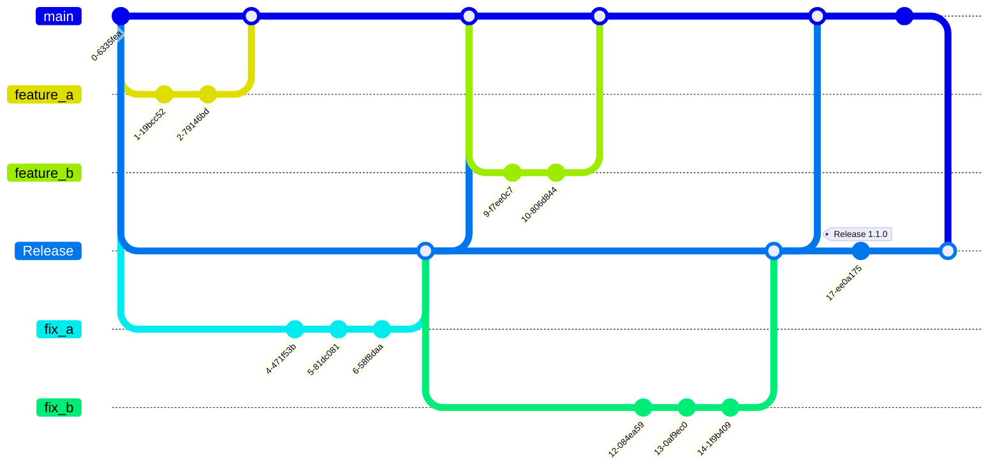

# Branching: Simplified GitFlow Strategy

This document outlines our Simplified GitFlow strategy which is crucial for understanding how we manage code versioning, development, and releases. Here’s a breakdown of our branch structure, workflows, and what you are expected to do when working on our projects.

## Overview of Branch Structure

### Main Branch
- **Role**: Serves as the long-lived development branch.
- **Purpose**: All feature development happens with `main` as the base branch. It hosts all the completed features that are ready for the next stage of release.

### Release Branch
- **Role**: Acts as the stable, production-ready code base.
- **Purpose**: Used for emergency hotfixes and preparing major releases. It contains the code that is currently in production.

## Workflow and Procedures

### Developing New Features
1. **Creating Feature Branches**:
    - Always branch off from `main` for new features.
    - Use a clear naming convention like `feature_<feature_name>`.

2. **Merging Back to Main**:
    - Once development and tests are complete, merge the feature branch back into `main`.
    - Merging to `main` triggers an automatic staging build, increments the OSSM Staging version number, and uploads a `firmware-dev.bin` binary to the Azure S3 bucket.

### Handling Hotfixes
1. **Creating Hotfix Branches**:
    - Branch off from `Release` for urgent fixes using the naming convention `fix_<issue_description>`.
    - Address the production issue in this branch.

2. **Merging Back to Release**:
    - After fixing and thorough testing, merge the hotfix branch back into `Release`.
    - This merge automatically increments the Production build number and creates a `firmware.bin` production build file in the production S3 bucket.

3. **Propagating Hotfixes to Main**:
    - Frequently merge `Release` back into `main` to ensure that the hotfixes are integrated into the development stream.

### Preparing for a Release
1. **Merging Main to Release**:
    - Before a major release, ensure that all new features and updates from `main` are merged into `Release`.

2. **Tagging the Release**:
    - Once merged and finalized, tag the `Release` branch with the version number (e.g., `Release 1.1.0`).
    - Tags help in tracking releases and facilitate rollback if needed.
